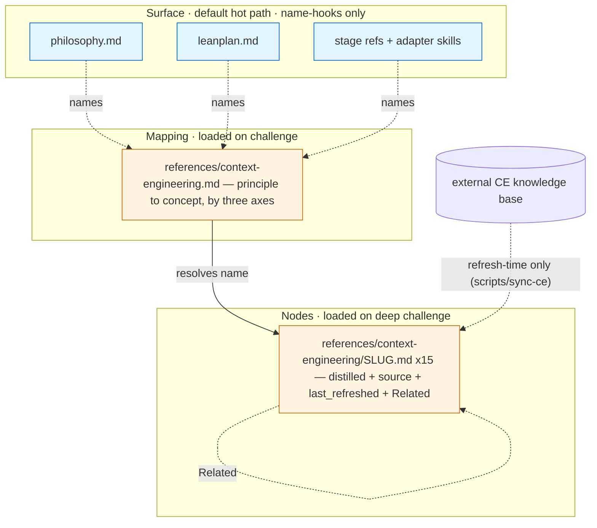

# 260619-context-engineering-knowledges-grounding — DESIGN

## Architecture

Three-layer grounding that mirrors LeanPlan's own surface/archive/JIT layering (`leanplan.md` §4): the **surface** carries concept *names* only; a **mapping** resolves a name to its node; **nodes** carry the distilled definition + provenance + locally-resolving `Related` edges. The only coupling to the external CE knowledge base is refresh-time. The archive ships via the existing `references/` tree, so `install.sh` and `validate.py` are unchanged (verified — `research.md` → Portability + tooling baseline), satisfying `SPEC#INV-1-portable-self-contained` at distribution.

## Decision-1: two-layer-vendored-archive

A two-layer CE archive lives under `references/`: a mapping file `references/context-engineering.md` (principle → `[[concept]]`, organized by the three axes) and one distilled node per concept at `references/context-engineering/<slug>.md` — **all 15 concepts** (the connected closure; no proper subset is link-closed). Nodes are distilled prose (the prescription + the failure mode it counters), not transcripts. Realizes `SPEC#O-2-principle-resolves-to-grounded-definition`, `SPEC#INV-1-portable-self-contained`, `SPEC#INV-3-grounding-stays-off-the-hot-path`. See rationale at [design-rationale.md#Decision-1-two-layer-vendored-archive].

## Decision-2: surface-grounds-by-name-hook

Load-bearing principles in `philosophy.md` and rules in `leanplan.md` (§1, §4, §6, §10) carry a parenthetical concept *name* (e.g. `(CE: jit-loading)`) — never inlined content; the mapping resolves each name to its node. The name set is the verified `research.md` → Principle → concept mapping. Realizes `SPEC#O-1-load-bearing-rule-names-its-principle`, `SPEC#INV-3-grounding-stays-off-the-hot-path`. See rationale at [design-rationale.md#Decision-2-surface-grounds-by-name-hook].

## Decision-3: adapters-lazy-load-references

Each stage adapter SKILL default-loads only its `<stage>.md` (procedure + template). `artifact-contract.md` loads on demand, gated: before writing or editing an artifact's structure or anchors. `philosophy.md` loads on demand: when a principle's intent or grounding is in question. This removes the measured 247-line eager-load at `impl` (`research.md` → Self-conformance gaps). Realizes `SPEC#O-3-framework-conforms-to-its-own-advice` (grounds `jit-loading`). See rationale at [design-rationale.md#Decision-3-adapters-lazy-load-references].

## Decision-4: isolation-as-method-primitive

`specify.md`, `design.md`, and `impl.md` prescribe isolating breadth-heavy investigation (wide SOTA / code research) into a sub-agent that returns only the distilled artifact — a RESEARCH entry or the conclusions — keeping the raw trail out of the planning window. The `specify` adapter gains `Agent` in `allowed-tools` (`design`/`impl` already carry it). Guidance, not mandate: "when breadth exceeds the window." Realizes `SPEC#O-3-framework-conforms-to-its-own-advice` (grounds `context-isolation`, `explore-then-compact-handoff`). See rationale at [design-rationale.md#Decision-4-isolation-as-method-primitive].

## Decision-5: stable-to-volatile-load-order

A `leanplan.md` §6 cross-cutting rule plus an adapter-authoring note prescribes ordering loaded context stable → volatile: universal references first, then the stage skill, then JIT artifact slices, then live code. Realizes `SPEC#O-3-framework-conforms-to-its-own-advice`. Why: orders the prompt for maximal prefix-cache reuse (grounds `prefix-cache-economics`); advisory and harness-dependent, so not validator-enforced.

## Decision-6: edge-placement-in-long-artifacts

The §6 prose rule extends: past the existing ToC>100-line threshold, an artifact re-anchors its critical invariants near the tail (recency) and orders high-stakes DAG cards at the edges. Realizes `SPEC#O-3-framework-conforms-to-its-own-advice`. Why: U-shaped recall favors the edges (grounds `lost-in-the-middle`); the >100-line trigger reuses §6's existing ToC threshold and is a LeanPlan-local heuristic, not a cutoff stated by the concept. Write-time guidance, not validator-enforced.

## Decision-7: session-boundary-principle

A first-class principle joins `philosophy.md` (and `leanplan.md` §1 + a cross-cutting note): keep requirement→spec→design→plan continuous in one warm session; make a hard hand-off to a fresh session before impl; isolate noisy sub-tasks into sub-agents; light-compact at major pivots. Cross-session impl survival rests on harness task-state + git — no new per-feature artifact. The principle stays harness-agnostic; where a harness provides grounded session-management commands they realize it — on Claude Code, `/handoff <goal>` at the plan→impl cut and `/compact-focus` at in-session pivots, both grounded in the same CE concepts — named only in `leanplan.md` §13 (and the Claude adapter), never in the portable principle text, so a bare install still performs the boundary manually (`SPEC#INV-1-portable-self-contained`). Realizes `SPEC#O-3-framework-conforms-to-its-own-advice` (grounds `compaction-vs-eviction`, `explore-then-compact-handoff`, `context-isolation`, `prefix-cache-economics`). See rationale at [design-rationale.md#Decision-7-session-boundary-principle].

## Decision-8: dated-provenance-and-optional-refresh

Each node's frontmatter carries `source: ce-kb:<slug>` and `last_refreshed: <ISO date>`. An optional `scripts/sync-ce` regenerates nodes from the external KB when it is present (refresh-time only; deferrable). Realizes `SPEC#INV-2-provenance-is-dated-and-visible`. See rationale at [design-rationale.md#Decision-8-dated-provenance-and-optional-refresh].
