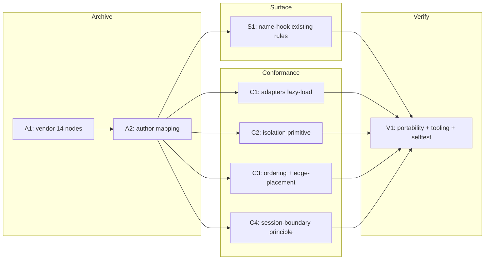

# 260619-context-engineering-knowledges-grounding — TASK

## Guidelines

- Work on a feature branch off `main`; grounding is additive. The only change to *existing* instructions is C1 (adapter load order) — keep it surgical.
- Several tasks edit `leanplan.md` (distinct sections — §1, §4, §6, §10, §13) and `philosophy.md`; land them section-aware to avoid clobbering. Anchor in DESIGN decisions; never restate them in the edits.
- Name-hooks are `(CE: <slug>)` and must resolve via the mapping — never hook a concept absent from `references/context-engineering.md` and its node.
- Runtime skills resolve via symlink to the installed copy `~/.local/share/leanplan/`; edits to this repo take effect for running skills only after reinstall / `chezmoi update`. Verify against the repo tree (V1); the reinstall is a post-merge step, not a task.

## Dependency DAG

Tracks: **A** archive (vendored grounding), **S** surface (name-hooks on the hot path), **C** conformance (behavior + new principle), **V** verify. The mapping (A2) is the grounding hub — every name-hook resolves through it.

## Task: A1

- **Goal**: Vendor the 14 CE concepts as distilled nodes at `references/context-engineering/<slug>.md`, one per concept — the node layer of `DESIGN#Decision-1-two-layer-vendored-archive` with the provenance of `DESIGN#Decision-8-dated-provenance-and-optional-refresh`. Distill each from its source entry (`research.md` → CE knowledge base) into prescription + the failure mode it counters, not a transcript; keep its `Related` edges so the closure is self-contained.
- **Repo**: `mynghn/leanplan` — `references/context-engineering/`.
- **Completion**:
  - 14 nodes exist, slugs matching the KB set listed in `research.md` → CE knowledge base.
  - Each carries frontmatter `source: ce-kb:<slug>` + `last_refreshed: <ISO date>` — verifies `SPEC#INV-2-provenance-is-dated-and-visible`.
  - Every `Related: [[slug]]` edge resolves to a sibling node (no dangling) — supports `SPEC#INV-1-portable-self-contained`.
  - Each node defines the concept + cites its source(s) — supports `SPEC#O-2-principle-resolves-to-grounded-definition`.
- **Dependencies**: none.

## Task: A2

- **Goal**: Author the mapping `references/context-engineering.md` per `DESIGN#Decision-1-two-layer-vendored-archive` — a conclusion-first index from each grounded principle to its `[[concept]]`, organized by the three axes (position / length / noise). Anchor; do not inline node content.
- **Repo**: `mynghn/leanplan` — `references/context-engineering.md`.
- **Completion**:
  - Every grounded principle in `research.md` → Principle → concept mapping appears with its `[[concept]]` link, each resolving to an A1 node — verifies the resolution half of `SPEC#O-2-principle-resolves-to-grounded-definition`.
  - Organized by the three axes; reads conclusion-first.
- **Dependencies**: A1 (enabler — the mapping's `[[links]]` resolve once the nodes exist).

## Task: S1

- **Goal**: Add `(CE: <slug>)` name-hooks to the pre-existing load-bearing rules in `philosophy.md` and `leanplan.md` (§1, §4, §6, §10) per `DESIGN#Decision-2-surface-grounds-by-name-hook`, using the verified `research.md` → Principle → concept mapping. Names only — never inline content.
- **Repo**: `mynghn/leanplan` — `references/philosophy.md`, `leanplan.md`.
- **Completion**:
  - Each pre-existing load-bearing rule names the concept it implements, resolvable via the mapping — verifies `SPEC#O-1-load-bearing-rule-names-its-principle`.
  - No inlined concept content added to surface docs — supports `SPEC#INV-3-grounding-stays-off-the-hot-path`.
- **Dependencies**: A2 (enabler — hooks resolve once the mapping lands).

## Task: C1

- **Goal**: Make stage adapters lazy-load references per `DESIGN#Decision-3-adapters-lazy-load-references`: default-load only `<stage>.md`; gate `artifact-contract.md` (load before editing artifact structure/anchors) and `philosophy.md` (load on principle challenge) on demand. Self-hook the changed load instruction `(CE: jit-loading)`. Apply across the 5 Claude adapter SKILLs + the Codex dispatcher; mirror the gating note in `impl.md`.
- **Repo**: `mynghn/leanplan` — `adapters/claude/*/SKILL.md`, `adapters/codex/leanplan/SKILL.md`, `references/impl.md`.
- **Completion**:
  - No stage SKILL eager-loads all three references; `artifact-contract.md` carries an explicit "load before structural edit" trigger — verifies `SPEC#O-3-framework-conforms-to-its-own-advice` (the `jit-loading` self-fix; baseline in `research.md` → Self-conformance gaps).
- **Dependencies**: A2 (enabler — the `(CE: jit-loading)` hook resolves once the mapping lands).

## Task: C2

- **Goal**: Prescribe isolation as a method primitive in `specify.md`, `design.md`, `impl.md` per `DESIGN#Decision-4-isolation-as-method-primitive` — breadth-heavy investigation runs in a sub-agent returning only the distilled artifact; guidance, not mandate. Add `Agent` to the `specify` adapter `allowed-tools`. Self-hook `(CE: context-isolation)` / `(CE: explore-then-compact-handoff)`.
- **Repo**: `mynghn/leanplan` — `references/{specify,design,impl}.md`, `adapters/claude/specify/SKILL.md`.
- **Completion**:
  - The three stage references prescribe isolated breadth-heavy investigation; the `specify` adapter `allowed-tools` includes `Agent` — verifies `SPEC#O-3-framework-conforms-to-its-own-advice`.
- **Dependencies**: A2 (enabler — hooks resolve once the mapping lands).

## Task: C3

- **Goal**: Add the two §6 write-time rules per `DESIGN#Decision-5-stable-to-volatile-load-order` and `DESIGN#Decision-6-edge-placement-in-long-artifacts`: stable→volatile load ordering (+ adapter-authoring note) and edge-placement past the §6 ToC>100-line threshold. Self-hook `(CE: prefix-cache-economics)` and `(CE: lost-in-the-middle)` respectively.
- **Repo**: `mynghn/leanplan` — `leanplan.md` §6 + adapter-authoring note.
- **Completion**:
  - §6 carries both rules; the edge-placement rule keys off the existing ToC>100-line threshold — verifies `SPEC#O-3-framework-conforms-to-its-own-advice`. Both stay write-time guidance, not validator-enforced (no `validate.py` change).
- **Dependencies**: A2 (enabler — hooks resolve once the mapping lands).

## Task: C4

- **Goal**: Add the session-boundary principle per `DESIGN#Decision-7-session-boundary-principle` to `philosophy.md` and `leanplan.md` §1, with a §13 note that on Claude Code `/handoff` (plan→impl) and `/compact-focus` (pivots) realize it — harness commands named there only, never in the portable principle. Self-hook `(CE: compaction-vs-eviction)` / `(CE: explore-then-compact-handoff)`. No new per-feature state artifact.
- **Repo**: `mynghn/leanplan` — `references/philosophy.md`, `leanplan.md` §1 + §13.
- **Completion**:
  - The principle is present in `philosophy.md` + `leanplan.md` §1; §13 names the Claude harness realizations; the portable principle text names no harness command — verifies `SPEC#O-3-framework-conforms-to-its-own-advice` and supports `SPEC#INV-1-portable-self-contained`.
  - No `docs/features/<KEY>/`-style cross-session state file is introduced (principle 7 held).
- **Dependencies**: A2 (enabler — hooks resolve once the mapping lands).

## Task: V1

- **Goal**: Verify the grounding is portable, lean, and tooling-neutral, confirming the Architecture's distribution claim. Check that a standalone tree (no external KB) resolves every grounding reference, that no use-time external dependency was introduced, that the surface grew only by name-hooks, and that `install.sh` / `validate.py` are unchanged. Run the validator on a sample feature + `leanplan-selftest`.
- **Repo**: `mynghn/leanplan` — whole tree.
- **Completion**:
  - With the external KB absent, every rule → principle → definition → related-concept reference resolves locally; `git diff` shows no edit to `install.sh` or `scripts/validate.py` — verifies `SPEC#INV-1-portable-self-contained`.
  - The default-loaded surface is enlarged only by `(CE: …)` name-hooks, not inlined content — verifies `SPEC#INV-3-grounding-stays-off-the-hot-path`.
  - `python3 scripts/validate.py fixtures/valid` exits 0 and `scripts/leanplan-selftest` reports 5/5 — grounding edits broke no existing contract.
- **Dependencies**: S1, C1, C2, C3, C4 (enablers — V1 verifies the integrated grounding; A1/A2 covered transitively).

## Forward coverage

| SPEC item | Realized by |
|---|---|
| O-1 load-bearing-rule-names-its-principle | S1 (+ C1–C4 self-hooks) |
| O-2 principle-resolves-to-grounded-definition | A1 + A2 |
| O-3 framework-conforms-to-its-own-advice | C1 + C2 + C3 + C4 |
| INV-1 portable-self-contained | V1 |
| INV-2 provenance-is-dated-and-visible | A1 |
| INV-3 grounding-stays-off-the-hot-path | V1 (realized by A1 + A2 + S1) |
