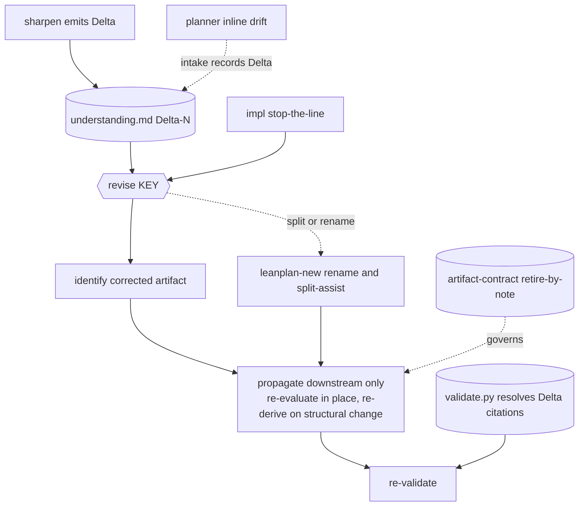

# 260620-artifact-later-update — DESIGN

## Architecture

`/revise <KEY>` is the single sanctioned, any-stage entry for editing committed artifacts (`SPEC#O-1-update-invocable-from-any-in-flight-stage`) — a skill (reference-doc procedure + adapters), LLM-executed like `/sharpen`, not a new engine. Its justified input is a `Delta-<N>` block in `understanding.md`: emitted by `/sharpen`, recorded at intake from a planner's inline drift, or handed up from an impl stop-the-line. `/revise` identifies the corrected artifact, propagates downstream-only (`SPEC#INV-3-change-stays-downstream-only`) re-evaluating in place by default, preserves anchor IDs via the generalized retire-by-note contract (`SPEC#O-3-prior-work-preserved`), and re-validates (`SPEC#INV-2-committed-set-stays-consistent`). Structural splits and renames route through the extended allocator (`SPEC#O-4-structural-ops-leave-nothing-stranded`). Supporting edits land in `artifact-contract.md`, `leanplan-new`, and `validate.py`; current-state of each is in `research.md`.

## Decision-1: revise-unified-editing-entry
`/revise <KEY>` is a new sanctioned skill and the single entry for editing committed artifacts at any in-flight occasion — realizes `SPEC#O-1-update-invocable-from-any-in-flight-stage`. The impl Artifact Update Loop's editing core (identify-layer → edit → re-evaluate-downstream → scope-gate) is re-homed here; impl's six stop-the-line *triggers* stay in impl but now call `/revise` rather than running their own inline walk-up, so a mid-task drift during impl flows through the same entry as every other occasion. → `design-rationale.md#Decision-1-revise-unified-editing-entry`.

- Files (skill-definition pattern in `research.md`): create `adapters/claude/revise/SKILL.md` and `references/revise.md`; add a dispatch row to `adapters/codex/leanplan/SKILL.md`; add a row to `leanplan.md` §12.
- Skill name `/revise` is provisional — the one user-facing label worth confirming.

## Decision-2: in-place-default-re-derive-on-threshold
For each artifact in the drift's downstream scope-of-impact, `/revise` re-evaluates **in place** by default — a local edit preserving stable anchor IDs — and escalates to full re-derivation (re-running the stage skill from the corrected upstream) only when the change is **structural**: the anchor set itself must change, not just prose inside stable anchors. This generalizes the impl loop's existing default (`impl.md:61`) to every stage. Realizes `SPEC#O-2-change-propagated-downstream`, preserves `SPEC#O-3-prior-work-preserved`, and honors `SPEC#INV-3-change-stays-downstream-only` by walking only downstream of the corrected artifact. → `design-rationale.md#Decision-2-in-place-default-re-derive-on-threshold`.

## Decision-3: generalize-retire-by-note
Lift the `(retired)` retire-by-note form from SPEC-only into the global `## Anchors` section of `artifact-contract.md`, so a superseded `Decision`, TASK card, or REQUIREMENT/SPEC item is retired by inline `(retired)` note rather than deleted. The stable-ID non-renumber rule there is already global (`artifact-contract.md:46`); only the retire *form* is SPEC-special-cased, so this removes an inconsistency with no live alternative. Realizes the cross-artifact half of `SPEC#O-3-prior-work-preserved`.

## Decision-4: justified-input-is-a-delta
`/revise` mutates artifacts only against a recorded `Delta-<N>` block in `understanding.md` — realizes `SPEC#INV-1-no-unjustified-mutation`. Two intake paths: consume an existing Delta named at invocation (the `/sharpen` handoff), or, on a direct manual drift with no Delta, record one at intake from the planner's asserted drift before any mutation. The update is **cause-agnostic**: the Delta records *why* the understanding moved — external change, the planner's rethink, or a latent error caught late — and `/revise` repairs whatever it is handed without re-judging it. Adjudicating a *contested* drift stays with `/sharpen` (the `SPEC` Non-goal). → `design-rationale.md#Decision-4-justified-input-is-a-delta`.

## Decision-5: structural-ops-via-allocator
Feature rename and split route through `leanplan-new`, today allocate-only (`research.md`; exits 2 on an existing dir). Add a mechanical `leanplan-new --rename <old> <new>`: move the dir, rewrite intra-repo path references to it, re-validate. Split is an LLM-driven `/revise` sub-procedure: allocate the new feature via `leanplan-new`, partition anchors/artifacts between the two features, then propagate per `Decision-2`. Realizes `SPEC#O-4-structural-ops-leave-nothing-stranded` — the rewrite-references + re-validate step is exactly what the raw-`mv` improvisation skipped (the grounding's stranded stubs). → `design-rationale.md#Decision-5-structural-ops-via-allocator`.

## Decision-6: resolve-understanding-citations
Make `validate.py` `_check_citations` resolve inbound `UNDERSTANDING#Delta-N-slug` citations against `understanding.md`'s delta anchors — today skipped at `validate.py:307`, the slot the contract reserves for "consumer (C)". A revised artifact may then cite the Delta that justified it and have that link checked, strengthening the auditable-justification side of `SPEC#INV-1-no-unjustified-mutation`. Trivial: drop `UNDERSTANDING` from the skip set and add `understanding.md`'s anchors to the resolvable set. Lowest-stakes of the six — droppable if scope tightens.
