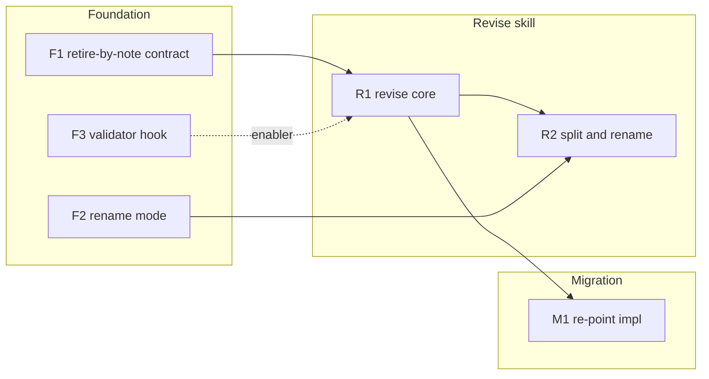

# 260620-artifact-later-update — TASK

## Guidelines

- This feature edits LeanPlan's own shared machinery — the artifact contract, the validator, and the allocator. A regression here breaks *every* feature, not just this one. After each task, confirm the existing `docs/features/*` still pass `validate.py` and that `leanplan-selftest` is green before moving on.

## Dependency DAG

Tracks: **F** Foundation (shared machinery the skill builds on), **R** the `/revise` skill, **M** Migration (re-home impl's loop). Edges are enablers — the impl agent re-evaluates them at task entry.

## Task: F1

- **Goal**: Make superseded items across *all* surface artifacts retire-by-note instead of vanishing (`SPEC#O-3-prior-work-preserved`) — lift the `(retired)` form from its SPEC-only home into the global Anchors contract, per `DESIGN#Decision-3-generalize-retire-by-note`.
- **Repo**: `leanplan` — `references/artifact-contract.md`
- **Completion**:
  - The global `## Anchors` contract states the `(retired)` retire-by-note form once, binding on `Decision` / `Task:` / `O` / `INV` alike; `specify.md` references it rather than uniquely owning it (`SPEC#O-3-prior-work-preserved`).
- **Dependencies**: none.

## Task: F2

- **Goal**: Add a mechanical feature-rename to the single allocator so a rename strands nothing (`SPEC#O-4-structural-ops-leave-nothing-stranded`) — a `--rename` mode that moves the dir, rewrites intra-repo path references, and re-validates, per `DESIGN#Decision-5-structural-ops-via-allocator`.
- **Repo**: `leanplan` — `scripts/leanplan-new`
- **Completion**:
  - (a) renaming feature `A` to `B` relocates `docs/features/A/` to `docs/features/B/` with every artifact readable at the new path;
  - (b) no intra-repo reference still points at the old path;
  - (c) `validate.py` passes on the renamed feature — the grounding's "stranded stubs unread at the new path" failure cannot recur (`SPEC#O-4-structural-ops-leave-nothing-stranded`).
- **Dependencies**: none.

## Task: F3

- **Goal**: Make a revised artifact's link back to its justifying Delta checkable (`SPEC#INV-1-no-unjustified-mutation`) — resolve inbound `UNDERSTANDING#Delta-N-slug` citations against `understanding.md` instead of skipping them, per `DESIGN#Decision-6-resolve-understanding-citations`.
- **Repo**: `leanplan` — `scripts/validate.py`
- **Completion**:
  - An `UNDERSTANDING#Delta-N-slug` citation resolves when the delta block exists and errors when it does not — parity with `SPEC#` / `DESIGN#` resolution; the prior unconditional skip is gone (`SPEC#INV-1-no-unjustified-mutation`).
- **Dependencies**: none.
- **Guidelines**: lowest-stakes card — `DESIGN#Decision-6-resolve-understanding-citations` marks it droppable; if scope tightens at impl, cut this (INV-1 stays covered by R1's gate).

## Task: R1

- **Goal**: Stand up `/revise <KEY>` as the one sanctioned, any-stage entry that injects a justified drift and propagates it (`SPEC#O-1-update-invocable-from-any-in-flight-stage`, `SPEC#O-2-change-propagated-downstream`) — the procedure intakes a `Delta` justification (`SPEC#INV-1-no-unjustified-mutation`, `DESIGN#Decision-4-justified-input-is-a-delta`), identifies the corrected artifact, walks only downstream of it (`SPEC#INV-3-change-stays-downstream-only`) re-evaluating in place by default and re-deriving on structural change (`DESIGN#Decision-2-in-place-default-re-derive-on-threshold`) while preserving anchor IDs (`SPEC#O-3-prior-work-preserved`), then re-validates (`SPEC#INV-2-committed-set-stays-consistent`). Skill shape per `DESIGN#Decision-1-revise-unified-editing-entry`.
- **Repo**: `leanplan` — `references/revise.md`, `adapters/claude/revise/`, `adapters/codex/leanplan/`, `framework-design.md`
- **Completion**:
  - (a) invoking `/revise` at requirement, spec, design, plan, and impl — including mid-task — engages on the feature's committed artifacts (`SPEC#O-1-update-invocable-from-any-in-flight-stage`);
  - (b) a change injected upstream reaches every downstream artifact in the Delta's scope-of-impact, and a content search finds no surviving reference to the superseded version (`SPEC#O-2-change-propagated-downstream`);
  - (c) an invocation with no Delta and no recordable justification mutates nothing (`SPEC#INV-1-no-unjustified-mutation`);
  - (d) after a completed revise, surviving anchor IDs still resolve and superseded items are retired-by-note, not deleted (`SPEC#O-3-prior-work-preserved`);
  - (e) artifacts upstream of the corrected one are byte-unchanged (`SPEC#INV-3-change-stays-downstream-only`);
  - (f) the feature passes `validate.py` after the revise (`SPEC#INV-2-committed-set-stays-consistent`).
- **Dependencies**: F1 lands the cross-artifact retire-by-note form the preservation step relies on; F3 makes the justification link checkable.

## Task: R2

- **Goal**: Make feature split and rename first-class `/revise` operations rather than improvisations (`SPEC#O-4-structural-ops-leave-nothing-stranded`) — wire the mechanical rename (F2) into the skill, and add the judgment-driven split that allocates the new feature through the allocator and partitions anchors/artifacts before propagating, per `DESIGN#Decision-5-structural-ops-via-allocator`.
- **Repo**: `leanplan` — `references/revise.md`
- **Completion**:
  - (a) a `/revise`-driven rename leaves nothing stranded and re-validates (delegates to F2);
  - (b) a `/revise`-driven split yields two valid feature dirs, each artifact readable, anchors partitioned without renumbering survivors, both passing `validate.py` (`SPEC#O-4-structural-ops-leave-nothing-stranded`).
- **Dependencies**: R1 lands the skill core this extends; F2 lands the rename the structural path calls.

## Task: M1

- **Goal**: Collapse the impl Artifact Update Loop's editing core into `/revise` so during-impl drift uses the one unified entry (`SPEC#O-1-update-invocable-from-any-in-flight-stage`) — impl's six stop-the-line triggers stay as impl-time detections but delegate the edit-and-propagate walk to `/revise`, per `DESIGN#Decision-1-revise-unified-editing-entry`.
- **Repo**: `leanplan` — `references/impl.md`
- **Completion**:
  - impl's stop-the-line section hands off to `/revise` for the artifact edit instead of describing its own inline walk-up; a mid-impl drift and a between-stage drift follow the same documented path (`SPEC#O-1-update-invocable-from-any-in-flight-stage`).
- **Dependencies**: R1 lands the `/revise` entry impl delegates to.
- **Guidelines**: if re-homing grows past a doc re-point (impl's loop carries impl-specific nuance worth keeping), land R1 + Foundation first and treat this as the fast-follow the `design-rationale.md#Decision-1-revise-unified-editing-entry` scope note sanctions.
