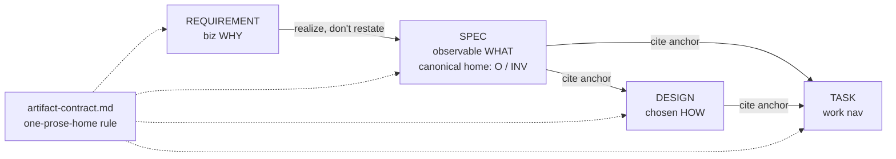

# 260620-lean-review-surfaces — DESIGN

## Architecture

Two contract edits land below — a de-dup rule (`Decision-1`) and conclusion-first legibility (`Decision-2`). REQUIREMENT holds a cross-cutting property's biz *why*, SPEC owns its observable form (the canonical `O`/`INV` home), DESIGN and TASK cite anchors. Both are guidance/contract edits to existing reference docs — no new tooling, no change to the anchor scheme or traceability.

## Decision-1: one-prose-home-per-fact
Generalize the existing DESIGN→SPEC "no duplicate Invariants" guard into a contract-wide rule: **a fact is authored as prose once, in its owning artifact; every other occurrence is an anchor reference.** Realizes SPEC#O-2-one-canonical-home-per-fact. See rationale at [design-rationale.md#Decision-1-one-prose-home-per-fact].

Ownership + the seams it resolves:
- **REQ↔SPEC (altitude split).** REQUIREMENT system-policy = biz *intent* (why a cross-cutting property matters); SPEC `O`/`INV` = its observable form (canonical home). A SPEC INV realizing a policy states the observable form and leaves the biz intent to REQUIREMENT — never re-paraphrasing.
- **Symmetric guard.** "Cite the anchor, don't restate" binds REQ→SPEC and TASK→SPEC, not only DESIGN→SPEC.
- **Within TASK.** Forward coverage has one home: inline `Completion` citations are canonical; a forward-coverage table, if kept, is a derived `**GAP**`-acknowledgment view — not a re-authored mapping.
- **Within DESIGN.** The Architecture caption owns boundaries/flow only; `Decision` blocks own realization claims — the caption does not restate a Decision.

Realization (where the rule lands):
- `artifact-contract.md` — add the general rule; sharpen the Stage Ownership rows (REQUIREMENT = biz intent for policies; SPEC `O`/`INV` = observable canonical home).
- `requirement.md` — redefine the System-policies sub-group as biz intent; drop its SPEC-vocabulary overlap; note the observable form lives in SPEC.
- `specify.md` — state SPEC `O`/`INV` is the canonical home; an INV realizing a REQ policy states the observable form and leaves the biz intent to REQUIREMENT.
- `design.md`, `plan.md` — generalize the guard wording; add the within-DESIGN and within-TASK clauses above.

## Decision-2: conclusion-first-on-prose-shaped-fields
Bind the two fields that collapse into blobs/run-ons — the DESIGN `Decision` body and the TASK `Goal` — to lead with their conclusion (the choice / the achieved outcome) on line one, with parallel facets as lists. Realizes SPEC#O-1-surface-graspable-at-skim-depth. See rationale at [design-rationale.md#Decision-2-conclusion-first-on-prose-shaped-fields].

- **Targets.** `design.md` (Decision-body guidance + one good/bad example), `plan.md` (Goal-field guidance + example), `artifact-contract.md` Prose Style (bind the rule to these named fields).
- **No new check.** Conclusion-first is not reliably lintable; rely on template + guidance + examples. Raw verbosity is backstopped by the landed surface-budget guard; the full leanness verification (incl. non-inflation) is stated once at `SPEC#INV-2-leanness-not-regressed`. Consistent with the SPEC Non-goal (automation optional).
- **REQUIREMENT/SPEC unchanged** — their list-shaped templates already conform; this lifts DESIGN/PLAN to that bar.

## Coverage
- **SPEC#O-1-surface-graspable-at-skim-depth** → Decision-2.
- **SPEC#O-2-one-canonical-home-per-fact** → Decision-1.
- **SPEC#INV-1-functional-identity-preserved** → by construction: every change edits guidance/rule text or prose order only; no anchor, traceability rule, or stage role is removed — the de-dup rule *strengthens* anchoring.
- **SPEC#INV-2-leanness-not-regressed** → Decision-1 (fewer restatements) + Decision-2 (denser information, not denser prose).
