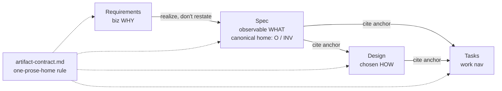

# 260620-lean-review-surfaces — Design

## Architecture

Two contract edits land below — a de-dup rule (`D-1`) and conclusion-first legibility (`D-2`). Both are guidance/contract edits to existing reference docs — no new tooling, no change to the anchor scheme or traceability. The diagram shows the cite-don't-restate flow `D-1` defines.

## D-1: one-prose-home-per-fact
Generalize the existing Design→Spec "no duplicate Invariants" guard into a contract-wide rule: **a fact is authored as prose once, in its owning artifact; every other occurrence is an anchor reference.** Realizes Spec#B-2-one-canonical-home-per-fact. See rationale at [design-rationale.md#D-1-one-prose-home-per-fact].

Ownership + the seams it resolves:
- **REQ↔Spec (altitude split).** Requirements system-policy = biz *intent* (why a cross-cutting property matters); Spec `B`/`C` = its observable form (canonical home). A Spec INV realizing a policy states the observable form and leaves the biz intent to Requirements — never re-paraphrasing.
- **Symmetric guard.** "Cite the anchor, don't restate" binds REQ→Spec and Tasks→Spec, not only Design→Spec.
- **Within Tasks.** Forward coverage has one home: inline `Completion` citations are canonical; a forward-coverage table, if kept, is a derived view of them, not a re-authored mapping — only the deliberately-uncovered subset carries the reserved `**GAP**` marker.
- **Within Design.** The Architecture caption owns boundaries/flow only; `Decision` blocks own realization claims — the caption does not restate a Decision.

Realization (where the rule lands):
- `artifact-contract.md` — add the general rule; sharpen the Stage Ownership rows (Requirements = biz intent for policies; Spec `B`/`C` = observable canonical home).
- `requirements.md` — redefine the System-policies sub-group as biz intent; drop its Spec-vocabulary overlap; note the observable form lives in Spec.
- `specify.md` — state Spec `B`/`C` is the canonical home; an INV realizing a REQ policy states the observable form and leaves the biz intent to Requirements.
- `design.md`, `tasks.md` — generalize the guard wording; add the within-Design and within-Tasks clauses above.

## D-2: conclusion-first-on-prose-shaped-fields
Bind the two fields that collapse into blobs/run-ons — the Design `Decision` body and the Tasks `Goal` — to lead with their conclusion (the choice / the achieved outcome) on line one, with parallel facets as lists. Realizes Spec#B-1-surface-graspable-at-skim-depth. See rationale at [design-rationale.md#D-2-conclusion-first-on-prose-shaped-fields].

- **Targets.** `design.md` (Decision-body guidance + one good/bad example), `tasks.md` (Goal-field guidance + example), `artifact-contract.md` Prose Style (bind the rule to these named fields).
- **No new check.** Conclusion-first is not reliably lintable; rely on template + guidance + examples. Raw verbosity is backstopped by the landed surface-budget guard; the full leanness verification (incl. non-inflation) is stated once at `Spec#C-2-leanness-not-regressed`. Consistent with the Spec Non-goal (automation optional).
- **Requirements/Spec unchanged** — their list-shaped templates already conform; this lifts Design/Tasks to that bar.

## Coverage
- **Spec#B-1-surface-graspable-at-skim-depth** → D-2.
- **Spec#B-2-one-canonical-home-per-fact** → D-1.
- **Spec#C-1-functional-identity-preserved** → by construction: every change edits guidance/rule text or prose order only; no anchor, traceability rule, or stage role is removed — the de-dup rule *strengthens* anchoring.
- **Spec#C-2-leanness-not-regressed** → D-1 (fewer restatements) + D-2 (denser information, not denser prose).
