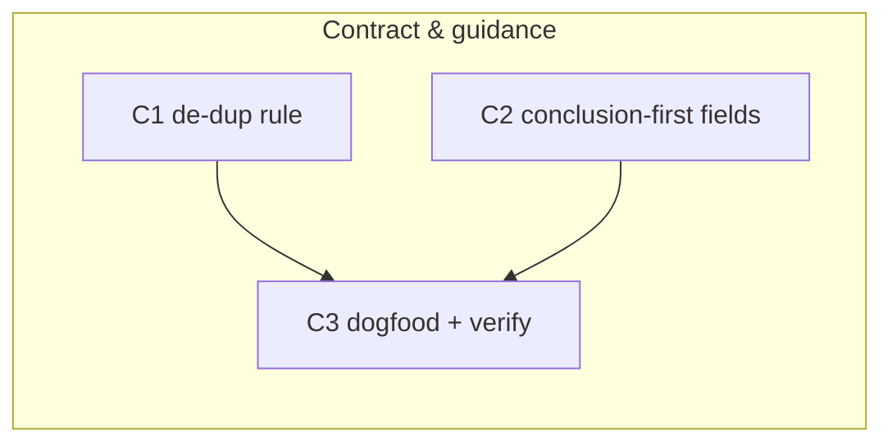

# 260620-lean-review-surfaces — Tasks

## Guidelines
- **Re-derive against current reference text at entry.** The references were just hardened on `main` (`8be1e86`); do not assume pre-hardening wording.
- **Validate against the repo copies, not the installed ones.** Running skills symlink to `~/.local/share/leanplan/`; edits take effect there only after reinstall/chezmoi sync. Use `scripts/validate.py` from this repo.
- **Dogfood every edit.** Each change must itself obey conclusion-first + one-prose-home — a change may not violate the rule it adds.
- C1 and C2 both touch `artifact-contract.md`, `design.md`, `tasks.md`; whichever runs second re-derives against the updated text.

## Dependency DAG

One track: edits to the LeanPlan reference contract + stage docs, then a conformance/verification pass. C1 and C2 are independent rule changes; C3 proves them on real surfaces.

## T: C1

- **Goal**: Land the de-dup rule so no surface re-paraphrases another (`Spec#B-2-one-canonical-home-per-fact`) — generalize the Design→Spec guard to all seams and apply the altitude split, per `Design#D-1-one-prose-home-per-fact`. Anchor in: the rule's substance, the REQ↔Spec altitude split, and the four seams it resolves live in the Decision — reflect each across the contract and the stage docs without restating it here.
- **Repo**: leanplan — `references/{artifact-contract.md, requirements.md, specify.md, design.md, tasks.md}`
- **Completion**:
  - The "one prose home / every other mention = anchor" rule is present in `artifact-contract.md` and scoped to every seam, not only Design→Spec (`Spec#B-2-one-canonical-home-per-fact`).
  - `requirements.md` defines System-policies as biz intent (no Spec-vocabulary overlap); `specify.md` names Spec `B`/`C` as the observable canonical home.
  - Grep an existing chain (e.g. `260619-…`) → one prose statement + bare anchors; a reviewer confirms no occurrence re-paraphrases it — grep catches the literal anchors, the no-paraphrase check is the reviewer's (`Spec#B-2-one-canonical-home-per-fact`).
  - `validate.py` green.
- **Dependencies**: none

## T: C2

- **Goal**: Make Design and Tasks graspable at skim depth, the bar Requirements/Spec already meet (`Spec#B-1-surface-graspable-at-skim-depth`) — bind the two blob-prone fields (the Design `Decision` body and the Tasks `Goal`) to conclusion-first + lists, each with one good/bad example, per `Design#D-2-conclusion-first-on-prose-shaped-fields`. No new automated check (the Decision records why).
- **Repo**: leanplan — `references/{design.md, tasks.md, artifact-contract.md}`
- **Completion**:
  - `design.md` (Decision body) and `tasks.md` (Goal) guidance each lead with the conclusion and carry one good/bad example; `artifact-contract.md` Prose Style names the two fields (`Spec#B-1-surface-graspable-at-skim-depth`).
  - A Design/Tasks authored from the templates passes the `Spec#B-1-surface-graspable-at-skim-depth` skim test.
  - `validate.py` surface-budget check still green; no surface inflates (`Spec#C-2-leanness-not-regressed`).
- **Dependencies**: none

## T: C3

- **Goal**: Prove the new rules on real surfaces and conform the ones that don't — including this feature's own chain — so the framework eats its own cooking (`Spec#C-1-functional-identity-preserved`, `Spec#B-1-surface-graspable-at-skim-depth`, `Spec#B-2-one-canonical-home-per-fact`). Where a surface still re-paraphrases or reads as a blob, bring it to the rule; confirm identity is preserved.
- **Repo**: leanplan — `docs/features/260620-lean-review-surfaces/*` (+ `references/` self-consistency)
- **Completion**:
  - This feature's `requirements.md` System-policies read as biz intent, and a grep across its chain returns zero cross-artifact re-paraphrases (`Spec#B-2-one-canonical-home-per-fact`).
  - This feature's `design.md`/`tasks.md` pass the `Spec#B-1-surface-graspable-at-skim-depth` skim test.
  - `validate.py` green across the feature dir: every anchor resolves and Spec↔Tasks coverage holds (`Spec#C-1-functional-identity-preserved`); each touched surface stays within its prose budget (`Spec#C-2-leanness-not-regressed`).
- **Dependencies**: C1, C2 (the rules must exist before conforming to and verifying them)
