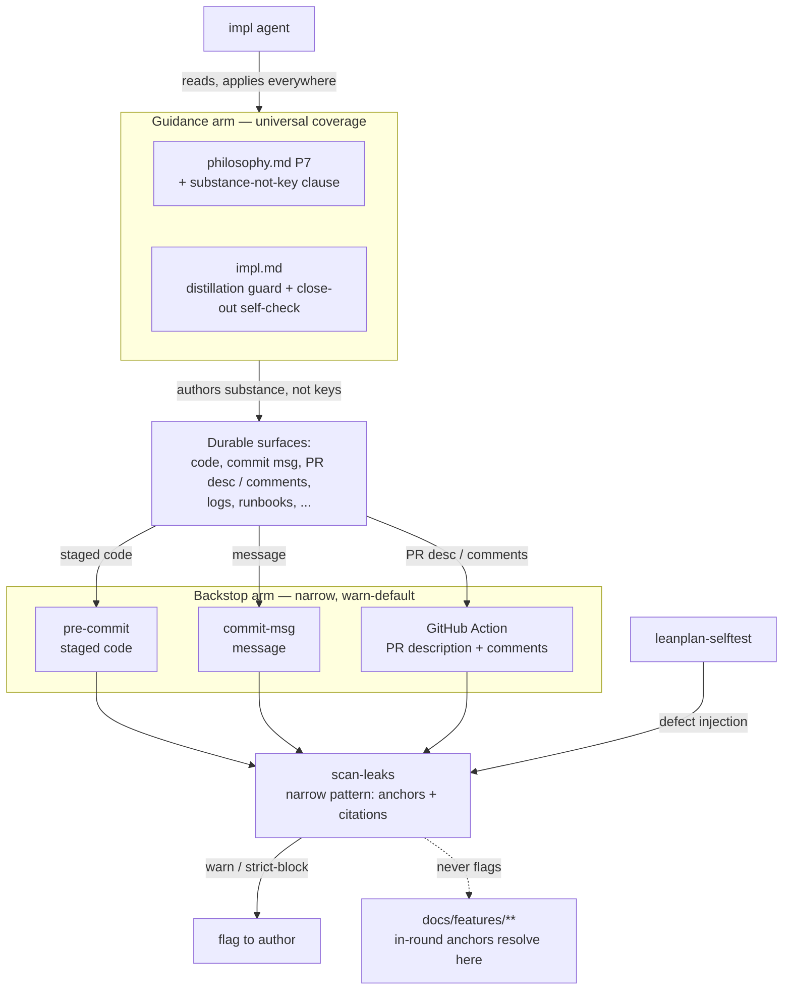

# 260620-round-scoped-key-leakage — DESIGN

## Architecture

Two arms realize `SPEC#INV-1-durable-artifacts-free-of-round-scoped-keys`, with the guidance arm also realizing `SPEC#O-1-durable-why-carries-substance-not-key`. The **guidance arm** (philosophy P7 + impl.md) is universal — it shapes the impl agent wherever it authors, so it reaches every durable surface, including logs, runbooks, and wikis the mechanical arm can't observe. The **backstop arm** is narrow — anchor tokens and cross-artifact citations only — and wires one shared detector (`scan-leaks`) into three surface-specific points: `pre-commit` and `commit-msg` locally (no CI needed), and a GitHub Action for PR descriptions and review comments, which local git hooks cannot see. Other durable surfaces are guidance-only by design. Warn by default; `LEANPLAN_STRICT` / CI blocks. `scan-leaks` never inspects `docs/features/**`, where round-scoped anchors legitimately resolve.

## Decision-1: guidance-carries-substance

Land the rule's substance in the guidance layer, the only arm that reaches every durable surface. Rationale at [design-rationale.md#Decision-1-guidance-carries-substance](design-rationale.md#Decision-1-guidance-carries-substance).

- **philosophy.md P7** — append a clause: migrate the *substance* of a WHY, not its round-local key. The key is round-scoped (cf. P6 transience) and dangles once the plan is discarded. Extends P7 rather than adding a 9th principle — the leak is a failure mode of "persist by migration," not a new axis.
- **impl.md distillation hierarchy** — add the guard: when promoting a WHY into any durable tier (commit / PR / inline comment / lint), carry the constraint in words, never the anchor or feature id.
- **impl.md close-out** — add a self-check step before commit: scan your own staged durable outputs for round-scoped tokens; replace any with substance.
- Realizes `SPEC#O-1-durable-why-carries-substance-not-key` and the guidance arm of `SPEC#INV-1-durable-artifacts-free-of-round-scoped-keys`.

## Decision-2: narrow-leak-detector

A shared detector, `scan-leaks` (sibling of `validate.py`), flags the high-precision token class only — round-scoped anchor tokens and cross-artifact citations — leaving feature ids and readable labels alone. Rationale at [design-rationale.md#Decision-2-narrow-leak-detector](design-rationale.md#Decision-2-narrow-leak-detector).

- **Detected** (two alternations):
  - Bare anchor tokens — `\b(O|INV|Decision|Delta)-\d+\b` (e.g. `INV-1`, `Decision-2`).
  - Cross-artifact citations — `\b(SPEC|DESIGN|TASK|RATIONALE|RESEARCH|UNDERSTANDING)#[A-Za-z0-9:_-]+` — the `:` covers `Task:`-style ids (e.g. `SPEC#INV-1-…`, `DESIGN#Decision-2-…`). REQUIREMENT is omitted: it carries no citable anchors, so it appears in neither `validate.py`'s citation kinds nor the contract.
- **Not detected** (narrow by construction, so the SPEC's allowed cases pass untouched) — feature-id forms (`NNNN-slug`, `YYMMDD-slug`, bare tracker keys), readable scope labels (`docs(<slug>)`), bare numbers. These do not match the pattern, so the grey zone needs no special-casing.
- **Inputs** — accepts both file paths and raw text (stdin / arg), so git hooks feed staged files and the Action feeds PR/comment text. The caller supplies what to scan; callers exclude `docs/features/**`.
- **Source of truth** — the token pattern is derived from the artifact-contract anchor vocabulary and kept in sync with it (as `validate.py`'s `SURFACE_SOFT_CAP` mirrors the contract).
- **Suppression** — an inline allow directive (e.g. `leanplan-allow-key`) escape-hatches the rare legitimate match; warn-mode absorbs the rest.
- **Severity** — clean / warn / (strict) error, mirroring `validate.py` exit codes.

## Decision-3: per-surface-backstop

Wire the detector into three surface-specific integration points; leave other durable surfaces to guidance. Rationale at [design-rationale.md#Decision-3-per-surface-backstop](design-rationale.md#Decision-3-per-surface-backstop).

- **pre-commit-leanplan** (extend) — after the existing feature-dir validation, run `scan-leaks` over staged files *not* under `docs/features/**`. Warn-default; `LEANPLAN_STRICT` blocks. Local, no CI required.
- **commit-msg hook** (new, ships with the hook bundle) — scan the message file. Gives local commit-message coverage without CI.
- **GitHub Action** (new workflow template) — on `pull_request`, scan PR title/body and the changed files / commit range; on `pull_request_review_comment` / `issue_comment`, scan the new comment. Warn = annotation / neutral check; strict = failing check on the PR description. PR comments are post-hoc, so they are detect-and-flag, not pre-blockable.
- **Coverage map** — committed code: pre-commit (+ Action); commit message: commit-msg (+ Action); PR description: Action (gateable); PR review comments: Action (flag-only). Logs, runbooks, wikis, and any other surface: **guidance-only**, an explicit accepted boundary.
- **Verification** — `scan-leaks` correctness is held by `leanplan-selftest` defect injection (a fixture leaking `INV-1` into a non-artifact file must be caught).
- Realizes the mechanical arm of `SPEC#INV-1-durable-artifacts-free-of-round-scoped-keys`.
