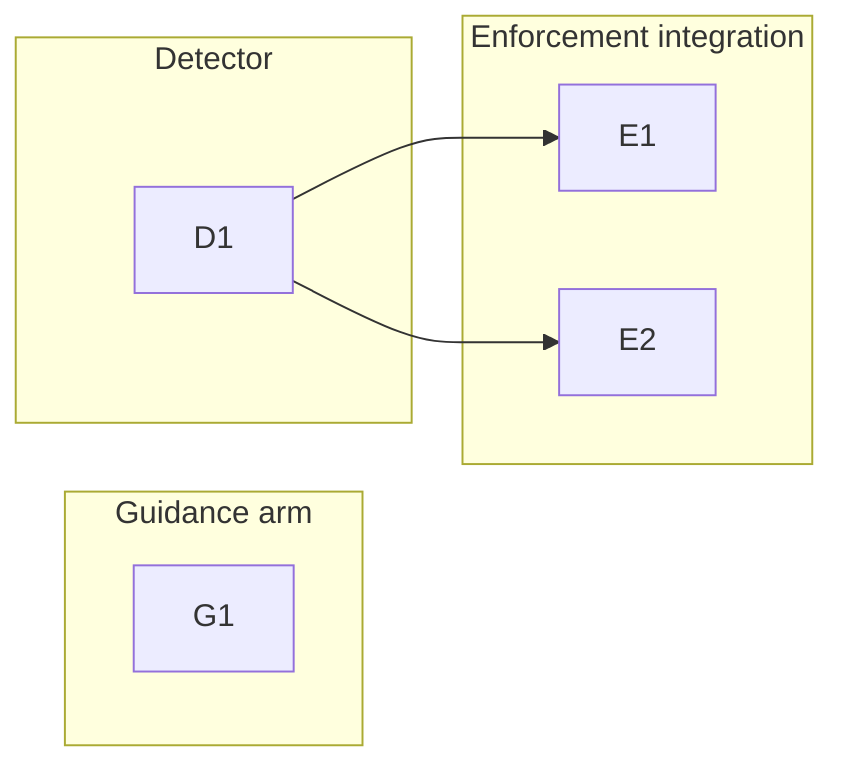

# 260620-round-scoped-key-leakage — Tasks

## Guidelines

- **Framework-source topology** — the work edits LeanPlan's own source in this repo (`references/`, `scripts/`); the *live* copies are at `~/.local/share/leanplan/`, a chezmoi-managed external clone of the repo's `main` that the hooks invoke by absolute path (see `scripts/README.md`). The whole repo is mirrored, so a new script reaches the canonical path simply by living in `scripts/`, going live after merge + `chezmoi update` — `install.sh` is the non-chezmoi *adapter* installer and delivers no scripts. Git hooks are enabled per-repo (symlink into `.git/hooks/`); the Action ships as a per-repo opt-in workflow template.
- **Branch** — land on a `feat/round-scoped-key-leakage` branch off the base; the planning docs currently sit on `feat/sparse-arrival-drawout`, so move them onto the feature branch before impl, to keep the two features unmixed.

## Dependency DAG

The guidance arm (G1) is independent — it ships as prose and covers every surface. The detector (D1) is the shared core the two integration cards (E1 local hooks, E2 PR-surface Action) build on.

## T: G1

- **Goal**: Land the rule's substance in the guidance layer so the impl agent carries the *substance* of a WHY — not its round-local key — onto every durable surface, per `Design#D-1-guidance-carries-substance`. Realizes `Spec#B-1-durable-why-carries-substance-not-key` and the guidance arm of `Spec#C-1-durable-artifacts-free-of-round-scoped-keys`. The exact placement (P7 clause, distillation-hierarchy guard, close-out self-check) is in the Decision; anchor in, don't restate.
- **Repo**: leanplan (`references/philosophy.md`, `references/impl.md`).
- **Completion**:
  - The guard and close-out self-check are present in `impl.md`, and the substance-not-key clause in `philosophy.md` P7 (review/presence check, readable in the docs).
  - One-shot observation per `Spec#B-1-durable-why-carries-substance-not-key`: a durable artifact produced under the new guidance (a commit body, inline comment, or PR note) states the constraint in words, with no `B-/C-/D-` token or feature id standing in for it.
- **Dependencies**: none.

## T: D1

- **Goal**: Build the narrow leak detector that flags round-scoped anchor tokens and cross-artifact citations in supplied files or text, per `Design#D-2-narrow-leak-detector`, and back it with defect-injection coverage so future changes can't silently regress it, per `Design#D-3-per-surface-backstop`. Realizes the detection core of `Spec#C-1-durable-artifacts-free-of-round-scoped-keys`. Token pattern, I/O, suppression, and exit-code shape live in the Decision; anchor in, don't restate.
- **Repo**: leanplan (`scripts/` — new detector; `scripts/leanplan-selftest`, `fixtures/`).
- **Completion**:
  - (a) a file/text containing `C-1` or `Spec#C-1-…` is flagged; (b) feature-id forms (`0004`, `260620-…`), readable scope labels (`docs(<slug>)`), and bare numbers are **not** flagged (narrow scope, per `Spec#C-1-durable-artifacts-free-of-round-scoped-keys` allowed cases); (c) the inline suppression directive silences a flagged line; (d) clean/warn/strict exit codes behave per the Decision.
  - `leanplan-selftest` catches a fixture that leaks `C-1` into a non-artifact file.
  - The detector is reachable at the install path the hooks will call (carried by `install.sh`).
- **Dependencies**: none.

## T: E1

- **Goal**: Bring committed code and commit messages under the mechanical backstop locally — extend `pre-commit-leanplan` to run the detector over staged files outside `docs/features/**`, and add a `commit-msg` hook for the message — per `Design#D-3-per-surface-backstop`. Realizes the local mechanical arm of `Spec#C-1-durable-artifacts-free-of-round-scoped-keys`.
- **Repo**: leanplan (`scripts/pre-commit-leanplan`; new `commit-msg` hook in `scripts/`).
- **Completion**:
  - (a) staging a code file containing `C-1` and committing emits a warning while the commit proceeds; (b) a commit message containing `Spec#C-1-…` emits a warning; (c) `LEANPLAN_STRICT=1` blocks both; (d) staged `docs/features/**` artifacts are not flagged (round-scoped anchors resolve there).
  - The pre-commit scan skips `docs/features/**` always, plus any repo-configured paths (LeanPlan excludes its own token-saturated framework dirs `scripts/`/`fixtures/`, which carry anchors as detector vocabulary and test data — a legitimate-match class, not a leak).
  - Both hooks install/ship per the framework-source-topology Guideline.
- **Dependencies**: D1 — lands the detector the hooks invoke.

## T: E2

- **Goal**: Cover the surfaces no local hook can see — add a GitHub Action workflow template that scans PR descriptions and review comments — per `Design#D-3-per-surface-backstop`. Realizes the PR-surface mechanical arm of `Spec#C-1-durable-artifacts-free-of-round-scoped-keys`.
- **Repo**: leanplan (new workflow template shipped for per-repo install; install wiring).
- **Completion**:
  - (a) a PR whose description contains `C-1` / `Spec#C-1-…` is flagged — warn as an annotation / neutral check, strict as a failing check on the description; (b) a review comment carrying a round-scoped key is detect-and-flagged (post-hoc, not pre-blocked); (c) `docs/features/**` content in the PR is not flagged.
  - Ships as an installable template (this repo runs no live CI; enabling it is a per-repo choice).
- **Dependencies**: D1 — reuses the same detector core.
