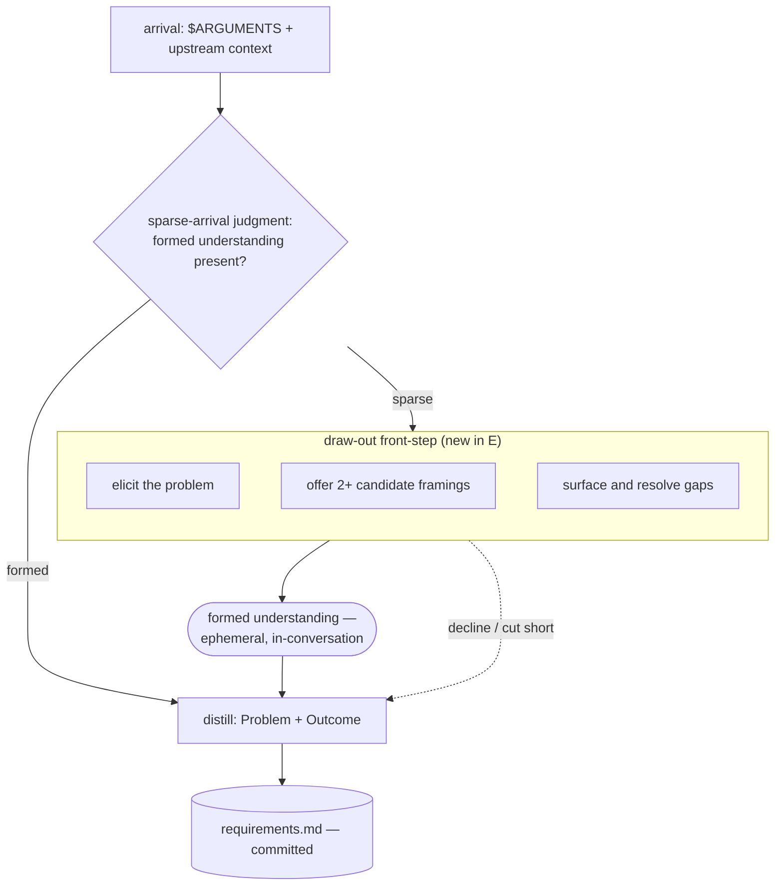

# 260620-sparse-arrival-drawout — Design

## Architecture

Control flow through the requirement stage with E's draw-out front-step. A sparse-arrival judgment routes a formed arrival straight to distillation and a sparse one through the draw-out (elicit / frame / surface); the understanding the draw-out forms is ephemeral and consumed by distillation, which remains the only writer of `requirements.md`. The dotted edge is the planner's exit to distillation at any point. The whole control flow lives in the shared `references/requirements.md`.

## D-1: drawout-as-requirement-front-step

Realize E as a load-bearing draw-out step at the front of the requirement procedure (`references/requirements.md`) — not a separate stage, skill, or off-pipeline move. Rationale: [design-rationale.md#D-1-drawout-as-requirement-front-step].

- **Trigger — a sparse-arrival judgment at entry.** Before distilling, the skill judges whether the arrival carries a formed problem understanding; only a *sparse* arrival enters the draw-out. Realizes `Spec#B-1-drawout-engages-on-sparse-arrival`. The judgment is qualitative (is there an articulable problem — who feels it, what's broken?), not a word-count metric: the framework's LLM-aware stance, and a mis-judgment is cheap because the planner can decline (below).
- **Content — elicit, frame, surface.** The step (a) elicits the problem, (b) presents two or more candidate framings for the planner to choose among, and (c) surfaces and resolves unclear details — via structured questions (the already-granted `AskUserQuestion` on Claude; the runtime-native equivalent on Codex). Realizes `Spec#B-2-candidate-framings-offered-for-choice` and `Spec#B-3-unclear-details-surfaced-before-distill`.
- **Opt-in — never gates.** The step offers; it never blocks. The planner can decline it or cut it short and proceed straight to distillation at any point, and a formed arrival skips it entirely (the trigger). Realizes `Spec#C-1-opt-in-never-forced`.
- **Placement — ahead of distill, not replacing it.** The step sits before the existing draft/confirm steps; distillation still owns turning the formed understanding into `Problem` + `Outcome`. It leaves the existing "confirm framing before writing" step intact — that confirms the *distilled* draft, whereas this forms the understanding upstream of it.
- **Scope — reference-only, no new surface.** The change lives in the shared `references/requirements.md` (inherited by both the Claude `requirements` adapter and the Codex dispatcher); no new skill, reference doc, artifact, or tool grant — `AskUserQuestion` is already granted in `adapters/claude/requirements/SKILL.md`. A matching self-check item and a guardrail are added alongside the step.
- **Boundary — delegates disturbances to `/sharpen`.** The step states its cold-start scope and hands the disturbance-to-a-formed-understanding case to the sibling move, closing the loop with the pointer that already exists in `references/sharpen.md` (Inputs). Mirrors the Spec Non-goal.

## D-2: ephemeral-understanding-no-artifact

The formed understanding stays ephemeral — it lives in the working conversation and is consumed directly by distillation in the same round; E writes no `understanding.md` and no new artifact. Rationale: [design-rationale.md#D-2-ephemeral-understanding-no-artifact].

- Realizes `Spec#C-2-drawout-forms-understanding-not-requirement`: the draw-out produces no committed artifact.
- Feeds `Spec#B-4-distill-consumes-formed-understanding`: distillation consumes the in-conversation understanding, and `requirements.md` is its durable distilled form. Distillation remains the sole writer of `requirements.md`.
