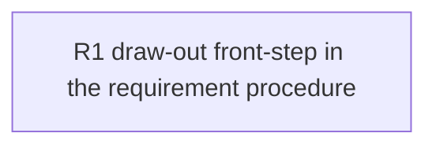

# 260620-sparse-arrival-drawout — TASK

## Guidelines

- **Base branch** `feat/sparse-arrival-drawout` (off `6a72858`); one deployment.
- **Dogfood the contract.** E edits LeanPlan's own framework docs; the new prose obeys the rules it ships — leanness, conclusion-first, One Prose Home, anchor-don't-restate (`artifact-contract.md`).
- **Runtime topology.** The running skills are the installed copies under `~/.local/share/leanplan/`, not this repo checkout. To exercise the draw-out live, install from here (or reinstall / chezmoi update); otherwise verify by inspection plus a manual dry-run.

## Dependency DAG

Single cohesive change to the shared requirement reference (with a one-line reverse pointer in the sharpen reference). One track, one task.

## Task: R1

- **Goal**: Strengthen the requirement procedure so a sparse arrival is reliably drawn out before distillation instead of distilled into a thin guess — add the load-bearing draw-out front-step to `references/requirement.md` per `DESIGN#Decision-1-drawout-as-requirement-front-step` (realizing `SPEC#O-1-drawout-engages-on-sparse-arrival`, `SPEC#O-2-candidate-framings-offered-for-choice`, `SPEC#O-3-unclear-details-surfaced-before-distill`, `SPEC#INV-1-opt-in-never-forced`). Place it ahead of the existing distill steps so the ephemeral understanding it forms feeds distillation while distillation stays the sole writer of `requirement.md` (`DESIGN#Decision-2-ephemeral-understanding-no-artifact`, `SPEC#O-4-distill-consumes-formed-understanding`, `SPEC#INV-2-drawout-forms-understanding-not-requirement`).
- **Repo**: leanplan (`references/requirement.md`; one-line reverse pointer in `references/sharpen.md`)
- **Completion**:
  - A sparse dry-run of the requirement stage engages elicitation — eliciting the problem, offering 2+ candidate framings, surfacing gaps — before any distillation (`SPEC#O-1-drawout-engages-on-sparse-arrival`, `SPEC#O-2-candidate-framings-offered-for-choice`, `SPEC#O-3-unclear-details-surfaced-before-distill`).
  - A formed arrival (already carrying a problem plus who-feels-it / what's-broken) proceeds straight to distillation with no forced draw-out, and at any point in a sparse draw-out the planner can decline and proceed (`SPEC#INV-1-opt-in-never-forced`).
  - After a draw-out, `git diff` shows the draw-out itself wrote no artifact; `requirement.md` appears only from the distill steps and reflects the elicited understanding, not the original sparse phrase (`SPEC#INV-2-drawout-forms-understanding-not-requirement`, `SPEC#O-4-distill-consumes-formed-understanding`).
  - The step states its cold-start scope and delegates a disturbance-to-a-formed-understanding to `/sharpen`; `references/sharpen.md`'s existing "requirement stage's concern" pointer (Inputs) names the new draw-out step, closing the seam both ways (`DESIGN#Decision-1-drawout-as-requirement-front-step`).
  - A matching self-check item and guardrail are added to `references/requirement.md`; the new prose is conclusion-first, lean, and anchors rather than restates (Guidelines: dogfood) — verified by inspection.
- **Dependencies**: none
