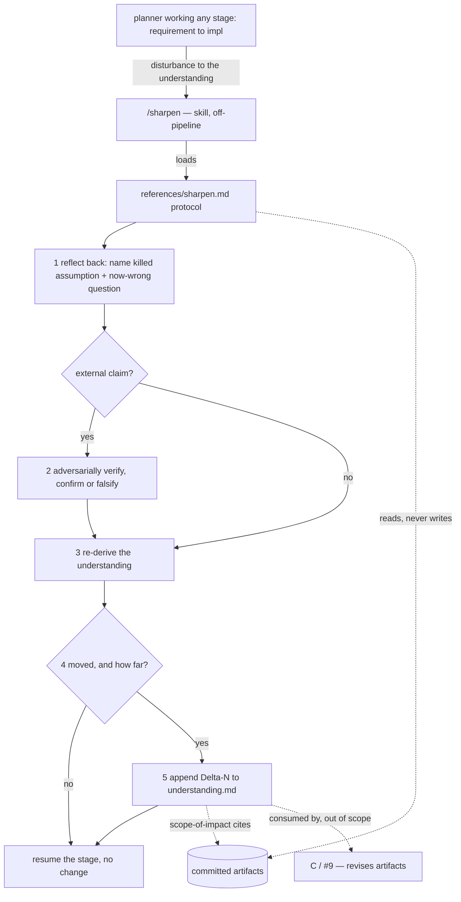

# 260620-understanding-sharpening — DESIGN

## Architecture

`/sharpen` is an off-pipeline skill: invoked mid-round, it runs a reflect → verify → re-derive protocol, reads the committed artifacts but never edits them, and logs an understanding delta that a later revision step (C, #9) consumes.

## Decision-1: sharpen-as-non-stage-skill

`/sharpen` is declared as a skill — a thin `adapters/claude/sharpen/SKILL.md` adapter over `references/sharpen.md` — invocable at any point in a round and sitting *off* the requirement→impl pipeline (a callable move, not a 6th stage). Being a skill is what enables mid-process pick-up. Realizes `SPEC#O-1-sharpen-invocable-mid-any-stage` and `SPEC#INV-3-opt-in-never-gates` (a skill is invoked, never a gate). See rationale at [design-rationale.md#Decision-1-sharpen-as-non-stage-skill].

- **Adapter:** `name: sharpen`; `argument-hint: "[what shifted | a claim to check]"`; `allowed-tools: Read, AskUserQuestion, WebSearch, WebFetch, Write, Bash(validate.py)` — but Write is used **only** for `understanding.md`; the skill never edits a committed surface artifact (`SPEC#INV-1`).
- **Registration:** add `sharpen` to `install.sh` `CLAUDE_SKILLS`; add a `sharpen` row to the Codex `## Dispatch` table; add the move to `leanplan.md` §12 as a non-pipeline skill (distinct from the five stage edges).

## Decision-2: understanding-delta-archive

The delta lands in a new feature-local **archive** `docs/features/<KEY>/understanding.md` — append-only, one `Delta-<N>: <slug>` block per delta, conclusion-first. Realizes `SPEC#O-4-understanding-delta-emitted` and `SPEC#INV-4-understanding-delta-durable`, and keeps the delta out of the committed surfaces (`SPEC#INV-1`). See rationale at [design-rationale.md#Decision-2-understanding-delta-archive].

- **Delta block** (inside each `Delta-<N>: <slug>`): a conclusion line (what the understanding now is) · the prior assumption it kills · why (the disturbance + verification verdict, if any) · scope-of-impact as bare citations to the committed work it bears on (`SPEC#O-…`, `DESIGN#Decision-…`, `TASK#Task:…` — whichever layers the change implicates) — no restatement.
- **Archive, not surface:** excluded from the Surface Budget; created only when a delta is actually emitted (a disturbance-free round has no `understanding.md`).
- Citation form: `UNDERSTANDING#Delta-<N>-<slug>`. Stable IDs; append, never renumber.

## Decision-3: reflect-verify-rederive-protocol

`references/sharpen.md` carries the move in five steps that map 1:1 to the SPEC: (1) reflect back the invalidated assumption + the now-wrong question (`SPEC#O-2-reflect-back-not-re-ask`); (2) if the disturbance is an external claim, treat it as a hypothesis and adversarially verify to a confirm/falsify verdict (`SPEC#O-3-injected-claim-verified-not-obeyed`); (3) re-derive the understanding; (4) decide whether it moved and how far — "no-op" is a legitimate close; (5) if moved, emit the `Delta-<N>` (`SPEC#O-4-understanding-delta-emitted`). The move reads artifacts to reflect against but never edits them (`SPEC#INV-1`) and returns control to the in-flight stage (`SPEC#INV-2-in-flight-stage-preserved`). See rationale at [design-rationale.md#Decision-3-reflect-verify-rederive-protocol].

## Decision-4: stage-docs-point-to-sharpen

Each stage reference doc (`requirement`/`specify`/`design`/`plan`/`impl.md`) gains a one-line pointer: a disturbance to the understanding is a sanctioned reason to invoke `/sharpen` (which won't touch your artifacts), rather than ignoring it or hand-rolling a fix. Trivial — it realizes the "from inside any stage, instead of ignoring" half of `SPEC#O-1-sharpen-invocable-mid-any-stage` by making the move discoverable where each stage runs.

- **Boundary:** this does **not** rewire `impl.md`'s existing Stop-The-Line / Artifact Update Loop. Those impl-only triggers are one disturbance *source* that may invoke `/sharpen` for the cognitive re-derivation; generalizing and reconciling impl's artifact-editing loop is C's (#9) territory, not B's.
