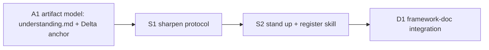

# 260620-understanding-sharpening — Tasks

## Guidelines

- **Base branch** `feat/problem-understanding` (off `eac584d`); one deployment.
- **Dogfood the contract.** B edits LeanPlan's own docs and skills; every new or edited doc obeys the rules it ships — leanness, conclusion-first, One Prose Home, anchor-don't-restate (`artifact-contract.md`).
- **Runtime topology.** The running skills are the installed copies under `~/.local/share/leanplan/`, not this worktree. To exercise `/sharpen` live, install from this worktree (or reinstall/chezmoi); otherwise verify by inspection plus a manual dry-run.

## Dependency DAG

Near-linear: the artifact model gives the protocol a delta home (A1→S1); the adapter lazy-loads the protocol (S1→S2); the docs point at the standing skill (S2→D1). Dependencies are enablers — re-evaluate at task entry.

## T: A1

- **Goal**: Land the delta's durable home in the artifact model — document `understanding.md` as a feature-local archive and `Delta-<N>: <slug>` as its anchor (`Design#D-2-understanding-delta-archive`), so an emitted delta has a legal, citable, durable place to live (`Spec#B-4-understanding-delta-emitted`, `Spec#C-4-understanding-delta-durable`).
- **Repo**: leanplan (`references/artifact-contract.md`)
- **Completion**:
  - `artifact-contract.md` lists `understanding.md` under Archive artifacts, `Delta-<N>: <slug>` under Anchors with citation form `Understanding#Delta-<N>-<slug>`, and a stage-ownership row for the understanding log.
  - A feature dir containing an `understanding.md` with a `Delta-1` block passes `validate.py` — the archive is legal and uncited-by-default, like `research.md`.
- **Dependencies**: none

## T: S1

- **Goal**: Write the move's protocol in `references/sharpen.md` (`Design#D-3-reflect-verify-rederive-protocol`) — the reflect → verify → re-derive → decide → emit sequence that *is* the sharpening move, including the two stances that keep it honest: adversarial claim-verification and a legitimate no-op.
- **Repo**: leanplan (`references/sharpen.md`)
- **Completion**:
  - The protocol specifies: (a) reflect back the invalidated assumption + now-wrong question (`Spec#B-2-reflect-back-not-re-ask`); (b) treat an external claim as a hypothesis and adversarially verify to a confirm/falsify verdict (`Spec#B-3-injected-claim-verified-not-obeyed`); (c) re-derive; (d) an explicit no-op close when nothing moved; (e) emit a `Delta-<N>` carrying what changed / why / killed assumption / scope-of-impact (`Spec#B-4-understanding-delta-emitted`).
  - It states the move reads committed artifacts but never edits them (`Spec#C-1-no-auto-mutation-of-committed-artifacts`) and returns control to the in-flight stage (`Spec#C-2-in-flight-stage-preserved`).
- **Dependencies**: A1 — the protocol writes into the `understanding.md` / `Delta-<N>` form A1 defines.

## T: S2

- **Goal**: Stand up and register `/sharpen` as an off-pipeline skill (`Design#D-1-sharpen-as-non-stage-skill`) — a thin Claude adapter over `references/sharpen.md`, wired into both runtimes — so the move can be picked up mid-round (`Spec#B-1-sharpen-invocable-mid-any-stage`).
- **Repo**: leanplan (`adapters/claude/sharpen/SKILL.md`, `adapters/codex/leanplan/SKILL.md`, `install.sh`)
- **Completion**:
  - `install.sh` includes `sharpen` in `CLAUDE_SKILLS`; the Codex `## Dispatch` table routes `sharpen` → `references/sharpen.md`.
  - Invoking `/sharpen` mid-round loads the protocol and engages within the current stage without gating it (`Spec#B-1-sharpen-invocable-mid-any-stage`, `Spec#C-3-opt-in-never-gates`).
  - After a `/sharpen` run, `git diff` shows changes confined to `understanding.md` — no committed surface artifact edited (`Spec#C-1-no-auto-mutation-of-committed-artifacts`).
- **Dependencies**: S1 — the adapter lazy-loads the protocol it stands up.

## T: D1

- **Goal**: Integrate the move across the framework docs so it is discoverable from inside any stage and the framework's own map stays truthful (`Design#D-4-stage-docs-point-to-sharpen`) — a one-line `/sharpen` pointer in each stage doc realizes the "from inside any stage, instead of ignoring" half of `Spec#B-1-sharpen-invocable-mid-any-stage`.
- **Repo**: leanplan (`references/{requirement,specify,design,plan,implementation}.md`, `framework-design.md`, `references/philosophy.md`)
- **Completion**:
  - Each of the five stage reference docs names `/sharpen` as the sanctioned response to a disturbance (which won't touch its artifacts), phrased as opt-in, never required (`Spec#B-1-sharpen-invocable-mid-any-stage`, `Spec#C-3-opt-in-never-gates`).
  - `framework-design.md` §12 lists `sharpen` as a non-pipeline skill, distinct from the five stage edges; `philosophy.md` companions note the new reference doc.
- **Dependencies**: S2 — the skill exists to point at.
