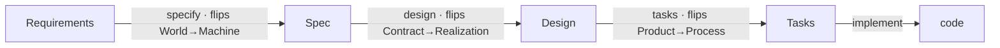

# 260621-derivable-orthogonality — Design

## Architecture

The finished system is the reworked stage model: **three faithful axes**, each the sole discriminator of one pipeline seam, so every boundary derives from the model. The pipeline traverses them one flip at a time.

**The three axes** (each cites a seminal model; each discriminates exactly one seam):

| Axis | What it splits | Seam it derives |
|---|---|---|
| **World ↔ Machine** (Jackson, *The World and the Machine*, ICSE 1995) | referent — the problem-world vs. our system (*not* techy/non-techy) | **REQ↔Spec** |
| **Contract ↔ Realization** | observable-outside vs. internal-inside (*not* abstraction/WHAT-HOW, which is a relative ladder) | **Spec↔Design** |
| **Product ↔ Process** (Osterweil, *Software Processes Are Software Too*) | the system vs. the work that builds it | **Design↔Tasks** |

The first two form a 2×2 over the Product side; **Product/Process** peels Tasks off it:

| | World | Machine |
|---|---|---|
| **Contract** | Requirements | Spec |
| **Realization** | *— World Design: out of software scope —* | Design |

**Reading the model:** an **artifact** is a *node* (a coordinate — a noun); a **stage** is an *edge* (one axis-flip — the activity/skill, a verb). The empty (World, Realization) cell — **World Design**, the non-software means to change the world ("offer a discount") — is a deliberate scope marker: LeanPlan does Machine design, not World design. Every artifact pair is distinguished by the axes between them (adjacent = 1 axis, the blurrable high-traffic seams; non-adjacent = 2–3, robustly distinct).

**Doc-change map.** The axis exposition is reworked in `framework-design.md` §2/§3; the complete naming scheme (below) becomes the rewritten §8; `artifact-contract.md`'s two seam guards get thin derivation-pointers; §6 gets the edge-anchor one-liner. No section renumbered; no stage role or content changed — only the model's self-description and the element labels.

## D-1: three-axes-world-machine-contract-realization-product-process

**State the model as three axes — World↔Machine × Contract↔Realization × Product↔Process — each the sole discriminator of one seam.** Realizes `Spec#B-1-req-spec-placement-derivable-from-model` and `Spec#B-2-design-task-placement-derivable-from-model`.

- The old 2-axis model (Abstraction × Biz/Tech) mislabeled two of these: "Biz/Tech" reached for **World↔Machine** (referent), and "Abstraction" conflated the **Contract↔Realization** (observable/internal) cut with a relative WHAT/HOW ladder. It also lacked **Product/Process**, so Tasks collided with Design.
- Each high-traffic seam now falls on exactly one axis (REQ↔Spec = World↔Machine; Design↔Tasks = Product/Process), and the robust Spec↔Design seam is Contract↔Realization. A reader places a fact, or catches a misplacement, by reasoning from the axis — no memorized side-rule.
- **Artifacts are nodes (coordinates); stages are edges (axis-flips).** "A stage is an axis-flip; an artifact is a coordinate." → `design-rationale.md#D-1`.
- The (World, Realization) cell is intentionally empty (**World Design**) — the scope marker that keeps the user's "give a candy" case correctly *out* of Requirements (it's World·Realization, not World·Contract).

## D-2: complete-vocabulary-naming-authority

**Adopt the complete ideal naming scheme — the authority a separate sweep will propagate (D-4).** Realizes `Spec#B-3-model-vocabulary-coherent-and-derivable`.

| Stage (edge·verb) | Artifact (node·noun) | File | Items (anchor) |
|---|---|---|---|
| `requirements` | Requirements | requirements.md | Outcome · Guarantee (prose) |
| `specify` | Spec | spec.md | Behavior `B-` · Constraint `C-` |
| `design` | Design | design.md | Decision `D-` |
| `tasks` | Tasks | tasks.md | Task `T:` |
| `implement` | (code) | — | — |

Archives: Rationale · Research · Understanding (`Delta-`). Axes as named in Architecture.

- **Naming rule (derivable):** a skill shares its artifact's root — a verb where one exists (`specify`→Spec, `design`→Design), the bare noun where none does (`requirements`, `tasks`). This makes every name follow from the model and retires the `plan`/Tasks/`tasks.md` triple.
- **Section names derive from the 2×2:** Requirements and Spec are both the **Contract** row, so each has an episodic + a continuous half, named by altitude — Outcome/Guarantee (World) vs. Behavior/Constraint (Machine). "Behavior" is the framework's own definition of Spec; this also kills the old same-name "Outcome on both" confusion.
- **`plan` is rejected as an artifact name:** it's the *activity* (LeanPlan *plans*; the whole spine is "the plan") — putting it on a node names the part after the whole — and it collides with agent plan-mode. `Tasks` (plural) also fixes the prior stage(TASK)/item(Task) name clash. → `design-rationale.md#D-2`.

## D-3: compose-edge-placement-with-one-prose-home

**"Re-anchor at the edge" places the bare anchor *pointer*, never restated prose.** Realizes `Spec#B-4-recall-and-dedup-compose`. One-line clarification at `framework-design.md` §6, cross-referencing `artifact-contract.md` → One Prose Home Per Fact. Why (trivial): a pointer is not a restatement, so the two rules were never in real conflict.

## D-4: lock-decisions-sweep-as-separate-effort

**L reworks only the model/authority docs (`framework-design.md` §2/§3/§8 + `artifact-contract.md` guards); the framework-wide rename is its own tracked effort.** Realizes `Spec#C-2-model-surface-not-inflated`. Triage (occurrence counts) shows the full scheme touches ~1,000 sites across every reference, shipped feature, fixture, `validate.py`, and adapter — bigger than L itself, tripping L's own "split the sweep if oversized" provision. So L ships the *decisions* (model + §8 authority); a dedicated effort propagates them atomically with full re-validation. L's own artifacts stayed in the prior vocab (validating as-shipped) until the #34 sweep migrated them. → `design-rationale.md#D-2`.

## Spec coverage

- `B-1`, `B-2` → D-1 (each seam = one axis).
- `B-3` → D-2 (the complete derivable scheme).
- `B-4` → D-3 (anchor pointer, not restated prose).
- `C-1-identity-and-traceability-preserved` → no Decision: only labels and the model's self-description change; every stage keeps its role and content; verified at task completion by the structural validator + diff.
- `C-2` → D-4 (model depth in the challenge-time archive; the costly rename is a separate, isolated effort — L's review surface stays lean).
