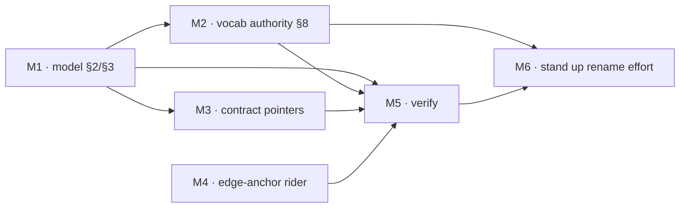

# 260621-derivable-orthogonality — TASK

## Guidelines

- **Edit in place; preserve identity.** Keep every anchor ID, `§N` number, stage role, and artifact content (`SPEC#INV-1-identity-and-traceability-preserved`); only the model's self-description and element labels change. Anchor set unchanged → revise-in-place, not re-derive.
- **Depth in the archive, pointers in the contract.** The axis exposition lives in `framework-design.md` (challenge-time); `artifact-contract.md` gets only thin derivation-pointers, never imported axis prose (`SPEC#INV-2-model-surface-not-inflated`).
- **L documents the new vocabulary; it does not apply it.** L writes the naming scheme into §8 as the authority and reworks the model, but L's own artifacts and the rest of the framework stay in today's vocab (`O-`/`INV-`/`Decision-`/`Task:`/`plan.md`) so everything validates now. Propagating the scheme is M6's separate effort (`DESIGN#Decision-4-lock-decisions-sweep-as-separate-effort`).

## DAG

One track (framework-doc rework). M1 lands the model; M2 writes the naming authority; M3 makes the always-loaded guards cite the model; M4 is the independent rider; M5 verifies the Invariants; M6 hands the costly rename off as its own effort.

## Task: M1

- **Goal**: Make the high-traffic seams derive from the model — rework `framework-design.md` §2/§3 to the three-axis model per `DESIGN#Decision-1-three-axes-world-machine-contract-realization-product-process`: World↔Machine derives REQ↔SPEC (`SPEC#O-1-req-spec-placement-derivable-from-model`), Product↔Process derives DESIGN↔TASK (`SPEC#O-2-design-task-placement-derivable-from-model`), Contract↔Realization the robust SPEC↔DESIGN; with artifacts framed as nodes / stages as edges, and the empty World Design cell as scope marker. Re-derive prose against the current §2/§3 at edit time.
- **Repo**: leanplan (worktree `leanplan-do`)
- **Completion**:
  - A planted REQ↔SPEC misplacement (a candy-like World·Realization line, or an observable predicate in Requirements) is caught and rehomed by reasoning from the World↔Machine / Contract↔Realization axes alone (`SPEC#O-1-req-spec-placement-derivable-from-model`).
  - A planted DESIGN↔TASK misplacement (a finished-system shape in a task card) is caught via the Product↔Process axis (`SPEC#O-2-design-task-placement-derivable-from-model`).
  - No `§N` cross-ref renumbered; no anchor renamed (`SPEC#INV-1-identity-and-traceability-preserved`).
- **Dependencies**: none

## Task: M2

- **Goal**: Establish the naming authority — rewrite `framework-design.md` §8 to the complete scheme per `DESIGN#Decision-2-complete-vocabulary-naming-authority` (the artifact / edge / item / anchor table, the "skill shares its artifact's root" rule, the section-name derivation from the 2×2, and World Design), so every element's name follows from the model (`SPEC#O-3-model-vocabulary-coherent-and-derivable`). Write the scheme as the target the separate rename (M6) rolls out; do not apply it elsewhere.
- **Repo**: leanplan (worktree `leanplan-do`)
- **Completion**:
  - Each element in §8 is name-predictable from the axes via the stated rule and denotes exactly one element — no element with several names (`SPEC#O-3-model-vocabulary-coherent-and-derivable`).
  - §8 marks the scheme as the authority the separate rename effort propagates (cross-ref to M6), and L's own artifacts remain in today's vocab.
- **Dependencies**: M1 lands the axes the scheme cites.

## Task: M3

- **Goal**: Make the always-loaded contract's two seam guards read as derived — add thin derivation-pointers in `artifact-contract.md` per `DESIGN#Decision-1-three-axes-world-machine-contract-realization-product-process`: the One-Prose-Home altitude split gains a "(World↔Machine cut)" pointer and the Drift-Guards DESIGN↔TASK rule a "(Product↔Process cut)" pointer, each to `framework-design.md` §2. Pointers only — no axis prose imported (`SPEC#INV-2-model-surface-not-inflated`) — so the guards deciding `SPEC#O-1-req-spec-placement-derivable-from-model` / `SPEC#O-2-design-task-placement-derivable-from-model` cite the model rather than standing alone.
- **Repo**: leanplan (worktree `leanplan-do`)
- **Completion**:
  - Each guard carries a one-clause pointer a reader can follow to the deriving axis (`SPEC#O-1-req-spec-placement-derivable-from-model`, `SPEC#O-2-design-task-placement-derivable-from-model`).
  - The edit adds pointers only: net prose-line delta on the touched guards is ~nil (`SPEC#INV-2-model-surface-not-inflated`).
- **Dependencies**: M1.

## Task: M4

- **Goal**: Resolve the recall-vs-dedup contradiction — clarify `framework-design.md` §6's edge-placement bullet so "re-anchor at the edge" places the bare anchor pointer, never restated prose, cross-referencing `artifact-contract.md` → One Prose Home Per Fact, per `DESIGN#Decision-3-compose-edge-placement-with-one-prose-home` (`SPEC#O-4-recall-and-dedup-compose`).
- **Repo**: leanplan (worktree `leanplan-do`)
- **Completion**:
  - §6's edge-placement rule and One-Prose-Home read together as one instruction with no residual contradiction (`SPEC#O-4-recall-and-dedup-compose`).
- **Dependencies**: none — independent of the axis rework.

## Task: M5

- **Goal**: Confirm only labels and the model's self-description changed — verify identity + traceability (`SPEC#INV-1-identity-and-traceability-preserved`) and non-inflation (`SPEC#INV-2-model-surface-not-inflated`) across M1–M4 by running the structural checks and inspecting the diff.
- **Repo**: leanplan (worktree `leanplan-do`)
- **Completion**:
  - `validate.py` passes on fixtures + existing `docs/features/*`; `leanplan-selftest` and `scan-leaks` clean — no anchor renamed, no `§N` renumbered, all citations + `(context-engineering: <slug>)` hooks resolve (`SPEC#INV-1-identity-and-traceability-preserved`).
  - Diff inspection: every stage keeps its role and content; only self-description and labels changed (`SPEC#INV-1-identity-and-traceability-preserved`).
  - `framework-design.md` carries the axis depth in the challenge-time archive while `artifact-contract.md`'s net prose delta is ~nil — no added review surface (`SPEC#INV-2-model-surface-not-inflated`).
- **Dependencies**: M1, M2, M3, M4.

## Task: M6

- **Goal**: Hand the costly rename off as its own tracked effort per `DESIGN#Decision-4-lock-decisions-sweep-as-separate-effort` — open a tracking issue that names `framework-design.md` §8 as the naming authority and scopes the ~1,000-site sweep (artifacts, edges, items, anchors, `validate.py`, fixtures, adapters, every shipped feature), so L's lean review surface isn't buried under it (`SPEC#INV-2-model-surface-not-inflated`) while the scheme still propagates framework-wide (`SPEC#O-3-model-vocabulary-coherent-and-derivable`).
- **Repo**: leanplan (worktree `leanplan-do`)
- **Completion**:
  - A tracking issue exists, cites §8 as the authority, and scopes the sweep with its occurrence counts; L closes without executing the rename (`SPEC#INV-2-model-surface-not-inflated`).
- **Dependencies**: M2, M5.
