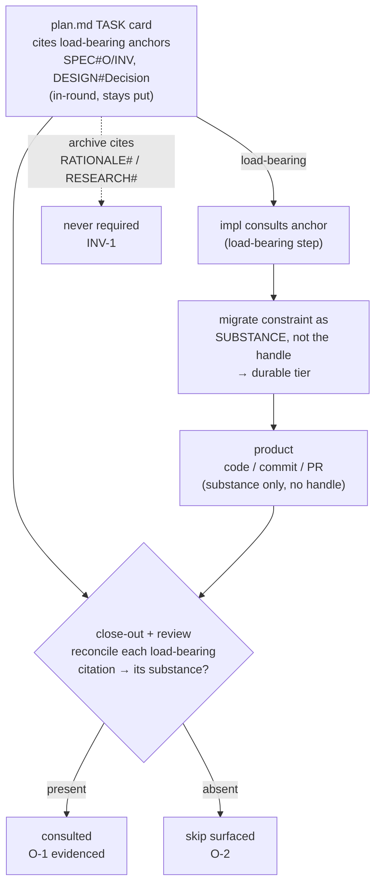

# 260621-jit-load-guarantee — DESIGN

## Architecture

The guarantee rides the existing impl→product distillation path; it adds no channel. A task's load-bearing citations (`SPEC#O/INV`, `DESIGN#Decision`) are already enumerated in its plan card and stay there, in-round. Implementation consults each and migrates its constraint into the product as **substance, never the handle** — the rule that already governs durable-tier promotion (`impl-closeout.md`). Close-out and review then reconcile the card's load-bearing citations against the substance that landed: a citation with substance present is consulted; one with none is a surfaced skip. The handles are read in-round (plan.md, still live at review); the product carries substance only, so no round-local identifier leaks into permanent history. Archive citations (`RATIONALE#`, `RESEARCH#`) never enter the reconciliation, so the surface stays untouched (`SPEC#INV-2-surface-no-less-lean`).

## Decisions

### Decision-1: mandatory-substance-distillation
The consultation signal is the distilled **substance** of the cited constraint in the product, not a new marker — realizing `SPEC#O-1-load-bearing-consultation-observable`. M makes the existing "substance, not the key" distillation (`impl-closeout.md`) mandatory and load-bearing for the load-bearing citation class, closing the gap where anchor consultation is described "as needed" yet is the lone major impl step absent from the "don't skip" set.

- **Realization.** In `impl.md`, the "JIT-load anchors" step joins the load-bearing ("don't skip or reorder") set, scoped to a task's `SPEC#O/INV` + `DESIGN#Decision` citations. Each such citation the task acts on must carry its constraint into the strongest available durable tier (the `impl-closeout.md` hierarchy), in words.
- **Leak-free by construction.** Substance — the reason in words — cannot be produced without consulting the anchor; a handle can be copied blind. The rule that forbids the handle is the rule that makes the proof load-bearing. See `RATIONALE#Decision-1-mandatory-substance-distillation`.

### Decision-2: in-round-reconciliation
A skip is surfaced by reconciling the task's load-bearing citations against the substance that landed — at close-out (self-check) and on the review path — never by a product-side marker and never by a new artifact. This realizes `SPEC#O-2-skipped-needed-load-surfaceable`.

- **Realization.** Add a close-out reconciliation step (`impl.md` close-out / `impl-closeout.md`) and a review-path check: for each `SPEC#O/INV` + `DESIGN#Decision` the task card cites, confirm its constraint's substance appears in the delivered work. A cited load-bearing anchor with no corresponding substance is the surfaced skip.
- **No product marker.** A `Consulted: SPEC#…` trailer in a commit or PR would stamp a round-local handle into permanent history — the leak Decision-1 avoids. The reconciliation reads the handles in-round (plan.md, live at review) and checks only substance in the product.
- **No new artifact.** The plan card already enumerates the load-bearing citations; a separate ledger would duplicate them. The floor is the enumerable obligation (derivable from the card) plus a judgment discharge (is the substance present?). See `RATIONALE#Decision-2-in-round-reconciliation`.

### Decision-3: scope-by-citation-prefix
The reconciliation fires only on the load-bearing prefix — `SPEC#O`, `SPEC#INV`, `DESIGN#Decision` — and never on `RATIONALE#` / `RESEARCH#`, realizing `SPEC#INV-1-archive-citation-never-force-loaded` by construction with no new tag.

- **Realization.** The obligation set is exactly the citations matching `SPEC#(O|INV)-…` or `DESIGN#Decision-…` — the discriminator already first-class in the citation grammar and in `validate.py`'s `_task_has_reason`. `DESIGN#Decision-N` is load-bearing while `RATIONALE#Decision-N` is archive: same target, different prefix, so the check keys on the `SPEC`/`DESIGN` file prefix, never the bare target kind. See `RATIONALE#Decision-3-scope-by-citation-prefix`.

## Non-goals
- **No validator gate on substance-presence.** `validate.py` reads artifacts, not code or commits, and cannot judge whether migrated substance is genuine. Reconciliation is close-out + review tier — the same side as conclusion-first and declarative-tense, which the framework already leaves to review because they resist reliable regex. The validator may, as an aid, *list* a card's load-bearing citations as the obligation set: a lister, not a gate.
- **No new artifact, no surface prose, no product-side identifier** — the three boundaries Decisions 1–3 hold, keeping `SPEC#INV-2-surface-no-less-lean`.
