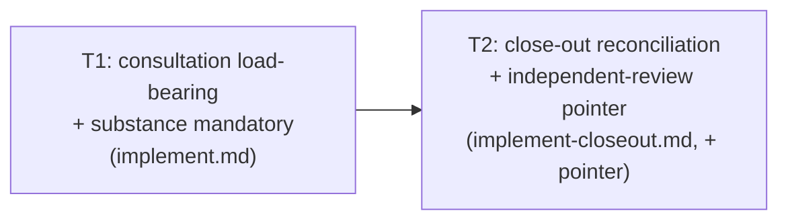

# 260621-jit-load-guarantee — Tasks

## Guidelines

- **Stay off the user review surface** (`Spec#C-2-surface-no-less-lean`). Every edit lands in framework references (`implement.md`, `implement-closeout.md`, and at most a one-line review-facing pointer) — never in a feature's `requirements` / `spec` / `design` / `tasks`. Add no new artifact kind, and write no round-local handle (`B-N` / `D-N` / `Spec#…`) into product code, commits, or PRs — the "substance, not the key" rule the feature itself enforces.
- **Re-derive against current reference text at task entry.** These references may have shifted since planning; confirm the current step list and close-out structure before editing rather than following a remembered layout.

## DAG

One mechanism in two lands: T1 makes the needed load happen and leave substance; T2 makes a skipped load surfaceable against that substance. T2 builds on T1 but its dependency is an enabler, not a gate.

## T: T1
- **Goal**: Make consulting a load-bearing citation a non-skippable part of implementation, and require its constraint to land in the product as substance — realizing `Spec#B-1-load-bearing-consultation-observable` via `Design#D-1-mandatory-substance-distillation`. In `implement.md`, the JIT-load-anchors step joins the load-bearing ("don't skip or reorder") set, scoped to a task's load-bearing citations; each such citation acted on must migrate its constraint into the strongest durable tier. Anchor — don't restate: the tier hierarchy and the "substance, not the key" rule already live in `implement-closeout.md`; point to them.
- **Repo**: leanplan (worktree `leanplan-jit`, branch `feat/jit-load-guarantee`) — `references/implement.md`.
- **Completion**: Observable by reading `implement.md` — anchor consultation is in the load-bearing step set (no longer the lone major step outside it) and names its `Spec#B/C` + `Design#D` scope; the substance-migration obligation is stated and points to `implement-closeout.md`. `validate.py` passes.
- **Dependencies**: none.

## T: T2
- **Goal**: Add the close-out reconciliation that surfaces a skipped needed-load, and make it runnable by an *independent* reviewer rather than only the agent that did the work — realizing `Spec#B-2-skipped-needed-load-surfaceable` and `Spec#C-1-archive-citation-never-force-loaded` via `Design#D-2-in-round-reconciliation` and `Design#D-3-scope-by-citation-prefix`. In `implement-closeout.md`, add a reconciliation: from the task card's load-bearing citations (the `Spec`/`Design`-prefix class — `Rationale#` / `Research#` are never included), confirm each one's substance landed in the delivered work; a load-bearing citation with no substance is the surfaced skip. Frame it to run at close-out (implementation self-check) and to re-run at review. Add a one-line review-facing pointer where the review surface is described so a reviewer runs the same reconciliation — closing the self-checking agent's own blind spot.
- **Repo**: leanplan (worktree `leanplan-jit`) — `references/implement-closeout.md`, plus a one-line pointer in the review-surface description (`references/artifact-contract.md` or `framework-design.md`).
- **Completion**: Verified by the Spec's one-shot tests. A task citing a load-bearing anchor whose constraint never landed as substance is flagged by the reconciliation (`Spec#B-2-skipped-needed-load-surfaceable`); an archive citation acted on without loading is never flagged (`Spec#C-1-archive-citation-never-force-loaded`); the user review surface is unchanged and no round-local handle entered the product (`Spec#C-2-surface-no-less-lean`). A reviewer-facing pointer to the reconciliation exists. `validate.py` passes.
- **Dependencies**: T1 (the reconciliation checks for the substance T1 makes mandatory) — enabler.
