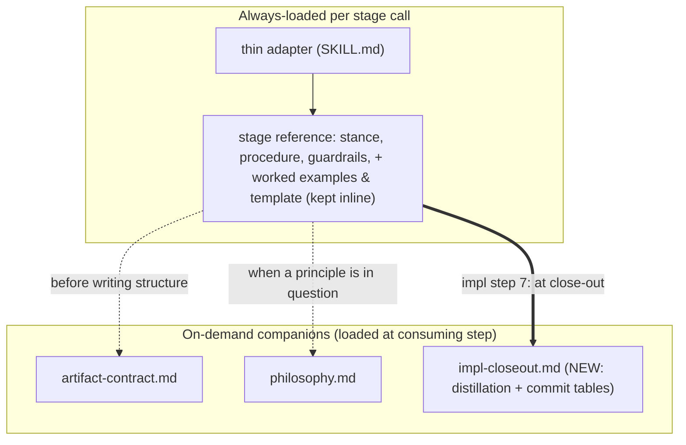

# 260621-reflexive-surface-budget — Design

## Architecture

The always-loaded hot path gains a within-reference second tier: step-scoped reference detail moves to an on-demand companion, reusing the framework's existing "load X at <trigger>" idiom. The one clear application is impl.md's three close-out tables.

Caption: the existing tiering — adapter + reference always-loaded, shared companions on-demand — is unchanged. The new edge is the bold one: impl.md's close-out tables become `impl-closeout.md`, loaded by a pointer at impl procedure step 7. Worked examples and templates stay inline (no reliable procedural trigger). Realizes `Spec#B-2-deferred-content-not-always-loaded` and `Spec#C-1-deferral-preserves-guidance`.

## D-1: tier-by-procedural-trigger

Within-reference content defers to an on-demand companion **iff** (a) it is consumed only at a later step **and** (b) that step is an explicit procedure step that can carry the load-trigger; otherwise it stays inline. Stance, procedure, and guardrails are always-needed and stay. Worked examples and templates are step-scoped (author-time) but fail (b) — no procedure step gates them, so deferring risks the agent silently skipping the calibration (`Spec#C-1-deferral-preserves-guidance`), so they stay inline, justified. The mechanism is the framework's existing on-demand-pointer idiom, not a new tier format. See rationale at [design-rationale.md#D-1-tier-by-procedural-trigger].

## D-2: defer-impl-closeout-tables

Move impl.md's three close-out tables — Distillation Hierarchy, Commit-message-vs-inline-comment, Squash-durability-promotion (impl.md ~L63–97, ~35 lines / 33%) — verbatim into a new `references/impl-closeout.md`. They are consumed only at close-out (procedure steps 7–8, 10), and impl is the scarcest-window stage (it also holds current code + JIT-loaded anchors + the card), so trimming them has the highest marginal value of any reference. Realization:

- impl.md procedure step 7 changes from "per the hierarchy below" to a load-pointer citing the absolute runtime path `~/.local/share/leanplan/references/impl-closeout.md` (CE: jit-loading). One load at step 7 serves steps 8 and 10 (all close-out). The *instruction* to distill stays inline; only the lookup tables defer.
- The adapter is unchanged — the step-7 pointer is the sole, sufficient load-trigger.
- Deployment: the companion is a new `references/*.md`; it rides the existing whole-repo clone into `~/.local/share/leanplan/` (`chezmoi update` / `git pull`) — no `install.sh` or chezmoi-config change (install.sh symlinks adapters only; references come from the repo clone).

impl.md drops 106 → ~71 always-loaded lines. Realizes `Spec#B-2-deferred-content-not-always-loaded`; the step-7 pointer is the resolvable load-point for `Spec#C-1-deferral-preserves-guidance`. See rationale at [design-rationale.md#D-2-defer-impl-closeout-tables].

## D-3: record-verdicts-type-level

Record the audit verdicts at content-type level in this feature's `design-rationale.md` — the rubric plus a per-reference audit summary — not as a per-block table, which would be the stale-prone "new drift surface" the audit exists to avoid. Deferred blocks self-evidence via their in-reference load-pointer; obvious keeps (stance/procedure/guardrails) need no record. A brief durable principle is added to `artifact-contract.md`'s Surface Budget section — the section that caps user artifacts but was silent on the framework's own references — stating the references follow the same tiering discipline. Advisory and on-demand, not a new enforcement gate (per `Spec` Non-goals). Realizes `Spec#B-1-hot-path-fully-adjudicated`. See rationale at [design-rationale.md#D-3-record-verdicts-type-level].
