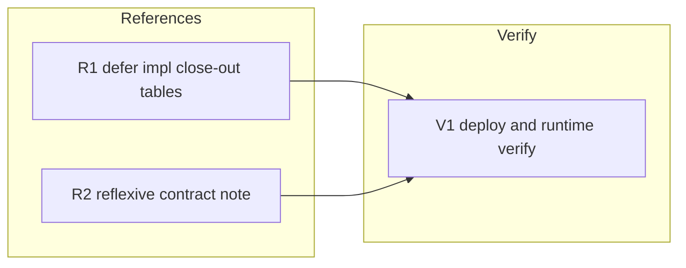

# 260621-reflexive-surface-budget — TASK

## Guidelines

- **Branch & delivery.** Work on `feat/reflexive-surface-budget` (worktree `leanplan-I`, off `main`); deliver as one bundled PR closing #25.
- **Edit the worktree source, not the runtime.** Reference edits land in this repo's `references/`; the runtime `~/.local/share/leanplan/` is a separate whole-repo clone that updates only via a post-merge pull (V1). Don't expect the running session to reflect edits until then.
- **You are editing the framework's own references.** Verify each change against the worktree source files (runtime was stale vs source for impl.md/design.md), not against the reference loaded into this session.

## DAG

Caption: track R edits the framework's reference sources (independent, parallel); track V deploys and proves the deferral end-to-end at runtime.

## Task: R1

- **Goal**: Defer impl.md's three close-out tables to an on-demand companion (`SPEC#O-2-deferred-content-not-always-loaded`) — per `DESIGN#Decision-2-defer-impl-closeout-tables`: move them verbatim into a new `references/impl-closeout.md` and repoint impl.md procedure step 7 to load the companion at close-out, which lays the resolvable load-point for `SPEC#INV-1-deferral-preserves-guidance`. The distill *instruction* stays inline; only the lookup tables move.
- **Repo**: leanplan — `references/impl.md`, new `references/impl-closeout.md`.
- **Completion**:
  - `references/impl-closeout.md` holds the three tables (Distillation Hierarchy, Commit-message-vs-inline-comment, Squash-durability-promotion) verbatim.
  - impl.md no longer contains them (prose drops ~106 → ~71 lines) and its step 7 cites the companion's absolute runtime path with a JIT trigger — realizing `SPEC#O-2-deferred-content-not-always-loaded` and the structural load-point for `SPEC#INV-1-deferral-preserves-guidance`.
  - `validate.py` passes; no dangling intra-doc reference left in impl.md (steps 8 and 10 still cohere against the moved tables).
- **Dependencies**: none.

## Task: R2

- **Goal**: Close the reflexive gap in the contract doc itself (`SPEC#O-1-hot-path-fully-adjudicated`) — per `DESIGN#Decision-3-record-verdicts-type-level`: add a brief advisory principle to `artifact-contract.md`'s Surface Budget section stating the framework's own stage references follow the same surface/tier discipline.
- **Repo**: leanplan — `references/artifact-contract.md`.
- **Completion**:
  - The Surface Budget section carries a 1–2 sentence note acknowledging the references' tiering discipline (always-loaded = stance/procedure/guardrails + author-time calibration; step-scoped detail defers on-demand), framed advisory — not a new enforcement gate (`SPEC` Non-goal) — partially realizing `SPEC#O-1-hot-path-fully-adjudicated`.
  - `validate.py` passes; artifact-contract.md is an on-demand companion, so the note adds no always-loaded-surface lines.
- **Dependencies**: none.

## Task: V1

- **Goal**: Prove the deferral end-to-end and the audit's completeness (`SPEC#INV-1-deferral-preserves-guidance`, `SPEC#O-1-hot-path-fully-adjudicated`) — deploy to the runtime clone and smoke-test that the deferred content reaches its consuming step. The deploy is a post-merge runtime pull (whole-repo clone, no install/config change — `DESIGN#Decision-2-defer-impl-closeout-tables`).
- **Repo**: runtime `~/.local/share/leanplan` (post-merge `chezmoi update` / `git pull`).
- **Completion**:
  - After deploy, `~/.local/share/leanplan/references/impl-closeout.md` exists, impl.md step 7's cited path resolves, and loading it yields the three tables — `SPEC#INV-1-deferral-preserves-guidance` at runtime.
  - A one-shot read of the hot path (all five stage references) confirms every always-resident block maps to a recorded verdict in `design-rationale.md`'s audit summary and impl.md's defer is realized — no un-adjudicated always-resident block remains (`SPEC#O-1-hot-path-fully-adjudicated`).
- **Dependencies**: R1 (companion + step-7 pointer must exist), R2 (bundle the full audit).

## Hand-off

For each independently startable task: `/impl 260621-reflexive-surface-budget <task-id>`. R1 and R2 start in parallel; V1 follows both.
