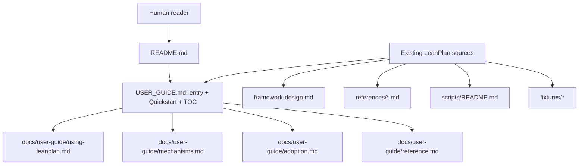

# 260622-human-user-manual — Design

## Architecture

The public documentation path starts in `README.md`, then sends human readers to `USER_GUIDE.md` — the single front door (entry orientation, Quickstart, and a depth-routed table of contents). Deeper material lives in focused, independently-loadable pages under `docs/user-guide/`, while existing framework and agent-facing sources remain the material the guide explains.

## Decisions

### D-1: top-level-user-guide
Make `USER_GUIDE.md` the single top-level human-facing front door — entry orientation, the Quickstart first-use path, and a depth-routed table of contents — and place the deeper material in focused, independently-loadable pages under `docs/user-guide/`. This satisfies Spec#B-1-first-run-path, Spec#B-2-end-to-end-workflow-guide, Spec#B-5-lookup-reference, and Spec#C-1-progressive-disclosure. Revised from a single-file guide per Understanding#Delta-1-multi-file-guide-suite.

- `USER_GUIDE.md` carries entry orientation, the Quickstart shortest complete first-use path, and a "read only as deep as you need" TOC linking onward.
- `docs/user-guide/using-leanplan.md` explains the full workflow, user decisions, artifact responsibilities, off-pipeline moves, and review posture.
- `docs/user-guide/mechanisms.md` explains the LeanPlan-specific mechanisms.
- `docs/user-guide/adoption.md` carries adoption guidance.
- `docs/user-guide/reference.md` gives lookup tables for commands, artifact shapes, stage transitions, validation modes, and troubleshooting cues.
- Rationale: DesignRationale#D-1-top-level-user-guide.

### D-2: readme-entry-point
Keep `README.md` concise and make it the entry point to the human manual instead of duplicating the manual. This satisfies Spec#B-1-first-run-path and Spec#B-4-adoption-guidance.

- The README keeps its install, layout, and quick command snippets.
- The README adds a clearly visible pointer to `USER_GUIDE.md` for learning the workflow.
- The README continues pointing to `framework-design.md` for canonical framework internals.

### D-3: source-boundary-map
Treat `USER_GUIDE.md` as explanatory user documentation, not as a replacement for agent-facing references. This satisfies Spec#B-6-existing-concept-alignment, Spec#C-3-non-canonical-agent-instructions, and Spec#C-4-no-framework-behavior-change.

- The guide uses existing LeanPlan terms: Requirements, Spec, Design, Tasks, implementation, sharpen, revise, validation, surface artifacts, archive artifacts, and traceability.
- Agent procedure remains owned by `references/*.md` and runtime adapters.
- Framework rationale remains owned by `framework-design.md` and `references/philosophy.md`.
- The guide links to canonical sources when a reader needs deeper internals, but explains the user-facing meaning in place.
- Rationale: DesignRationale#D-3-source-boundary-map.

### D-4: mechanism-explanation-pattern
Explain LeanPlan-specific mechanisms through a repeated reader-facing pattern: what the user sees, why LeanPlan does it, how to work with it, and when to challenge it. This satisfies Spec#B-3-mechanism-explanations and Spec#C-2-mechanism-transparency.

- Apply the pattern to brevity controls, one prose home per fact, stage ownership, surface/archive layering, traceability, validation, sharpen/revise, and stop-the-line moments.
- The brevity explanation states that LeanPlan uses surface budgets, artifact ownership, citation instead of restatement, archive layering, and validation guardrails; strict validation can harden advisory limits, but brevity is not only a length cut.
- Each mechanism section names the user action it affects, so the reader can intervene rather than treating the behavior as hidden agent preference.
- Rationale: DesignRationale#D-4-mechanism-explanation-pattern.

### D-5: adoption-section
Provide adoption guidance on its own page (`docs/user-guide/adoption.md`) that frames when LeanPlan fits, how to choose a first project, and how teams can introduce it gradually. This satisfies Spec#B-4-adoption-guidance. Page placement revised per Understanding#Delta-1-multi-file-guide-suite.

- The fit guidance presents LeanPlan as one-deployment-sized feature planning.
- The first-project guidance favors bounded features with visible review value.
- The gradual-adoption guidance covers using the framework for planning only before adopting implementation-stage discipline.

### D-6: reference-appendix
Provide a compact reference page (`docs/user-guide/reference.md`) for commands, artifacts, transitions, review checks, validation flags, and common failure signals. This satisfies Spec#B-5-lookup-reference and Spec#B-6-existing-concept-alignment. Moved from an in-`USER_GUIDE.md` appendix per Understanding#Delta-1-multi-file-guide-suite.

- Commands list the Codex and Claude forms where both matter.
- Artifact tables preserve LeanPlan vocabulary and ownership boundaries.
- Failure signals point readers toward sharpen, revise, validation, or feature splitting without turning the reference into agent procedure.
