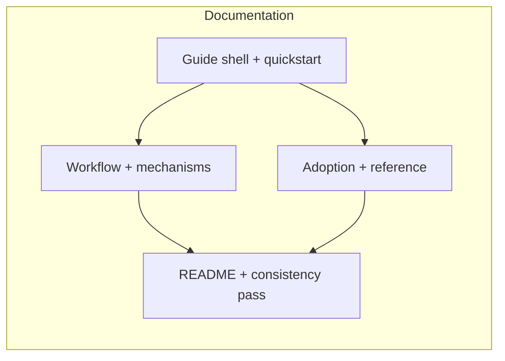

# 260622-human-user-manual — Tasks

## Dependency DAG

## T: D1

- **Goal**: Establish the human manual entry path and first-use experience (`Spec#B-1-first-run-path`, `Spec#C-1-progressive-disclosure`) by creating the `USER_GUIDE.md` structure from `Design#D-1-top-level-user-guide` and connecting it from the public entry point in `Design#D-2-readme-entry-point`.
- **Repo**: `/Users/admin/nio/playground/leanplan`
- **Completion**:
  - A first-time reader can start at `README.md`, find the manual, and follow the first-use path without consulting agent-facing references (`Spec#B-1-first-run-path`).
  - The guide structure lets the reader stop after the entry path or continue into deeper material (`Spec#C-1-progressive-disclosure`).
- **Dependencies**: none

## T: D2

- **Goal**: Write the workflow and mechanism explanation core of the guide (`Spec#B-2-end-to-end-workflow-guide`, `Spec#B-3-mechanism-explanations`) using the structure and explanation pattern from `Design#D-1-top-level-user-guide` and `Design#D-4-mechanism-explanation-pattern`.
- **Repo**: `/Users/admin/nio/playground/leanplan`
- **Completion**:
  - A returning reader can trace the stages from requirements through implementation and identify the user's decision points at each transition (`Spec#B-2-end-to-end-workflow-guide`).
  - Mechanism sections explain user-visible behavior, purpose, user action, and challenge points for the core LeanPlan mechanisms (`Spec#B-3-mechanism-explanations`, `Spec#C-2-mechanism-transparency`).
  - The brevity explanation captures the broader mechanism set and does not reduce LeanPlan to arbitrary length policing (`Design#D-4-mechanism-explanation-pattern`).
- **Dependencies**: D1

## T: D3

- **Goal**: Add adoption guidance and compact lookup material (`Spec#B-4-adoption-guidance`, `Spec#B-5-lookup-reference`) following `Design#D-5-adoption-section` and `Design#D-6-reference-appendix`.
- **Repo**: `/Users/admin/nio/playground/leanplan`
- **Completion**:
  - A team evaluator can identify fit, first-project shape, gradual-adoption path, and misuse signals (`Spec#B-4-adoption-guidance`).
  - A power user can look up stages, commands, artifact ownership, review expectations, validation modes, and stage transition cues without rereading the full guide (`Spec#B-5-lookup-reference`).
  - Lookup material preserves LeanPlan terminology and routes deeper procedural detail to the canonical sources (`Spec#B-6-existing-concept-alignment`, `Spec#C-3-non-canonical-agent-instructions`).
- **Dependencies**: D1

## T: D4

- **Goal**: Perform the README wiring and final consistency pass (`Spec#B-6-existing-concept-alignment`, `Spec#C-3-non-canonical-agent-instructions`, `Spec#C-4-no-framework-behavior-change`) against the boundaries in `Design#D-2-readme-entry-point` and `Design#D-3-source-boundary-map`.
- **Repo**: `/Users/admin/nio/playground/leanplan`
- **Completion**:
  - `README.md` points human learners to the manual while staying concise (`Design#D-2-readme-entry-point`).
  - The guide uses existing LeanPlan vocabulary consistently and does not create a parallel model (`Spec#B-6-existing-concept-alignment`).
  - The guide explains agent-facing references without replacing them as canonical procedure (`Spec#C-3-non-canonical-agent-instructions`).
  - The completed documentation describes current LeanPlan behavior without requiring framework behavior changes (`Spec#C-4-no-framework-behavior-change`).
- **Dependencies**: D2, D3
