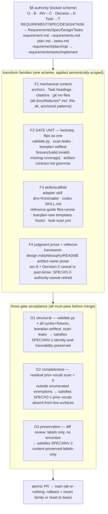

# 260622-vocab-v2-rename — DESIGN

## Architecture

The rollout is a set of **transform families** over the repo, all applying one fixed scheme (§8), bounded by a **three-gate acceptance** and landed as one atomic PR. The families split by *judgment cost*, not by document; one family — the gate itself — is special: its members validate every other family, so they must all flip together (Decision-2). The diagram shows composition and the lockstep coupling, not work order (ordering is Tasks').

## Decision-1: staged-authoring-atomic-landing

Roll out **staged by family for authoring/review, but landed atomically** — not one 1,000-edit commit, and not a green gate after every family. Each family is a reviewable/bisectable commit; the gate is deliberately **red between families**; the worktree (`leanplan-v2`) isolates those intermediate states; the full three-gate runs once at the end; the branch merges to `main` only as one all-or-nothing PR. "Atomic" (per #34 / Decision-2) is honored at the **landing** boundary, not at every commit. Rationale at `design-rationale.md#Decision-1-staged-authoring-atomic-landing`. Rollback: revert the offending family commit, or `git reset --hard` the worktree to the pre-sweep base — disposable by construction.

## Decision-2: gate-unit-flips-in-lockstep

The validators validate the content, so **`validate.py` + `scan-leaks` + `leanplan-selftest` + both fixture sets + the `artifact-contract.md` anchor grammar form one lockstep unit that flips in a single commit** — they cannot be partially migrated. `validate.py`'s `ANCHOR_RE`/`CITATION_RE`, the `kind` discriminator values (`O`/`INV`/`Decision`→`B`/`C`/`D`) that flow into every `_anchors(kind=)` call, `SURFACE_FILES`/`STAGE_ORDER`/`SURFACE_SOFT_CAP` keys, the required-section names (`Outcome`→`Behavior`, `Invariants`→`Constraint`), and the error strings all move together; `scan-leaks` and the selftest's exact-string assertions (and its `task_file()` helper, which must learn `tasks.md`) move with them. Satisfies `SPEC#INV-1-identity-and-traceability-preserved`. Rationale at `design-rationale.md#Decision-2-gate-unit-flips-in-lockstep`.

## Decision-3: three-gate-acceptance

Acceptance is **three distinct gates with distinct instruments**, because no single one catches everything: **G1 structural** (`validate.py` on all shipped cycles + both fixtures, `leanplan-selftest`, `scan-leaks`) proves internal consistency → `SPEC#INV-1-identity-and-traceability-preserved`; **G2 completeness** (a residual prior-vocab-token scan returning zero outside an enumerated exemption list) catches a *missed* rename that is still internally consistent → `SPEC#O-1-prior-vocab-absent-from-live-surfaces`; **G3 preservation** (diff review: only labels changed, sequence numbers intact) catches over-reach the other two cannot see → `SPEC#INV-2-content-preserved-labels-only`. Rationale at `design-rationale.md#Decision-3-three-gate-acceptance`.

## Decision-4: resolve-section-8-derivation-gaps

§8 fixes the names but leaves three mechanical-application questions a blind sweep would get wrong; **resolve them once, here**: (a) **citation-namespace casing** — the citation token follows the artifact node's §8 spelling (`SPEC#`→`Spec#`, `DESIGN#`→`Design#`, `TASK#`→`Tasks#`, plus `Rationale#`/`Research#`/`Understanding#`), not retained all-caps; (b) **anchor-regex ordering** — once `Decision`→`D`, `D` is a prefix of `Delta`, so `ANCHOR_RE`/`scan-leaks` must list `Delta` before `D` (the selftest's `Delta-N` case is the regression guard); (c) **REQUIREMENT section split** — §8 splits Outcome→**Outcome · Guarantee**, so `requirements.md` gains a `## Guarantee` section as a *conditional* (warn-empty) section in `validate.py` + the scaffold + the guide, while SPEC's section headings rename `Outcome`→`Behavior` / `Invariants`→`Constraint`. These realize the end-state behind `SPEC#O-1-prior-vocab-absent-from-live-surfaces`. Rationale at `design-rationale.md#Decision-4-resolve-section-8-derivation-gaps`.

## Decision-5: anchored-semantic-transforms-and-reflexive-self-inclusion

Transforms are **anchored and semantically scoped, never blind `s/old/new/g`** — one line, no rationale needed: the occurrence counts (`plan` 164, `SPEC` 448…) are raw token counts, but only vocabulary-as-LeanPlan-term uses are renamed, so each transform matches a structural position (heading prefix `### O-`, citation namespace `SPEC#`, fenced filename) and the **judgment-heavy prose family (F4) is decided per-occurrence, not scripted** (ordinary-English "plan/spec/outcome" is left alone — `SPEC#INV-2-content-preserved-labels-only`). This sets the family **risk gradient** the plan orders by: F1 mechanical → F2/F3 semi-mechanical → F4 judgment. Reflexively, **this feature's own `docs/features/260622-vocab-v2-rename/` dir is authored in current vocab and swept by F1/F4 like any other cycle** — not an exemption — so it validates under the live validator now and reaches v2 at the end like the rest.
