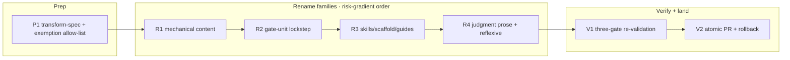

# 260622-vocab-v2-rename — TASK

## Guidelines
- **Base + isolation**: work on `feat/vocab-v2-rename` in the `leanplan-v2` worktree off `main` (`b2b59a5`). The worktree isolates a deliberately-broken intermediate state.
- **Apply §8, never re-derive** a name; §8 is the authority. Transforms are anchored to a structural position (heading prefix, citation namespace, fenced filename), never a blind `s/old/new/g` — ordinary English ("plan" the activity, generic "spec/design/outcome") is left untouched (`SPEC#INV-2-content-preserved-labels-only`).
- **Sequence numbers are never renumbered** (`O-1`→`B-1`, never `O-1`→`B-2`).
- **The gate is RED between families — that is expected.** Do not "repair" an intermediate validation failure by reverting a half-done family; the only green checkpoint is the end gate (V1). The validator cannot be trusted mid-sweep because it is itself being swept (`DESIGN#Decision-2-gate-unit-flips-in-lockstep`).
- **This feature's own dir is in the sweep**, not an exemption — it is authored in current vocab and swept by R1/R4 like any other cycle.
- **Land as one atomic PR after V1 passes; no partial merge** (`DESIGN#Decision-1-staged-authoring-atomic-landing`).

## Dependency DAG

Tracks: **P** lays the deterministic mapping every family applies; **R** is the four DESIGN transform families, ordered by judgment cost (mechanical → gate → surface → prose) — the edges are risk-gradient ordering, not hard gates; **V** runs the full acceptance and lands.

## Task: P1

- **Goal**: Produce the deterministic transform spec the families execute against — the per-token mapping table (from §8), each family's exact site list, the anchored match-patterns per token class, and the **G2 exemption allow-list** (the enumerated places prior-vocab tokens legitimately survive: §8's prior-vocab column, explicitly-historical framing). Settles the three §8-derivation gaps up front per `DESIGN#Decision-4-resolve-section-8-derivation-gaps` (citation-namespace casing, `Delta`-before-`D` regex order, the REQUIREMENT `Guarantee` split) and the anchored-not-blind rule per `DESIGN#Decision-5-anchored-semantic-transforms-and-reflexive-self-inclusion`. This is the single source the completeness gate (`DESIGN#Decision-3-three-gate-acceptance`) scans against.
- **Repo**: leanplan (`docs/features/260622-vocab-v2-rename/` working notes)
- **Completion**:
  - The mapping table covers every row of §8 (artifacts, edges/skills, items/anchors, filenames, citation namespaces) with its anchored match-pattern.
  - The exemption allow-list is enumerated and justified, not open-ended — each entry names the file + the reason it survives.
  - The citation-casing fork is resolved with a recommendation recorded (title-case, faithful to §8) and the alternative noted for ratification.
- **Dependencies**: none

## Task: R1

- **Goal**: Roll the **mechanical content family** across every `docs/features/*` cycle (incl. this dir) and unambiguous in-doc anchors — item anchors (`### O-N:`→`### B-N:`, `INV-`→`C-`, `Decision-`→`D-`), Task headings (`## Task:`→`## T:`), cross-doc citations (`SPEC#O-…`→`Spec#B-…` per the casing resolution), and the file renames (`git mv requirement.md requirements.md`, `plan.md tasks.md`). Pure label substitution preserving every sequence number (`SPEC#INV-2-content-preserved-labels-only`), applied via the anchored patterns from P1 (`DESIGN#Decision-5-anchored-semantic-transforms-and-reflexive-self-inclusion`).
- **Repo**: leanplan (`docs/features/**`)
- **Completion**:
  - A grep for the F1 prior-vocab token classes inside `docs/features/**` returns zero (outside the exemption list).
  - `git mv` is used for the file renames so history follows; no `requirement.md`/`plan.md` filename remains under `docs/features/**`.
  - Diff inspection confirms prefix/namespace-only changes — no sequence number moved, no prose re-argued.
- **Dependencies**: P1 lands the mapping + patterns this family applies.

## Task: R2

- **Goal**: Flip the **gate-unit in lockstep** — `validate.py`, `scan-leaks`, `leanplan-selftest`, both `fixtures/` sets, and the `artifact-contract.md` anchor grammar — in a single coherent move, because they validate each other and cannot be half-migrated (`DESIGN#Decision-2-gate-unit-flips-in-lockstep`). Covers `ANCHOR_RE`/`CITATION_RE` and the `kind` values feeding every check, `SURFACE_FILES`/`STAGE_ORDER`/soft-cap keys, the section-name checks (`Outcome`→`Behavior`, `Invariants`→`Constraint`, conditional `Guarantee`), error strings, the selftest's exact-string assertions + its `task_file()` helper (reconcile to `tasks.md`), and the `Delta`-before-`D` ordering fix. Restores structural verifiability in the new vocab (`SPEC#INV-1-identity-and-traceability-preserved`).
- **Repo**: leanplan (`scripts/`, `references/artifact-contract.md`, `fixtures/`)
- **Completion**:
  - `leanplan-selftest` passes with every injection case re-expressed in v2 tokens — including the `Delta-N` case that guards the regex-ordering fix.
  - `validate.py` and `scan-leaks` parse and flag the v2 vocabulary (anchors, citations, filenames, sections) and no longer recognize the prior vocab.
  - Both fixture sets are renamed (files + internal anchors) and the `valid/` fixture validates clean under the flipped validator.
- **Dependencies**: R1 moves the bulk of the content this gate will validate; flip the gate once the content vocab is in place.

## Task: R3

- **Goal**: Roll the **skills / scaffold / guides family** — adapter skill dirs and frontmatter (`requirement`→`requirements`, `plan`→`tasks`, `impl`→`implement`; `specify`/`design` unchanged), the Codex `SKILL.md`, the reference-guide files (`references/plan.md`→`tasks.md`, `requirement.md`→`requirements.md`, `impl.md`→`implement.md`) and their in-prose vocab, `leanplan-new`'s scaffold templates (H1 strings, section skeletons incl. the new `Guarantee` block per `DESIGN#Decision-4-resolve-section-8-derivation-gaps`, the Goal-template citation examples, the line-460 explanatory comment), the git hooks, and `templates/leanplan-leak-scan.yml`. Keeps every cross-reference resolvable after the renames (`SPEC#INV-1-identity-and-traceability-preserved`).
- **Repo**: leanplan (`adapters/`, `references/`, `scripts/`)
- **Completion**:
  - Skill names + frontmatter + the reference-guide filenames are v2, and every `references/<x>.md` cross-reference still resolves to an existing file.
  - A fresh `leanplan-new` scaffold emits v2 artifacts (`requirements.md`/`tasks.md`, `Outcome`+`Guarantee`, `## Behavior`/`## Constraint`, `Spec#B-…` example citations) that validate clean under the R2 validator.
- **Dependencies**: R2 lands the validator the new scaffold output is checked against.

## Task: R4

- **Goal**: Roll the **judgment prose + reflexive family** — per-occurrence artifact-name prose in `framework-design.md`, `philosophy.md`, `README.md`, and the reference guides (distinguishing LeanPlan-term from ordinary English, not scriptable), and retire the authority caveat: rewrite §8's "until that sweep lands…" and `Decision-2`'s "separate effort / today's vocab" framing to past-tense historical record (`SPEC#O-2-authority-caveat-retired`), preserving §8's prior-vocab column as the deliberate migration record. Decided per-occurrence, the highest-judgment family (`DESIGN#Decision-1-staged-authoring-atomic-landing`).
- **Repo**: leanplan (`framework-design.md`, `references/`, `README.md`)
- **Completion**:
  - §8 and `Decision-2` read as past-tense history; no sentence asserts a live prior/target split (`SPEC#O-2-authority-caveat-retired`).
  - §8's prior-vocab column and any explicitly-historical framing survive verbatim (on the exemption list); no ordinary-English "plan/spec/design" was renamed.
- **Dependencies**: R1–R3 land the mechanical and structural renames this prose now describes.

## Task: V1

- **Goal**: Run the **full three-gate re-validation** as the single green checkpoint before landing (`DESIGN#Decision-3-three-gate-acceptance`): **G1 structural** — `validate.py` over all nine shipped cycles + both fixtures, `leanplan-selftest`, `scan-leaks` all pass (`SPEC#INV-1-identity-and-traceability-preserved`); **G2 completeness** — the residual prior-vocab scan over the repo minus the P1 exemption allow-list returns zero (`SPEC#O-1-prior-vocab-absent-from-live-surfaces`); **G3 preservation** — diff review confirms labels-only, no renumbering, no re-argued prose (`SPEC#INV-2-content-preserved-labels-only`), which also confirms the O-2 caveat edit changed framing only.
- **Repo**: leanplan
- **Completion**:
  - G1: `validate.py` exits clean on each of the nine `docs/features/*` cycles and both fixtures; `leanplan-selftest` reports all cases passed; `scan-leaks` clean over durable outputs.
  - G2: the residual-token scan returns zero hits outside the enumerated exemptions; any hit is either fixed or added to the allow-list with a justification.
  - G3: the full diff shows only vocabulary substitutions, the bounded §8/Decision-2 reframing, and the §8-mandated section splits — no sequence-number change and no semantic rewrite.
- **Dependencies**: R4 (all families) lands the end-state this gate accepts.

## Task: V2

- **Goal**: Land the rollout as **one atomic PR** to `main` closing #34, all-or-nothing, only after V1 is green; document the **rollback** path (revert the offending family commit, or `git reset --hard` the worktree to the pre-sweep base) per `DESIGN#Decision-1-staged-authoring-atomic-landing`. Note the go-live follow-on (the skill renames need a chezmoi/reinstall refresh to take effect at runtime) as a post-merge step, not part of this PR.
- **Repo**: leanplan
- **Completion**:
  - One PR contains the whole sweep, merges as a unit, and closes #34; no family lands on `main` independently.
  - The PR body records the rollback procedure and the post-merge runtime-refresh follow-on.
- **Dependencies**: V1 passing is the enabler.
