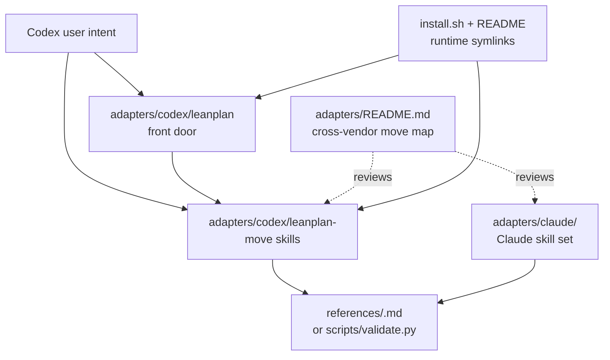

# 260623-codex-leanplan-skill-form — Design

## Architecture

Codex gains one thin, prefixed skill per LeanPlan move, plus a small `leanplan` front door that preserves the current `$leanplan <move>` invocation style by delegating to those move contracts. The shared stage references remain the procedural source of truth; an adapter map makes the Claude/Codex correspondence reviewable.

## D-1: codex-move-skills

Codex exposes the LeanPlan moves as separate prefixed skill directories: `adapters/codex/leanplan-requirements/`, `leanplan-specify/`, `leanplan-design/`, `leanplan-tasks/`, `leanplan-implement/`, `leanplan-sharpen/`, `leanplan-revise/`, and `leanplan-validate/`. Each `SKILL.md` has a stage-specific `name` and `description`, then a thin runtime-glue body pointing to exactly one shared reference or to `scripts/validate.py`. This realizes `Spec#B-1-codex-move-catalog-complete`, `Spec#B-2-requested-move-selects-matching-stage`, `Spec#C-1-canonical-reference-single-home`, and `Spec#C-2-one-stage-jit-loading-preserved`. See rationale at [design-rationale.md#D-1-codex-move-skills].

- Skill names use the `leanplan-` prefix in Codex (`leanplan-design`, not bare `design`) so generic Codex requests about design do not accidentally activate a framework stage. The move name inside the contract remains the LeanPlan move (`design`).
- Stage wrappers mirror the matching Claude wrapper's semantics: missing-input behavior, validation command, and handoff wording are the same, with Codex invocation text replacing Claude slash-command text.
- `leanplan-validate` is a utility move, not a pipeline stage. Its body owns only path intake, validator invocation, flags, and terminal reporting.
- The wrappers do not copy stage procedure. They load only `references/<move>.md` for stage moves, `references/sharpen.md`, `references/revise.md`, or `scripts/validate.py` for validation.

## D-2: leanplan-front-door

`adapters/codex/leanplan/SKILL.md` remains installed as a compatibility front door for `$leanplan <move>`, but it no longer carries the canonical stage contracts itself. Its body becomes a compact router from `requirements|specify|design|tasks|implement|sharpen|revise|validate` to the corresponding `adapters/codex/leanplan-<move>/SKILL.md`, then the move wrapper owns the load and handoff. This realizes `Spec#B-2-requested-move-selects-matching-stage` without keeping the current dispatcher as the only semantic surface. See rationale at [design-rationale.md#D-2-leanplan-front-door].

- The front door contains only the dispatch table, the rule to read the target move wrapper before acting, and the validation flags summary.
- It has no per-stage procedure beyond the pointer, so a stage edit changes one move wrapper plus its shared reference, not two Codex homes.
- Direct invocation of `leanplan-<move>` and front-door invocation of `$leanplan <move>` converge on the same move wrapper.

## D-3: adapter-move-map

Add `adapters/README.md` as the review surface for vendor parity: one row per LeanPlan move with columns for move name, canonical reference or script, Claude adapter path, Codex move skill path, Codex front-door alias, artifact boundary, handoff, and any vendor-specific divergence. This realizes `Spec#B-3-adapter-parity-is-reviewable`, `Spec#C-3-activation-quality-drives-surface-shape`, and `Spec#C-4-cross-vendor-semantic-parity`.

- For `requirements`, `specify`, `design`, `tasks`, `implement`, `sharpen`, and `revise`, the Codex and Claude rows resolve to the same canonical reference and the same artifact boundary.
- For `validate`, the divergence note records that Codex keeps a dedicated validation utility because the existing front door already exposes `validate`; Claude validation remains embedded in each stage wrapper's runtime glue. Both routes execute the same `scripts/validate.py` contract.
- The map is adapter metadata only. It does not restate stage procedures or artifact shapes.

## D-4: installer-and-docs-register-codex-moves

`install.sh` and `README.md` enumerate the Codex runtime registry explicitly: `leanplan` plus every `leanplan-<move>` directory is symlinked under `~/.agents/skills/`. The README's chezmoi examples mirror that list. This realizes the installed-surface half of `Spec#B-1-codex-move-catalog-complete` and keeps the documented Codex surface aligned with the actual adapter tree.

- `install.sh` gains a `CODEX_SKILLS` array, symmetric with the Claude array, and both install and uninstall loop over it.
- README layout changes from "Codex (1 dispatcher)" to "Codex (move skills plus front door)" and its symlink examples list the new targets.
- Existing Claude install entries are kept as the cross-vendor baseline and corrected if their names do not match the live adapter directories.

## Spec coverage

- `B-1` -> D-1, D-4.
- `B-2` -> D-1, D-2.
- `B-3` -> D-3.
- `C-1` -> D-1.
- `C-2` -> D-1, D-2.
- `C-3` -> D-1, D-3.
- `C-4` -> D-3.
