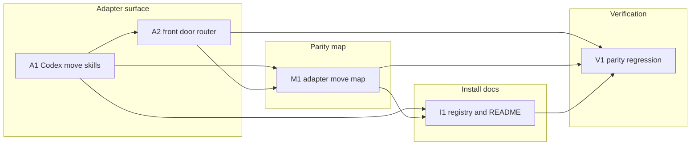

# 260623-codex-leanplan-skill-form — Tasks

## Guidelines

- Keep adapter edits as runtime glue. If a stage semantic change seems necessary, stop and revise the shared reference instead of duplicating procedure in a vendor wrapper (`Spec#C-1-canonical-reference-single-home`, `Design#D-1-codex-move-skills`).

## Dependency DAG

Tracks separate adapter authoring, parity documentation, install documentation, and final verification. Edges mean an earlier task leaves a concrete surface for the next task to inspect or register.

## T: A1

- **Goal**: Establish the direct Codex move-skill surface (`Design#D-1-codex-move-skills`) so each LeanPlan move has its own entry contract and shared-reference boundary (`Spec#B-1-codex-move-catalog-complete`, `Spec#C-1-canonical-reference-single-home`).
- **Repo**: `leanplan` — `adapters/codex/`
- **Completion**:
  - `adapters/codex/leanplan-{requirements,specify,design,tasks,implement,sharpen,revise,validate}/SKILL.md` exists and each file names the accepted intent, input shape, canonical reference or validator script, and handoff or terminal result (`Spec#B-1-codex-move-catalog-complete`).
  - Inspection confirms every move wrapper points to exactly one shared stage reference or `scripts/validate.py`, and does not fork stage procedure into a second Codex source of truth (`Spec#C-1-canonical-reference-single-home`, `Spec#C-2-one-stage-jit-loading-preserved`).
  - Direct move-skill inspection shows each wrapper can be activated without the broad dispatcher carrying unrelated stage procedure (`Spec#B-2-requested-move-selects-matching-stage`, `Spec#C-3-activation-quality-drives-surface-shape`).
- **Dependencies**: none

## T: A2

- **Goal**: Convert the existing Codex `leanplan` skill into the compatibility front door (`Design#D-2-leanplan-front-door`) so `$leanplan <move>` converges on the same move wrappers as direct activation (`Spec#B-2-requested-move-selects-matching-stage`).
- **Repo**: `leanplan` — `adapters/codex/leanplan/SKILL.md`
- **Completion**:
  - The front door dispatch table covers `requirements`, `specify`, `design`, `tasks`, `implement`, `sharpen`, `revise`, and `validate`, and each row delegates to the matching `leanplan-<move>` wrapper (`Spec#B-1-codex-move-catalog-complete`, `Spec#B-2-requested-move-selects-matching-stage`).
  - Static inspection confirms the front door keeps only routing, target-wrapper loading, and validation flag summary; full stage procedure remains in the move wrapper plus shared reference (`Spec#C-1-canonical-reference-single-home`, `Spec#C-2-one-stage-jit-loading-preserved`).
  - Sample route checks for one stage move, one off-pipeline move, and `validate` resolve to the expected target wrappers (`Spec#B-2-requested-move-selects-matching-stage`).
- **Dependencies**: A1

## T: M1

- **Goal**: Create the cross-vendor adapter map (`Design#D-3-adapter-move-map`) so Claude and Codex parity is reviewable instead of inferred (`Spec#B-3-adapter-parity-is-reviewable`, `Spec#C-4-cross-vendor-semantic-parity`).
- **Repo**: `leanplan` — `adapters/README.md`
- **Completion**:
  - The map has one row for every supported move, with canonical reference or script, Claude adapter path, Codex move skill path, Codex front-door alias, artifact boundary, handoff, and divergence note (`Spec#B-3-adapter-parity-is-reviewable`).
  - The seven shared LeanPlan moves resolve to the same canonical references and preserve the same boundaries and handoffs across vendors (`Spec#C-4-cross-vendor-semantic-parity`).
  - The `validate` row records the intentional utility-surface difference while pointing both vendors at the same validator semantics (`Spec#B-3-adapter-parity-is-reviewable`, `Spec#C-4-cross-vendor-semantic-parity`).
- **Dependencies**: A1, A2

## T: I1

- **Goal**: Register and document the installed Codex move surface (`Design#D-4-installer-and-docs-register-codex-moves`) so the runtime registry matches the authored adapter catalog (`Spec#B-1-codex-move-catalog-complete`).
- **Repo**: `leanplan` — `install.sh`, `README.md`
- **Completion**:
  - `install.sh` installs and uninstalls `leanplan` plus every `leanplan-<move>` Codex skill, and `bash -n install.sh` passes (`Spec#B-1-codex-move-catalog-complete`).
  - README layout and chezmoi examples list the Codex front door and move-skill symlinks, and no documented symlink target points at a missing adapter directory (`Spec#B-1-codex-move-catalog-complete`).
  - Existing Claude install/docs entries are aligned with the live Claude adapter directories so the map's vendor baseline is not misleading (`Spec#B-3-adapter-parity-is-reviewable`, `Spec#C-4-cross-vendor-semantic-parity`).
- **Dependencies**: A1, M1

## T: V1

- **Goal**: Verify the completed adapter surface as one coherent vendor-neutral LeanPlan runtime shell (`Design#D-1-codex-move-skills`, `Design#D-2-leanplan-front-door`, `Design#D-3-adapter-move-map`, `Design#D-4-installer-and-docs-register-codex-moves`).
- **Repo**: `leanplan`
- **Completion**:
  - A catalog check over `adapters/codex/` and `adapters/README.md` finds all eight moves exactly once as direct Codex move skills and exactly once as front-door aliases (`Spec#B-1-codex-move-catalog-complete`).
  - Route inspection confirms direct `leanplan-<move>` activation and `$leanplan <move>` activation converge on the same canonical reference or validator script for every move (`Spec#B-2-requested-move-selects-matching-stage`, `Spec#C-2-one-stage-jit-loading-preserved`).
  - Cross-vendor comparison confirms every non-utility move maps to the same shared reference and artifact boundary, with any surface-only divergence documented in the adapter map (`Spec#B-3-adapter-parity-is-reviewable`, `Spec#C-4-cross-vendor-semantic-parity`).
  - Framework checks pass: `python3 scripts/validate.py docs/features/260623-codex-leanplan-skill-form --stage tasks`, `python3 scripts/validate.py fixtures/valid`, and `LEANPLAN_FIXTURE=$PWD/fixtures/valid scripts/leanplan-selftest`.
- **Dependencies**: A2, M1, I1
