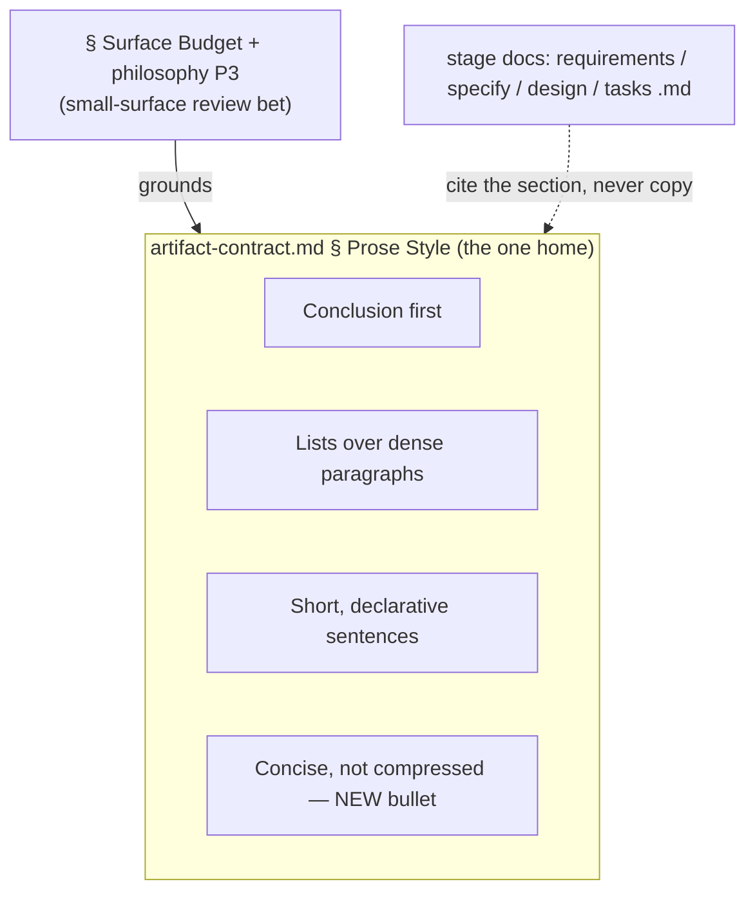

# 260623-concise-not-compressed — Design

## Architecture

Caption: `§ Prose Style` is the single home; it gains one named bullet (bold node) beside the three existing form-rules. The `§ Surface Budget` + philosophy P3 rationale is unchanged and still grounds it. Stage docs keep *citing* the section rather than copying the lesson — the single-home boundary. Realizes `Spec#B-1-distinction-named-in-shared-home`, `Spec#B-2-discriminator-sorts-a-line`, `Spec#C-1-surface-not-grown`.

## D-1: named-bullet-not-woven

Add the lesson as a fourth titled bullet in `§ Prose Style`, not woven into an existing rule — because compression (an unfamiliar coined word, or concepts packed into one token) is a distinct axis — reader-unpacking effort — from the form-rules beside it (sentence length, list-vs-paragraph), and `Spec#B-1-distinction-named-in-shared-home` / `Spec#B-2-discriminator-sorts-a-line` require a named, citable handle. Realization:

- **Bullet content** (final wording finalized in place at implement, against the surrounding prose — it must itself be concise-not-compressed):

  > **Concise, not compressed.** Brevity is an easy-to-read depiction of the point — not the same content squeezed into a denser form the reviewer must unpack, whether an unfamiliar coined word (`bypass-check save` ❌ vs. "save without the duplicate check" ✅) or several concepts piled into one separator-joined string. The defect is the unpacking cost, not the vocabulary or the separator: a familiar term and a stage-map `·` are fine, and a short sentence can still hide it. Judge by the reader's effort, not the length. Spend the words. (context-engineering: literal-vs-latent-matching)

- **Grounding hook** — the bullet ends with `(context-engineering: literal-vs-latent-matching)`. Decompressing a packed token is *latent* recovery — inferring the concept from a handle that does not state it — and latent recall degrades as the surface grows (NoLiMa), which is precisely the LLM-reviewer-over-a-long-surface case. The hook matches the section's grounding convention (One-Prose-Home, Surface Budget both end in one) and reinforces the reflexive-grounding moat.
- **Worked contrast, inline** — a minimal good→bad pair (compressy word ❌ vs. plain depiction ✅), not a full ✅/❌ block. The primary example is the **lexical** form (an unfamiliar/coined word vs. a plain phrase), the more insidious case; the syntactic pile is named as the same defect, no separate example. The pair must **isolate the variable**: the ✅ depicts the *same* content the ❌ compresses, so only readability varies, not topic. It must not imply that the *vocabulary or separator* is the defect — a familiar standard term and a stage-map `·` both stay fine, which is what `Spec#B-2-discriminator-sorts-a-line` clears. The contrast is the doc's own §134 register; a full block belongs in a stage doc and fights `C-1`. (broadened — `Understanding#Delta-1-compression-has-a-lexical-form`)
- **Placement** — last in the bullet list, as the capstone: even after you have shortened sentences and used lists, do not compress. (Trivial ordering call.)
- **Citable handle** — the bold lead `**Concise, not compressed.**` is the name a reviewer cites when rejecting a compressed line (`Spec#B-2-discriminator-sorts-a-line`); the inline good→bad contrast is the recognizer, the reader-effort line is the discriminator.

See rationale at [design-rationale.md#D-1-named-bullet-not-woven].

## D-2: single-home-held-surface

Author the lesson once in `§ Prose Style` and hold the section's prose footprint flat-or-smaller, satisfying `Spec#C-1-surface-not-grown`. Realization:

- **One home, no copies** — the lesson goes only in `§ Prose Style`; the stage docs already cite the section, so none is edited (the single-home rule, `artifact-contract.md` → One Prose Home Per Fact).
- **Offset the added lines by tightening adjacent slack**, not by adding net length — the longest existing bullet (`Conclusion first`) and the section `Why:` line carry trim-able verbosity. Tightening keeps `Spec` Non-goal *sharpens-does-not-replace*: trim prose, never a rule's meaning.
- **Verify the delta, not just the size** — the stateless surface-budget guard sees absolute size; non-growth is confirmed by reading the diff, and single-home by grepping the stage docs for any copy.
- **Deployment** — editing an existing tracked reference; it rides the existing whole-repo clone refresh (`chezmoi update` / `git pull`). No new file, no `install.sh` or symlink change.

See rationale at [design-rationale.md#D-2-single-home-held-surface].
