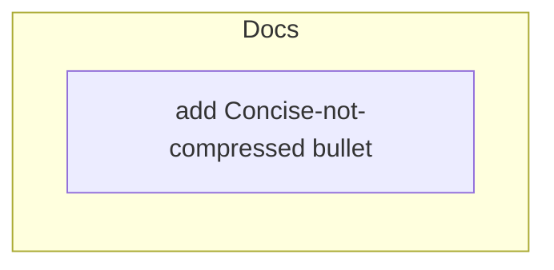

# 260623-concise-not-compressed — Tasks

## Guidelines

- Edit the **source repo only** (this worktree on `feat/concise-not-compressed`), never the installed `~/.local/share/leanplan/` copy — it is overwritten on refresh. Go-live (a post-merge `chezmoi update`) is a delivery step, not part of any task's completion.

## Dependency DAG

Caption: one atomic edit to a single reference section — no tracks to coordinate.

## T: D1

- **Goal**: Add the "Concise, not compressed" bullet to `§ Prose Style` in `artifact-contract.md` — naming compression-as-false-brevity with an inline good→bad contrast and the reader-effort discriminator (`Spec#B-1-distinction-named-in-shared-home`, `Spec#B-2-discriminator-sorts-a-line`), per `Design#D-1-named-bullet-not-woven` — while holding the section's surface flat by tightening adjacent slack rather than adding net length (`Spec#C-1-surface-not-grown`, `Design#D-2-single-home-held-surface`). Re-derive the bullet's final wording in place so it itself obeys the rule.
- **Repo**: `mynghn/leanplan` (this repo).
- **Completion**:
  - `§ Prose Style` carries a titled bullet whose bold lead names the failure mode (a citable handle), includes a good→bad contrast that decompresses the *same* content (varying density, not separator presence), and ends with `(context-engineering: literal-vs-latent-matching)` — `Spec#B-1-distinction-named-in-shared-home`.
  - Reviewer-judgment test: given the edited guidance plus one compressed line and one clean line (including a legitimate inline `·`/`→`), a reviewer flags the first and clears the second, citing the bullet — the discriminator distinguishes, it does not flag every separator — `Spec#B-2-discriminator-sorts-a-line`.
  - The section's prose-line count holds-or-shrinks vs. pre-edit (diff, excluding Mermaid / fenced code / blank lines per the budget rule), and no existing rule's meaning changed (sharpens-not-replace) — `Spec#C-1-surface-not-grown`.
  - Single-home: grepping the stage docs (`requirements`, `specify`, `design`, `tasks`, `implement*` `.md`) returns zero copies of the lesson — authored once — `Spec#C-1-surface-not-grown`.
  - `scripts/leanplan-selftest` stays green and the edited section reads coherently end-to-end (no broken adjacent rule, no orphaned reference).
- **Dependencies**: none.
