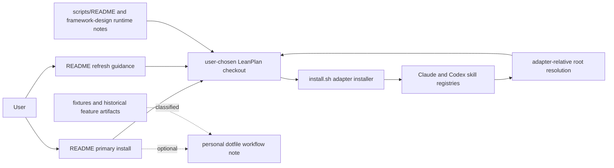

# 260623-remove-chezmoi-dependency — Design

## Architecture

Current LeanPlan guidance presents one primary checkout-based adoption path, then routes optional personal dotfile usage into a clearly labeled side path. Current runtime docs and adapters resolve from the installed checkout rather than a fixed path; historical artifacts and fixtures remain classified rather than rewritten.

## D-1: readme-primary-path-is-direct-checkout

`README.md` makes clone-to-a-user-chosen-checkout plus running that checkout's `install.sh` the primary install path, and makes pulling that checkout the primary refresh path. See rationale at [design-rationale.md#D-1-readme-primary-path-is-direct-checkout].

- Satisfies `Spec#B-1-primary-install-path-is-self-contained`, `Spec#B-2-refresh-path-is-self-contained`, `Spec#B-5-install-root-is-user-selected`, `Spec#C-1-no-current-guidance-requires-personal-dotfiles`, and `Spec#C-3-no-current-guidance-requires-fixed-checkout-path`.
- The README keeps the current adapter registry targets: Claude Code at `~/.claude/skills/<name>` and Codex stage skills at `~/.agents/skills/leanplan-*` (`UnderstandingShifts#Delta-1-codex-front-door-removed`).
- The README describes re-running `install.sh` after adapter-list changes as a harmless refresh of registry symlinks.

## D-2: installer-is-the-product-adapter-installer

`install.sh` is documented as LeanPlan's adapter installer, not as the non-personal-workflow alternative to another primary installer.

- Satisfies `Spec#B-1-primary-install-path-is-self-contained` and `Spec#C-1-no-current-guidance-requires-personal-dotfiles`.
- The script behavior stays unchanged: it links the checked-out `adapters/claude/*` and `adapters/codex/*` directories into the runtime skill registries, and `--uninstall` removes only those links.

## D-3: runtime-docs-use-normal-checkout-language

`scripts/README.md` and the opening source-of-truth note in `framework-design.md` describe the installed LeanPlan root as the checkout the user chose.

- Satisfies `Spec#B-2-refresh-path-is-self-contained`, `Spec#B-3-plain-checkout-runtime-is-supported`, `Spec#B-5-install-root-is-user-selected`, `Spec#C-1-no-current-guidance-requires-personal-dotfiles`, and `Spec#C-3-no-current-guidance-requires-fixed-checkout-path`.
- `scripts/README.md` states that tools live under `<leanplan-root>/scripts/` because the installed checkout provides them, not because a separate source tree applies them there.
- `framework-design.md` keeps `README.md` as the install source of truth and removes the personal-workflow wording from its first-line runtime summary.

## D-4: personal-workflow-is-an-optional-readme-note

Current README mentions the personal dotfile workflow only after the primary path, under an optional section for users who already manage local tools that way. See rationale at [design-rationale.md#D-4-personal-workflow-is-an-optional-readme-note].

- Satisfies `Spec#B-4-optional-personal-workflow-is-separated`, `Spec#C-1-no-current-guidance-requires-personal-dotfiles`, and `Spec#C-2-remaining-references-are-classified`.
- The optional note points back to the same runtime checkout and adapter targets rather than defining a second LeanPlan-owned install contract.

## D-5: historical-references-stay-archival

Existing `docs/features/**` and `fixtures/**` references to the personal workflow remain unchanged unless they become current guidance.

- Satisfies `Spec#C-2-remaining-references-are-classified`.
- The implementation verification treats `README.md`, `install.sh`, `scripts/README.md`, `framework-design.md`, and `adapters/README.md` as current guidance; old feature artifacts and fixtures are archival or test material.

## D-6: adapters-and-hooks-resolve-from-their-installed-path

Adapter wrappers and hook scripts resolve LeanPlan references and scripts from their installed file path or symlink target, not from a hardcoded checkout path (`UnderstandingShifts#Delta-2-install-root-is-not-fixed`, `UnderstandingShifts#Delta-3-validator-allow-pattern-is-too-broad`). See rationale at [design-rationale.md#D-6-adapters-and-hooks-resolve-from-their-installed-path].

- Satisfies `Spec#B-5-install-root-is-user-selected` and `Spec#C-3-no-current-guidance-requires-fixed-checkout-path`.
- Codex and Claude adapter docs define `<LEANPLAN_ROOT>` as the checkout containing the adapter file after resolving symlinks, then refer to `<LEANPLAN_ROOT>/references/*` and `<LEANPLAN_ROOT>/scripts/*`.
- Claude validation allow-tool entries target the LeanPlan-specific executable `leanplan-validate` instead of a generic `python3 */scripts/validate.py` pattern.
- Hook scripts use their resolved script directory as the default tool directory, with environment-variable overrides still available for callers that need them.
