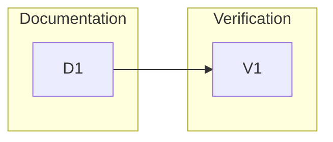

# 260623-remove-chezmoi-dependency — Tasks

## Guidelines

- Keep archival examples intact unless they affect current install, update, adapter, or runtime guidance.

## Dependency DAG

The documentation task lands the guidance shape. The verification task then checks the current-guidance boundary and LeanPlan artifact integrity.

## T: D1

- **Goal**: Update the current LeanPlan guidance surfaces to follow `Design#D-1-readme-primary-path-is-direct-checkout`, `Design#D-2-installer-is-the-product-adapter-installer`, `Design#D-3-runtime-docs-use-normal-checkout-language`, and `Design#D-4-personal-workflow-is-an-optional-readme-note`.
- **Repo**: this repo.
- **Completion**:
  - Current install guidance shows the direct product path as primary (`Spec#B-1-primary-install-path-is-self-contained`).
  - Current refresh guidance shows the direct product path as primary (`Spec#B-2-refresh-path-is-self-contained`).
  - Runtime guidance describes the installed tree as a normal checkout (`Spec#B-3-plain-checkout-runtime-is-supported`).
  - Any current personal workflow note is optional and separated from the primary path (`Spec#B-4-optional-personal-workflow-is-separated`).
  - Current guidance has no normal-use required or recommended personal-dotfile path (`Spec#C-1-no-current-guidance-requires-personal-dotfiles`).
- **Dependencies**: none

## T: V1

- **Goal**: Verify the remaining-reference boundary from `Design#D-5-historical-references-stay-archival` and run the LeanPlan checks for this feature.
- **Repo**: this repo.
- **Completion**:
  - A repository search shows remaining personal-workflow references are confined to optional current guidance, archival feature artifacts, fixtures, or upstream context (`Spec#C-2-remaining-references-are-classified`).
  - The feature validates with `validate.py --stage tasks`, proving the plan keeps bidirectional coverage for `Spec#B-1-primary-install-path-is-self-contained`, `Spec#B-2-refresh-path-is-self-contained`, `Spec#B-3-plain-checkout-runtime-is-supported`, `Spec#B-4-optional-personal-workflow-is-separated`, `Spec#C-1-no-current-guidance-requires-personal-dotfiles`, and `Spec#C-2-remaining-references-are-classified`.
- **Dependencies**: D1
