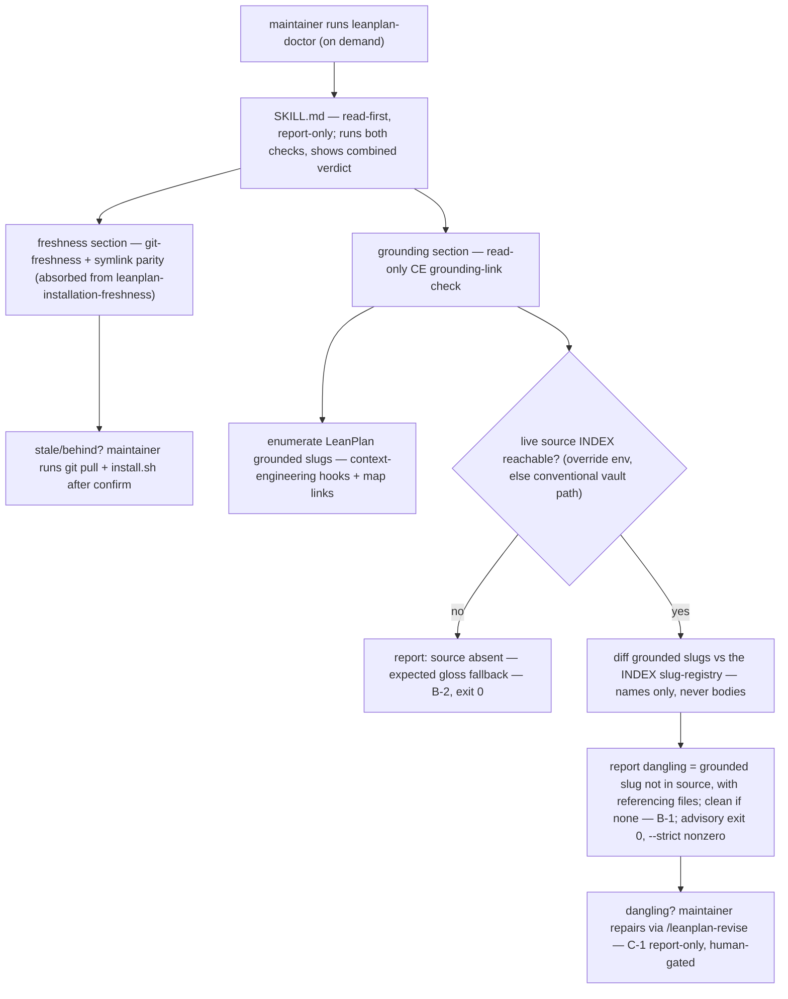

# 260626-ce-grounding-link-check — Design

## Architecture

`leanplan-doctor` is a read-only health-check skill running two diagnostics as labeled sections. The **grounding section** enumerates the slugs LeanPlan grounds in, compares them against the live source's INDEX slug-registry when reachable, and reports dangling references; the source's absence is a distinct, non-error outcome. The **freshness section** is the absorbed `leanplan-installation-freshness` check (git-freshness + symlink parity). The grounding section mutates nothing — repairs flow through `/leanplan-revise` (`Spec#C-1-report-only-no-mutation`); the freshness section self-heals only after the maintainer confirms.

## D-1: realize-as-utility-skill-with-check-script
Build it as one diagnostic inside a `leanplan-doctor` utility skill under `utils/` — a single `SKILL.md` (read-first, report-only) running two deterministic check scripts as labeled sections: **installation freshness** (git-freshness + symlink parity) and **CE grounding links** (the grounded-slug resolution check). `leanplan-doctor` absorbs the existing `leanplan-installation-freshness` skill, which retires — one "is my LeanPlan healthy?" command. Install via `install.sh`'s `UTILITY_SKILLS` (both Claude and Codex registries), which drops `leanplan-installation-freshness` and adds `leanplan-doctor`. Realizes the on-demand, report-only shape of `Spec#C-1-report-only-no-mutation`; reverses the original separate-skill choice per `UnderstandingShifts#Delta-1-package-as-doctor-umbrella-absorbing-freshness`. See rationale at [design-rationale.md#D-1-realize-as-utility-skill-with-check-script].
- `SKILL.md` resolves `<LEANPLAN_ROOT>` from the installed symlink (walk up two from `utils/leanplan-doctor/`), runs both checks, and shows a combined verdict with one section per diagnostic. Each section keeps its own fix route: freshness → `git pull` + re-run `install.sh` after the maintainer confirms; grounding → `/leanplan-revise` when a reference dangles. It is not a planning-stage skill; it owns only installation + grounding health.
- The two check scripts live under `utils/leanplan-doctor/` (`checks/freshness.sh`, `checks/grounding.sh`) — each independently runnable; the `SKILL.md` orchestrates them. `checks/freshness.sh` is the relocated `leanplan-installation-freshness` check; `checks/grounding.sh` is the grounding check (D-2 / D-3).

## D-2: check-algorithm-and-advisory-posture
`check.sh` is read-only and deterministic: (1) enumerate LeanPlan's grounded slug set — the union of `(context-engineering: <slug>)` hook slugs across `references/`, `framework-design.md`, `adapters/`, and the map's `[[<slug>]]` links; (2) resolve the live source INDEX (D-3); (3) when reachable, report every grounded slug absent from the source as **dangling**, each with the files that reference it, and report clean when none; when unreachable, report the distinct source-absent outcome. Realizes `Spec#B-1-dangling-grounding-is-reported`, `Spec#B-2-source-absent-is-reported-distinctly`. See rationale at [design-rationale.md#D-2-check-algorithm-and-advisory-posture].
- **Advisory by default** — clean, source-absent, and dangling-found all exit 0 (report only); a `--strict` flag exits nonzero on dangling for CI gating. Mirrors `leanplan-validate` / `scan-leaks` (warn by default, strict to block).
- The grounded-slug enumeration is the same logic proven runnable by hand against the live INDEX (15/15 clean today); `check.sh` only encodes it.

## D-3: source-access-via-index-registry-located-by-convention
The check reaches the live source through its **INDEX slug-registry** — the same source-of-truth the `context-engineering-knowledge-base` skill itself reads — never the concept bodies, located by `$LEANPLAN_CE_SOURCE_INDEX` override, else the conventional Metacognition vault INDEX path (`~/.local/share/metacognition-vault/context-engineering/INDEX.md`), else treated as absent. Realizes `Spec#C-2-reference-only-not-semantic` and the reachability half of `Spec#C-3-self-contained-run`. See rationale at [design-rationale.md#D-3-source-access-via-index-registry-located-by-convention].
- **Reference-only, concretely** — it extracts only each INDEX line's `<slug>` (the name registry); it never opens `knowledge/<slug>.md`, and it ignores the `⚠`-degraded marker entirely — a flagged-but-present slug still resolves, so it yields no finding (`Spec#C-2`).
- **Self-contained** — enumerating LeanPlan's grounded slugs needs nothing external; only the diff needs the source, and its absence is the B-2 outcome, never a run failure (`Spec#C-3`).
- Guards the post-`260626-live-ce-grounding` grounding model; the slug enumeration works against the map either way, so the skill is buildable independently of that feature's merge (it only becomes *load-bearing* once the deep layer is live).
