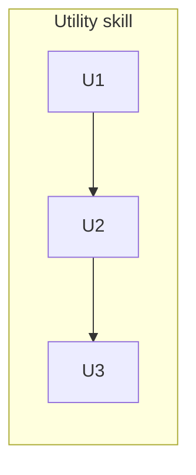

# 260626-ce-grounding-link-check — Tasks

## DAG

One track: build the read-only check, wrap it in a utility skill, then register it for install. Linear — each step enables the next.

## T: U1
- **Goal**: Build the read-only `check.sh` that enumerates LeanPlan's grounded slugs and reports those absent from the live source — per `Design#D-2-check-algorithm-and-advisory-posture` and `Design#D-3-source-access-via-index-registry-located-by-convention`.
- **Repo**: `mynghn/leanplan` — `utils/leanplan-ce-grounding-link-check/check.sh`
- **Completion**:
  - (a) source INDEX reachable + a grounded slug injected that the source lacks → that slug is listed as dangling with its referencing files; all grounded slugs present → clean report (`Spec#B-1-dangling-grounding-is-reported`).
  - (b) source absent (override unset and conventional path missing) → the distinct "source absent — expected gloss fallback" outcome, exit 0, no error (`Spec#B-2-source-absent-is-reported-distinctly`, `Spec#C-3-self-contained-run`).
  - (c) a source entry that is reworded or `⚠`-flagged-but-present yields no finding — only a non-resolving slug does; confirm `check.sh` reads only INDEX slug names, never `knowledge/<slug>.md` bodies (`Spec#C-2-reference-only-not-semantic`).
  - (d) the run mutates nothing (`Spec#C-1-report-only-no-mutation`); advisory exit 0 by default, `--strict` exits nonzero when dangling.
- **Dependencies**: none

## T: U2
- **Goal**: Author the read-first, report-only `SKILL.md` that resolves `<LEANPLAN_ROOT>`, runs `check.sh`, surfaces the verdict, and routes any dangling finding to `/leanplan-revise` for human-gated repair — per `Design#D-1-realize-as-utility-skill-with-check-script`; the inspection itself never repairs (`Spec#C-1-report-only-no-mutation`).
- **Repo**: `mynghn/leanplan` — `utils/leanplan-ce-grounding-link-check/SKILL.md`
- **Completion**:
  - invoking the skill runs `check.sh` and shows its verdict; on dangling, it directs the maintainer to `/leanplan-revise` and edits no grounding itself (`Spec#C-1-report-only-no-mutation`).
  - the frontmatter description triggers on a Metacognition update / "check CE grounding links" and scopes the skill to grounding-link validity only.
- **Dependencies**: U1 (wraps `check.sh`)

## T: U3
- **Goal**: Register the skill in `install.sh` so it installs into both runtime registries — add it to `UTILITY_SKILLS` for install and uninstall — per `Design#D-1-realize-as-utility-skill-with-check-script`.
- **Repo**: `mynghn/leanplan` — `install.sh`
- **Completion**:
  - running `install.sh` symlinks `leanplan-ce-grounding-link-check` into `~/.claude/skills` and `~/.agents/skills`; `--uninstall` removes both; re-running install is idempotent.
- **Dependencies**: U2 (the skill dir + `SKILL.md` must exist to symlink)

## Forward coverage

| Spec item | Verified by |
|---|---|
| `Spec#B-1-dangling-grounding-is-reported` | U1(a) |
| `Spec#B-2-source-absent-is-reported-distinctly` | U1(b) |
| `Spec#C-1-report-only-no-mutation` | U1(d), U2 |
| `Spec#C-2-reference-only-not-semantic` | U1(c) |
| `Spec#C-3-self-contained-run` | U1(b) |

Reverse: U1 → `Design#D-2` / `Design#D-3` + the Spec items above; U2 → `Design#D-1` + `Spec#C-1`; U3 → `Design#D-1`. No orphan tasks, no uncovered Spec items.
