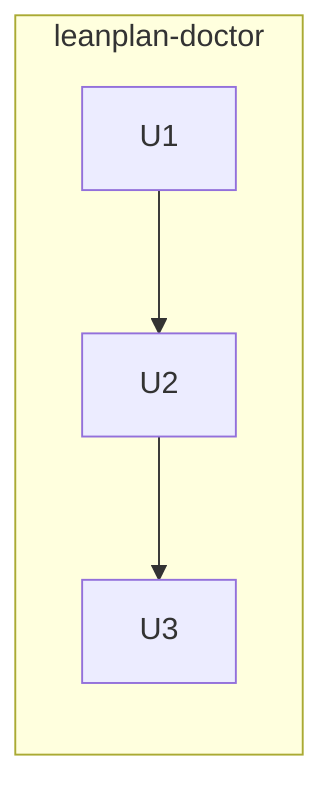

# 260626-ce-grounding-link-check — Tasks

## DAG

One track: build the read-only grounding check, assemble it into the `leanplan-doctor` skill (absorbing the freshness check), then register doctor for install and retire the old freshness skill. Linear — each step enables the next.

## T: U1
- **Goal**: Build the read-only grounding check (`checks/grounding.sh`) that enumerates LeanPlan's grounded slugs and reports those absent from the live source — per `Design#D-2-check-algorithm-and-advisory-posture` and `Design#D-3-source-access-via-index-registry-located-by-convention`.
- **Repo**: `mynghn/leanplan` — `utils/leanplan-doctor/checks/grounding.sh`
- **Completion**:
  - (a) source INDEX reachable + a grounded slug injected that the source lacks → that slug is listed as dangling with its referencing files; all grounded slugs present → clean report (`Spec#B-1-dangling-grounding-is-reported`).
  - (b) source absent (override unset and conventional path missing) → the distinct "source absent — expected gloss fallback" outcome, exit 0, no error (`Spec#B-2-source-absent-is-reported-distinctly`, `Spec#C-3-self-contained-run`).
  - (c) a source entry that is reworded or `⚠`-flagged-but-present yields no finding — only a non-resolving slug does; confirm the check reads only INDEX slug names, never `knowledge/<slug>.md` bodies (`Spec#C-2-reference-only-not-semantic`).
  - (d) the run mutates nothing (`Spec#C-1-report-only-no-mutation`); advisory exit 0 by default, `--strict` exits nonzero when dangling.
- **Dependencies**: none

## T: U2
- **Goal**: Assemble the `leanplan-doctor` skill — author the read-first, report-only `SKILL.md` that runs both diagnostics as labeled sections (freshness + grounding) and relocate the existing freshness check under it — per `Design#D-1-realize-as-utility-skill-with-check-script`; the inspection itself never repairs (`Spec#C-1-report-only-no-mutation`).
- **Repo**: `mynghn/leanplan` — `utils/leanplan-doctor/SKILL.md`, `utils/leanplan-doctor/checks/freshness.sh` (relocated from `utils/leanplan-installation-freshness/check.sh`)
- **Completion**:
  - invoking the skill runs both checks and shows a combined verdict, one section per diagnostic; on a dangling grounding reference it directs the maintainer to `/leanplan-revise` and edits no grounding itself (`Spec#C-1-report-only-no-mutation`); on stale freshness it directs to `git pull` + reinstall after confirmation.
  - `<LEANPLAN_ROOT>` resolves from the installed symlink (walk up two from `utils/leanplan-doctor/`); the grounding section wraps `checks/grounding.sh`, the freshness section `checks/freshness.sh`.
  - the frontmatter description triggers on a Metacognition update or a LeanPlan-install change / "check LeanPlan health" and scopes the skill to installation + grounding health only.
- **Dependencies**: U1 (provides `checks/grounding.sh`)

## T: U3
- **Goal**: Update `install.sh`'s `UTILITY_SKILLS` to register `leanplan-doctor` and retire `leanplan-installation-freshness` — per `Design#D-1-realize-as-utility-skill-with-check-script`.
- **Repo**: `mynghn/leanplan` — `install.sh`
- **Completion**:
  - `UTILITY_SKILLS` lists `leanplan-doctor` and no longer lists `leanplan-installation-freshness`; running `install.sh` symlinks `leanplan-doctor` into `~/.claude/skills` and `~/.agents/skills`; `--uninstall` removes both; re-running install is idempotent.
  - a stale `leanplan-installation-freshness` symlink left by a prior install is cleaned up on install (mirroring the legacy-front-door removal), so retiring the skill strands no symlink; the retired skill dir is removed (its check relocated under doctor in U2).
- **Dependencies**: U2 (the `leanplan-doctor` dir + `SKILL.md` must exist to symlink)

## Forward coverage

| Spec item | Verified by |
|---|---|
| `Spec#B-1-dangling-grounding-is-reported` | U1(a) |
| `Spec#B-2-source-absent-is-reported-distinctly` | U1(b) |
| `Spec#C-1-report-only-no-mutation` | U1(d), U2 |
| `Spec#C-2-reference-only-not-semantic` | U1(c) |
| `Spec#C-3-self-contained-run` | U1(b) |

Reverse: U1 → `Design#D-2` / `Design#D-3` + the Spec items above; U2 → `Design#D-1` + `Spec#C-1`; U3 → `Design#D-1`. No orphan tasks, no uncovered Spec items.
