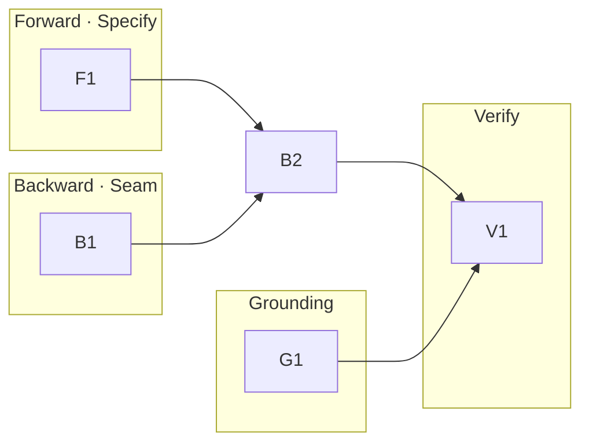

# 260626-contract-co-discovery — Tasks

## DAG

Tracks: **F** the forward probe in Specify; **B** the backward in-session fold; **G** the primary-source grounding; **V** the cross-file consistency gate. All edits land in the `leanplan` repo's own docs. (B2, the agnostic-statement guard, sits in track B; it depends on both F1 and B1.)

## T: F1

- **Goal**: Give Specify a generative move — an opt-in contract-discovery probe at the machine/world boundary (`Spec#B-1-specify-probes-for-unnamed-contract-facts`), kept opt-in (`Spec#C-1-discovery-moves-are-opt-in`) and surface-bounded (`Spec#C-3-discovery-feeds-dialogue-not-surface-bloat`), per `Design#D-1-specify-discovery-probe`.
- **Repo**: leanplan — `references/specify.md`
- **Completion**:
  - specify.md carries a discovery step between Lift-Constraints and the Spec test, plus a matching Guardrails bullet and self-check bullet (`Spec#B-1-specify-probes-for-unnamed-contract-facts`);
  - the step is declinable and a complete contract skips it; candidates route through dialogue/research, only accepted items reach the surface (`Spec#C-1-discovery-moves-are-opt-in`, `Spec#C-3-discovery-feeds-dialogue-not-surface-bloat`);
  - `leanplan-validate` and `leanplan-selftest` pass.
- **Dependencies**: none

## T: B1

- **Goal**: Make Design's backward discovery an **in-session fold** — additive facts authored into the Spec as new `B`/`C`, contradictory ones re-authored, both inline while the spine is warm, with `/revise` left to the committed path only (`Spec#B-2-design-found-fact-folds-back-as-completion`, `Spec#C-4-contradictory-change-not-silently-folded`), per `Design#D-2-backward-discovery-folds-in-session`.
- **Repo**: leanplan — `references/design.md` (step 8), `references/framework-design.md` (§194 reconciliation)
- **Completion**:
  - design.md step 8 replaces the blanket "Spec is wrong, run revise" with a warm working-set branch: (a) an additive fact is authored into the Spec as a new anchor, no `Delta`, no `/revise` (`Spec#B-2-design-found-fact-folds-back-as-completion`); (b) a contradictory fact is retire-by-noted + corrected in-session and stays distinct from additive (`Spec#C-4-contradictory-change-not-silently-folded`); both re-derive downstream and re-validate;
  - the branch states `/revise` is reserved for the committed/handed-off path;
  - framework-design.md §194 reconciles the editing-loop core as inline-while-warm vs `/revise`-once-committed;
  - `leanplan-validate` and `leanplan-selftest` pass.
- **Dependencies**: none

## T: B2

- **Goal**: Keep discovered facts solution-agnostic — guard both the Specify probe and the Design in-session fold so a fact discovered through a realization is stated by its observable property and passes the implementation-swap test (`Spec#B-3-solution-discovered-fact-stated-agnostically`, `Spec#C-2-spec-stays-invariant-under-realization-swap`), per `Design#D-3-solution-agnostic-statement-guard`.
- **Repo**: leanplan — `references/specify.md`, `references/design.md`
- **Completion**:
  - the probe (F1) and the in-session fold (B1) each carry the agnostic-statement guard with a worked agnostic-vs-coupled example (`Spec#B-3-solution-discovered-fact-stated-agnostically`);
  - a discovered fact stated through the guard passes the existing "what a Spec is NOT" swap test (`Spec#C-2-spec-stays-invariant-under-realization-swap`);
  - `leanplan-validate` and `leanplan-selftest` pass.
- **Dependencies**: F1, B1

## T: G1

- **Goal**: Ground the model claims in `framework-design.md` with verified primary citations, attributing the two-kinds taxonomy as LeanPlan's own synthesis (`Spec#C-5-model-claims-grounded-and-honestly-attributed`), per `Design#D-4-primary-source-grounding`. Confirm the unverified sources before any citation lands.
- **Repo**: leanplan — `framework-design.md` (coordinate model + research inputs)
- **Completion**:
  - the DOIs / wording flagged unverified in `research.md` are confirmed against publisher/book, or the specific citation is dropped or replaced (`Spec#C-5-model-claims-grounded-and-honestly-attributed`);
  - co-evolution and solution-agnostic-Spec claims carry canonical citations; the problem-given/solution-induced distinction is credited to the derived-requirements lineage + Jackson's designed-domain and marked LeanPlan's synthesis, not RE canon (`Spec#C-5-model-claims-grounded-and-honestly-attributed`);
  - `leanplan-validate` and `leanplan-selftest` pass.
- **Dependencies**: none

## T: V1

- **Goal**: Confirm the change leaves the framework internally consistent and passing its own gates — the cross-cutting integration check for the seam edit (`Design#D-2-backward-discovery-folds-in-session`).
- **Repo**: leanplan — repo-wide
- **Completion**:
  - `leanplan-selftest` and `leanplan-validate` pass repo-wide; any fixture asserting on edited reference content is updated and green;
  - a dry dogfood read confirms a fresh Specify run surfaces the probe, and a fresh Design run folds an additive fact into the Spec in-session (no `/revise`, no "Spec is wrong");
  - no dangling anchor or cross-reference remains among the edited docs (`specify.md`, `design.md`, `framework-design.md`).
- **Dependencies**: B2, G1
