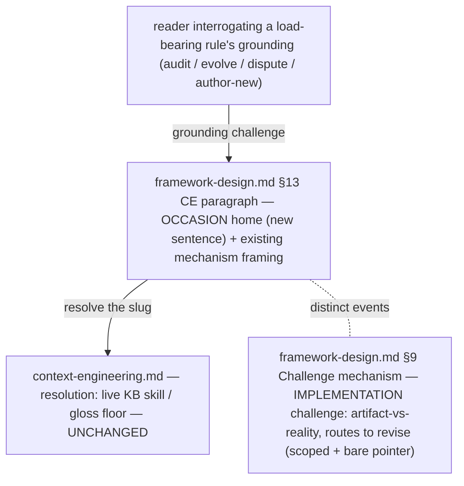

# 260626-grounding-challenge-occasion — Design

## Architecture

The whole change lives in `framework-design.md`. §13's CE paragraph gains the consultation *occasion* (it already owns the deep-grounding framing); §9's "Challenge mechanism" is scoped to the *implementation* challenge with a bare pointer the other way. The map (`context-engineering.md`) and `philosophy.md` already own *resolution* and the principle pointer respectively — they stay unchanged (one prose home per fact). No new skill, stage, or section (`Spec#C-1-minimal-altitude-no-new-machinery`).

## D-1: occasion-home-in-ce-paragraph
Add the consultation occasion to the `framework-design.md` §13 CE deep-grounding paragraph — the one prose home — realizing `Spec#B-1-consultation-occasion-resolvable-from-one-home`. State that a grounding challenge means **interrogating a load-bearing rule's grounding** (auditing it, evolving it, disputing it, or authoring a new grounding) — done when reasoning *about* the framework's design, not when operating a stage. See rationale at [design-rationale.md#D-1-occasion-home-in-ce-paragraph].
- The §13 paragraph already says hooks load "only when a hook is challenged" and owns the deep-grounding framing — the occasion sentence completes the same thought in place, adding no new section.
- **Reference the freshness concern abstractly, never the link-check skill by name** — keeps this feature independent of `260626-ce-grounding-link-check` (no forward reference to a deliverable that may land later).

## D-2: disambiguate-the-two-challenges
Distinguish the two events the framework calls "challenge", realizing `Spec#B-2-two-challenge-events-distinguishable`. The full one-line distinction lives in §13 beside the new occasion (the grounding challenge — a rule's *justification* questioned → consults the live source — is distinct from the §9 implementation challenge — a committed artifact contradicting current reality → routes to `revise`); §9's "Challenge mechanism" bullet is scoped to the *implementation* challenge with a bare pointer back to §13. See rationale at [design-rationale.md#D-2-disambiguate-the-two-challenges].
- One prose home for the distinction (§13); §9 carries only a bare cross-pointer, not a restatement (`artifact-contract.md` → One Prose Home Per Fact).
- Both edits are prose within existing bullets/paragraphs — no rename of an anchor, no new concept (`Spec#C-1-minimal-altitude-no-new-machinery`).
