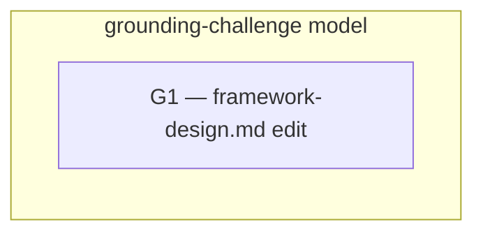

# 260626-grounding-challenge-occasion — Tasks

## Guidelines
- Docs-only, one PR; `leanplan-validate` + `leanplan-selftest` stay green. The change is confined to `framework-design.md` — `context-engineering.md`, `philosophy.md`, and adapters stay untouched.

## Dependency DAG

One task: a single coherent prose edit to `framework-design.md` (§13 + §9). No tracks to coordinate.

## T: G1

- **Goal**: Add the consultation occasion and disambiguate the two "challenge" events in `framework-design.md`, per `Design#D-1-occasion-home-in-ce-paragraph` and `Design#D-2-disambiguate-the-two-challenges`. In §13's CE paragraph state the grounding-challenge occasion (interrogating a load-bearing rule's grounding — audit / evolve / dispute / author-new — off the operational path) plus the one-line distinction from the §9 implementation challenge; scope §9's "Challenge mechanism" bullet to the implementation challenge with a bare back-pointer. Reference the freshness concern abstractly — never the `leanplan-ce-grounding-link-check` skill — to keep the features independent.
- **Repo**: `mynghn/leanplan` — `framework-design.md` (§13 CE paragraph + §9 Challenge-mechanism bullet).
- **Completion**:
  - (a) §13's CE paragraph names the occasion (interrogating a rule's grounding) and that it sits off the operational path — a reader names both from that one home — `Spec#B-1-consultation-occasion-resolvable-from-one-home`.
  - (b) the grounding challenge (rule-vs-evidence → live source) and the §9 implementation challenge (artifact-vs-reality → `revise`) are distinguishable: the full distinction sits in §13, §9 is scoped + carries a bare pointer — `Spec#B-2-two-challenge-events-distinguishable`.
  - (c) prose-only change — no new skill, stage, move, validator rule, or section; `context-engineering.md` and `philosophy.md` unchanged; `leanplan-selftest` passes — `Spec#C-1-minimal-altitude-no-new-machinery`.
- **Dependencies**: none

## Forward coverage

| Spec item | Covered by |
| --- | --- |
| `B-1-consultation-occasion-resolvable-from-one-home` | G1 (a) |
| `B-2-two-challenge-events-distinguishable` | G1 (b) |
| `C-1-minimal-altitude-no-new-machinery` | G1 (c) |
