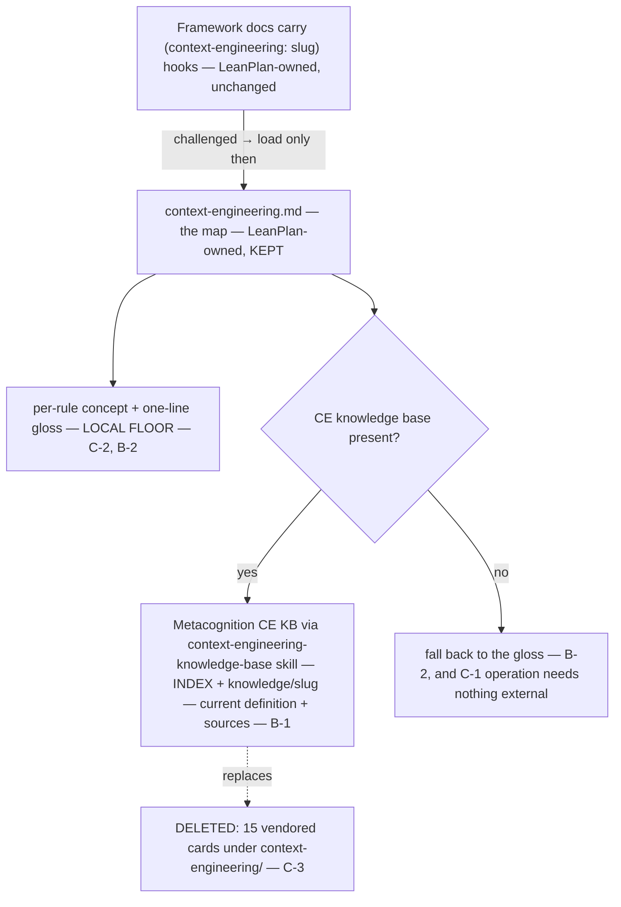

ㄱ# 260626-live-ce-grounding — Design

## Architecture

The hooks and the map stay LeanPlan-owned; only the 15 distilled cards are deleted. A challenged hook resolves through the map to the live Metacognition CE knowledge base when present (current definition + sources), and to the map's own per-rule gloss when absent. Nothing here is loaded by default — only on challenge (`Spec#C-4-grounding-stays-off-the-default-surface`).

## D-1: delete-the-vendored-cards
Delete all 15 `references/context-engineering/*.md` distilled cards — the deep-definition layer becomes the live source, not a LeanPlan-held copy. Realizes `Spec#C-3-no-vendored-definition-copy-ships`. See rationale at [design-rationale.md#D-1-delete-the-vendored-cards].
- The hooks and the map (`context-engineering.md`) are **not** deleted — they are LeanPlan-authored bindings, not copies of source content.
- No script touches the cards: `leanplan-validate` / `leanplan-selftest` validate `docs/features/` only, so deletion needs no validator change (Tasks confirms by a repo sweep).

## D-2: map-resolves-live-with-gloss-floor
Rewire `references/context-engineering.md` from a name→*vendored-node* map into a name→concept map whose deep layer resolves live, with the per-rule gloss as the local floor. Realizes `Spec#B-1-challenged-hook-resolves-live-when-source-present`, `Spec#B-2-challenged-hook-degrades-to-gloss-when-source-absent`, `Spec#C-2-every-hook-resolves-locally-to-a-named-concept-and-gloss`. See rationale at [design-rationale.md#D-2-map-resolves-live-with-gloss-floor].
- **Access mechanism — the Metacognition skill, not a path and not the remote.** Resolve via the `context-engineering-knowledge-base` *skill*, chosen over a location reference: its name is identical across the Claude / Codex / agents registries (a Metacognition identifier, not a harness one — so portable in this reference doc), and it abstracts the vault location, insulating LeanPlan from any storage relayout. It reads the **local** live vault; keeping that current vs. the private upstream is Metacognition's own `metacognition-freshness` concern, not LeanPlan's. The naive alternatives (hardcode the local vault path; fetch the private remote) are weighed and rejected in rationale.
- **Header rewrite** — replace "resolves every such name to its vendored node … `[[<slug>]]` resolves to `context-engineering/<slug>.md`" with a resolution note: *each `(context-engineering: <slug>)` hook names a context-engineering concept; to read its full definition + sources, consult Metacognition's context-engineering knowledge base (its `INDEX.md` + `knowledge/<slug>.md`) via the `context-engineering-knowledge-base` skill where present; when that source is absent or unreachable, the one-line gloss on the rule below is the local floor. Load only when a hook is challenged.*
- **Gloss floor** — the existing "Grounded rules → concept" bullets already carry a one-line gloss per rule; that gloss is the designated fallback. Completeness obligation (C-2): every `(context-engineering: <slug>)` hook in the framework must appear in this section with a gloss (Tasks verifies against the enumerated hook set).
- **`[[<slug>]]` redefined** — from "link to the vendored card file" to "concept name; resolves live (above) or to its rule gloss." No `leanplan-validate` citation depends on these wiki-links (it checks `Spec#`/`Design#`/`Tasks#` anchors, not `[[]]`).
- **Source identity recorded** — the resolution note names Metacognition's CE KB as the source, so freshness stays honest: the live source carries its own provenance; LeanPlan holds no `last_refreshed` stamp to go stale.

## D-3: frame-as-harness-supplied-grounding
Record CE deep-grounding as an instance of the framework's "name the behavior portably; the harness supplies the mechanism when present" split, and reconcile the two docs that still describe resolution as reaching a *vendored* node. Realizes the framework-level statement of `Spec#C-1-operation-needs-nothing-external` and keeps `Spec#C-4-grounding-stays-off-the-default-surface` intact. See rationale at [design-rationale.md#D-3-frame-as-harness-supplied-grounding].
- **`framework-design.md` §13** — add CE deep-grounding beside session-management as a harness-supplied mechanism: LeanPlan names the grounding portably (hooks + map + gloss — self-contained for *operation*); a present CE knowledge base supplies the live definition; a bare install reads the gloss. This is the framework-level home for the narrowed portability (only the *deep definition* layer is external; operation and named grounding stay local).
- **`framework-design.md` line 13** — reconcile "resolve via `context-engineering.md` (the name→node map)" → name→concept map; the full node lives in the live CE knowledge base, the gloss is the local floor.
- **`philosophy.md` line 28** — reconcile "to their context-engineering concept node (definition, sources, related edges)" → to the concept's gloss locally and its full node in the live CE knowledge base on challenge.
- The map's resolution note is the single prose home for the mechanism; adapters and stage docs are unchanged (they carry only hooks, which resolve via the map).
- **Residual coupling — named, not built here** (`UnderstandingShifts#Delta-1-referential-coupling-survives-unvendoring`). Unvendoring removes *content* drift but not the *reference* coupling: the slugs the hooks and map name must still resolve upstream. Validating that — one-way (Metacognition→LeanPlan), advisory, reference-link only; a concept's semantic correctness stays Metacognition's — is a **fast-follow** reference-link soft-gate skill, sibling to `leanplan-installation-freshness`. This feature names it (Requirements `## Guarantee`); the fast-follow builds it. Today's state is consistent (grounded slugs == the 15 live INDEX slugs), so nothing here is broken — only unguarded.
