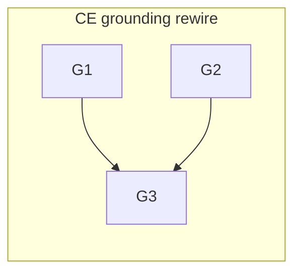

# 260626-live-ce-grounding — Tasks

## Guidelines
- **Docs-only, one PR closing #27.** No code/validator/skill changes; `leanplan-validate` + `leanplan-selftest` must stay green throughout.
- **No intermediate dangling reference.** Order so no committed state has a live doc pointing at a deleted card — rewire and reconcile (`G1`, `G2`) before deleting (`G3`). The DAG enforces this.

## Dependency DAG

One track: every change touches the same context-engineering grounding apparatus. `G1` rewires the map and `G2` reconciles the two resolution-describing docs so nothing points at the cards; `G3` then deletes them.

## T: G1

- **Goal**: Rewire `references/context-engineering.md` from a name→*vendored-node* map into a name→concept map that resolves the deep layer live, with the per-rule gloss as the local floor — per `Design#D-2-map-resolves-live-with-gloss-floor`. Replace the header/resolution note and redefine `[[<slug>]]` so a challenged hook reaches the live CE knowledge base when present (`Spec#B-1-challenged-hook-resolves-live-when-source-present`) and the rule's gloss when absent (`Spec#B-2-challenged-hook-degrades-to-gloss-when-source-absent`); name Metacognition's CE KB as the source.
- **Repo**: `mynghn/leanplan` — `references/context-engineering.md`.
- **Completion**:
  - (a) the header no longer claims a "vendored node" nor "`[[<slug>]]` resolves to `context-engineering/<slug>.md`"; it carries the resolution note (live KB via the `context-engineering-knowledge-base` skill where present; per-rule gloss when absent) — `Spec#B-1-challenged-hook-resolves-live-when-source-present`, `Spec#B-2-challenged-hook-degrades-to-gloss-when-source-absent`.
  - (b) gloss-floor completeness: enumerate every `(context-engineering: <slug>)` hook in the framework and confirm each appears in the "Grounded rules → concept" section with a one-line gloss — zero hooks missing a gloss — `Spec#C-2-every-hook-resolves-locally-to-a-named-concept-and-gloss`.
- **Dependencies**: none

## T: G2

- **Goal**: Reconcile the two docs that still describe resolution as reaching a vendored node, and record CE deep-grounding as a `framework-design.md` §13 harness-supplied mechanism — per `Design#D-3-frame-as-harness-supplied-grounding`. Frame the narrowed portability at the framework level (operation + named grounding stay self-contained; only the deep definition is external), keeping grounding challenge-time only (`Spec#C-1-operation-needs-nothing-external`, `Spec#C-4-grounding-stays-off-the-default-surface`).
- **Repo**: `mynghn/leanplan` — `framework-design.md` (line 13 + §13), `references/philosophy.md` (line 28).
- **Completion**:
  - (a) `framework-design.md:13` and `philosophy.md:28` no longer describe resolution as reaching a *vendored* node; §13 names CE deep-grounding beside session-management as harness-supplied, with the gloss as the bare-install floor — `Design#D-3-frame-as-harness-supplied-grounding`.
  - (b) no stage adapter or reference is changed to load the KB or cards by default; `leanplan-selftest` passes and a stage still authors its artifact with no external KB present — `Spec#C-1-operation-needs-nothing-external`, `Spec#C-4-grounding-stays-off-the-default-surface`.
- **Dependencies**: none

## T: G3

- **Goal**: Delete the 15 vendored cards and verify the deep-definition layer is now solely the live source — per `Design#D-1-delete-the-vendored-cards`. Remove `references/context-engineering/*.md` and sweep the live framework for any surviving pointer to a deleted card path (`Spec#C-3-no-vendored-definition-copy-ships`).
- **Repo**: `mynghn/leanplan` — `references/context-engineering/`.
- **Completion**:
  - (a) `references/context-engineering/` holds no card files — all 15 removed — `Spec#C-3-no-vendored-definition-copy-ships`.
  - (b) a repo sweep over live docs (excluding `docs/features/` history) returns no reference to a deleted `context-engineering/<slug>.md` path; `leanplan-selftest` still passes — `Spec#C-3-no-vendored-definition-copy-ships`, `Design#D-1-delete-the-vendored-cards`.
- **Dependencies**: G1 (map no longer points at the cards), G2 (the two docs reconciled) — both land before the delete so no committed state dangles.

## Forward coverage

| Spec item | Covered by |
| --- | --- |
| `B-1-challenged-hook-resolves-live-when-source-present` | G1 (a) |
| `B-2-challenged-hook-degrades-to-gloss-when-source-absent` | G1 (a) |
| `C-1-operation-needs-nothing-external` | G2 (b) |
| `C-2-every-hook-resolves-locally-to-a-named-concept-and-gloss` | G1 (b) |
| `C-3-no-vendored-definition-copy-ships` | G3 (a), G3 (b) |
| `C-4-grounding-stays-off-the-default-surface` | G2 (b) |
