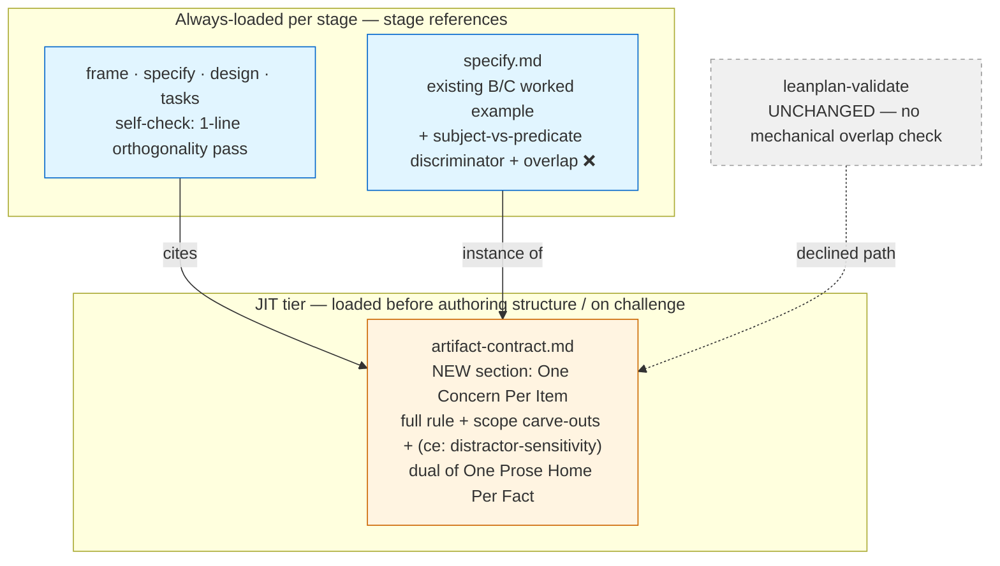

# 260630-item-orthogonality — Design

## Architecture

The rule is authored once in the JIT contract tier; each item-producing stage carries a one-line check that cites it; the validator is untouched.
This splits *where the full rule lives* (paid for only when authoring structure or on challenge) from *where the check fires* (always-loaded when a stage runs).



The B↔C discriminator (the crux of `Spec#B-2-same-subject-behavior-constraint-pair-adjudicated`) resolves on **predicate**, not subject:

```
two items share a subject?
  └─ no  → orthogonal by subject; done
  └─ yes → do they assert the same predicate (claim about the subject)?
            ├─ yes → OVERLAP — one merely restates the other → merge / cut
            └─ no  → distinct predicates (occurrence vs standing property) → LEGITIMATE pair
```

## D-1: principle-home-and-form

Author **One Concern Per Item** once in `artifact-contract.md`, as the explicit dual of *One Prose Home Per Fact*, stated as an affirmative goal and carrying the `(context-engineering: distractor-sensitivity)` grounding hook.
Realizes `Spec#B-1-item-overlap-named-as-defect`, `Spec#C-1-orthogonality-guidance-stays-high-freedom`, `Spec#C-2-additions-hold-the-surface-budget`, `Spec#C-3-rule-flags-no-legitimately-distinct-pairing`.
The rule binds every item kind and every section pair; its body carves out the two legitimately-distinct structures (an altitude pair; a correct Behavior + Constraint split) so it never reads as forbidding them.
Non-trivial (placement alternatives weighed) → `design-rationale.md#D-1-principle-home-and-form`.

## D-2: bc-discriminator-in-specify

Extend `specify.md`'s existing B/C worked example with the subject-vs-predicate test and one ❌ overlap case (a Constraint that only re-asserts a Behavior's occurrence).
Realizes `Spec#B-2-same-subject-behavior-constraint-pair-adjudicated` and demonstrates the `Spec#C-3` legitimate-split carve-out in situ.
The discriminator lives where the hard case is authored, not as a standalone section.
Non-trivial → `design-rationale.md#D-2-bc-discriminator-in-specify`.

## D-3: write-time-check-as-stage-self-check-pointer

Add a one-line, high-freedom orthogonality-pass bullet to each item-producing stage's self-check — `frame.md`, `specify.md`, `design.md`, `tasks.md` — each phrased as a goal ("name each item's one concern; resolve any pair that shares one") and citing D-1 rather than restating the rule.
Realizes `Spec#B-3-authoring-surfaces-an-orthogonality-check`, `Spec#C-1-orthogonality-guidance-stays-high-freedom`, `Spec#C-2-additions-hold-the-surface-budget`.
The full rule stays in the JIT tier (D-1); only the trigger + goal sit in the always-loaded stage reference, so four small additions cost little.
Non-trivial (which stages; always-loaded vs JIT tier) → `design-rationale.md#D-3-write-time-check-as-stage-self-check-pointer`.

## D-4: no-mechanical-enforcement

Leave `leanplan-validate` unchanged: neither a content-overlap check nor the cheap slug-near-duplicate advisory is added.
Realizes the Requirements non-goal (mechanical detection out of scope) and protects `Spec#C-1-orthogonality-guidance-stays-high-freedom`.
A real alternative (the slug advisory) was weighed and rejected.
Non-trivial (road-not-taken worth recording) → `design-rationale.md#D-4-no-mechanical-enforcement`.
