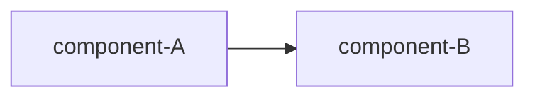

# 260630-item-orthogonality — Design

## Architecture

<!-- brief caption: what this visual shows.
Mermaid or fenced ASCII art are valid. -->

<!-- Add Decision blocks below, each as:
##   D-<N>: <kebab-slug>
with a one-line WHAT and a one-line WHY (trivial) or a rationale anchor (non-trivial).
See rationale at [design-rationale.md#D-<N>-<slug>]. -->
