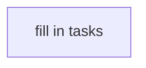

# 260630-item-orthogonality — Tasks

<!-- Doc-level Guidelines section is conditional — include only when feature-wide
work-stance rules genuinely apply (base branch, canary sequence, coordination). -->

## Dependency DAG

<!-- caption: what the tracks represent; 1-2 sentences. -->

<!-- Add task cards below, each as:
##   T: <track-prefix><N>
- **Goal**: <WHAT + HOW; inline Spec#B-<N>-<slug> / Spec#C-<N>-<slug> / Design#D-<N>-<slug> anchors.
  Place the task outcome on its own source line when adding more detail.>
- **Repo**: <path or repo name>
- **Completion**: <observable verification, cites Spec anchors>
- **Dependencies**: <prior task IDs as enablers | none>
- **Guidelines** (conditional): <task-level work-stance rules>
-->
