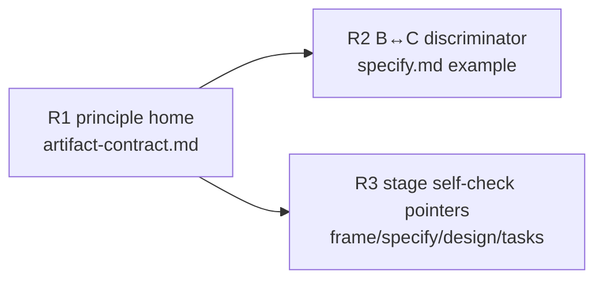

# 260630-item-orthogonality — Tasks

## Guidelines

- `leanplan-validate` is intentionally untouched (`Design#D-4-no-mechanical-enforcement`); a task that finds itself editing the validator has drifted.
- Dogfood the rule on every doc this feature edits: each edited file's own item set must itself be orthogonal.
  Reconciliation is scoped to edited artifacts only — a broad audit of shipped feature specs is a separate follow-up (`Deferrals#Defer-1-existing-artifact-reconciliation-scope`).

## Dependency DAG

Single track (framework docs, all under `references/`).
R1 authors the canonical rule; R2 and R3 cite it, so both depend on R1 and are independent of each other.

## T: R1

- **Goal**: Author the **One Concern Per Item** rule once in `artifact-contract.md`, as the named dual of *One Prose Home Per Fact* (`Design#D-1-principle-home-and-form`).
  State it affirmatively (each item asserts exactly one concern no sibling asserts), bind it to every item kind and section pair, carry the `(context-engineering: distractor-sensitivity)` hook, and carve out the two legit non-overlaps (an altitude pair; a correct Behavior + Constraint split).
- **Repo**: leanplan (`references/artifact-contract.md`)
- **Completion**: the section exists and reads as an affirmative goal realizing `Spec#B-1-item-overlap-named-as-defect`; it states the rule once with no restatement elsewhere (`Spec#C-2-additions-hold-the-surface-budget`), is phrased as a goal not a procedure (`Spec#C-1-orthogonality-guidance-stays-high-freedom`), and its carve-outs flag no legitimately-distinct pairing (`Spec#C-3-rule-flags-no-legitimately-distinct-pairing`).
  `leanplan-validate` passes on the repo's own fixtures/selftest.
- **Dependencies**: none

## T: R2

- **Goal**: Extend `specify.md`'s existing B/C worked example with the subject-vs-predicate discriminator and one ❌ overlap case — a Constraint that only re-asserts a Behavior's occurrence (`Design#D-2-bc-discriminator-in-specify`).
  The example must cite the R1 rule rather than restate it.
- **Repo**: leanplan (`references/specify.md`)
- **Completion**: the worked example distinguishes a legitimate same-subject B+C pair from an overlap, realizing `Spec#B-2-same-subject-behavior-constraint-pair-adjudicated` and showing the `Spec#C-3-rule-flags-no-legitimately-distinct-pairing` carve-out in situ; a reader applying it verdicts the anomaly case legitimate and a restating Constraint as overlap.
- **Dependencies**: R1 (cites the rule)

## T: R3

- **Goal**: Add a one-line, high-freedom orthogonality-pass bullet to the self-check of each item-producing stage — `frame.md`, `specify.md`, `design.md`, `tasks.md` — each phrased as a goal and citing the R1 rule, not restating it (`Design#D-3-write-time-check-as-stage-self-check-pointer`).
- **Repo**: leanplan (`references/frame.md`, `references/specify.md`, `references/design.md`, `references/tasks.md`)
- **Completion**: each of the four stage self-checks carries the orthogonality pass, realizing `Spec#B-3-authoring-surfaces-an-orthogonality-check`; each bullet is a goal not a rote N×N procedure (`Spec#C-1-orthogonality-guidance-stays-high-freedom`) and is a pointer to R1, adding no restatement (`Spec#C-2-additions-hold-the-surface-budget`).
- **Dependencies**: R1 (cites the rule)
