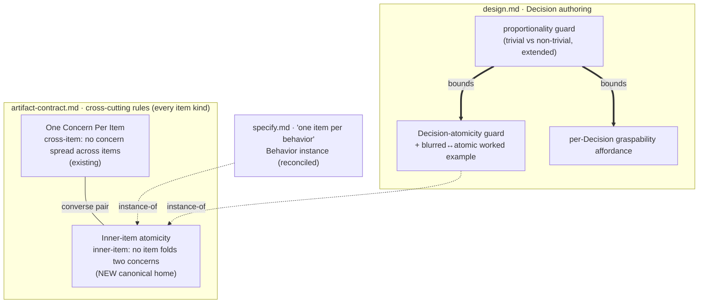

# 260701-design-decision-legibility — Design

## Architecture

The edits touch three framework docs.
`artifact-contract.md` gains the canonical home for inner-item atomicity, paired with its existing converse One Concern Per Item (`D-1`); `specify.md`'s behavior rule and `design.md`'s new Decision guard both become instances of it (`D-1`, `D-2`).
Inside `design.md`, two per-Decision affordances are added — atomicity (`D-2`) and graspability (`D-3`) — and both are held under one proportionality guard (`D-4`) so neither fires on a trivial decision.

## Decisions

### D-1: promote-inner-atomicity-to-cross-cutting

Lift inner-item atomicity — "an item asserts exactly one concern; don't fold two into one" — into `artifact-contract.md` as a named cross-cutting rule over every item kind (B / C / D / T:), the converse of One Concern Per Item, so `specify.md` and `design.md` carry per-stage *instances* rather than the rule's home.
Satisfies `Spec#C-2-decision-asserts-one-separable-point` (its canonical home), with `D-2` its Decision instance.
WHY: non-trivial (a live stage-local alternative was rejected; edits an always-loaded doc) → `design-rationale.md#D-1-promote-inner-atomicity-to-cross-cutting`.

- `artifact-contract.md` One Concern Per Item section is reframed to own *both* converse directions: the headline already encodes both ("exactly one concern that no sibling asserts"), so the edit rewrites the passage that attributes the inner direction to `specify.md`, naming `specify.md` (B) and `design.md` (D) as instances instead.
- The section's existing nuance is preserved verbatim in substance: converse-not-reversal, the partition framing, and the two legitimate look-alikes (altitude pair; Behavior+Constraint over one subject).
- `specify.md`'s "one item per behavior; don't fold two into one" is reconciled to cite the cross-cutting rule, keeping its Behavior-specific ❌-fold worked example.

### D-2: decision-atomicity-instance

Add `design.md`'s Decision-level instance of inner-item atomicity: a guardrail "one Decision per separable choice; don't fuse two separable choices into one block," bounded by a separability test, plus a blurred↔atomic worked example.
Satisfies `Spec#C-2-decision-asserts-one-separable-point` (the Decision instance of the `D-1` rule).
WHY: non-trivial (the separability bound is what stops it becoming its own over-splitting flat prescription) → `design-rationale.md#D-2-decision-atomicity-instance`.

- New guardrail near "No fake decisions," citing the `D-1` cross-cutting rule; a block fusing two choices — each with its own alternative or tradeoff — is split, while facets of one choice (schema, rejected alternative, invalidation cue) stay folded together (aligns with the existing "schemas fold inline within the relevant Decision").
- Worked example paralleling the existing conclusion-first good/bad: ❌ one "cache" Decision fusing cache-vs-direct-read + invalidation-strategy + key-schema; ✅ split into a cache-read Decision (key-schema folded in) and a separate invalidation-strategy Decision (its own alternative), showing where the separability line falls.
- Self-check gains: "each Decision is one separable choice; a block fusing two choices — each with its own alternative — is split."

### D-3: per-decision-graspability-affordance

Generalize `design.md`'s step-3 "prefer a visual companion … where a relationship / sequence / mapping would be prose" from the Architecture step down to the per-Decision level, and widen the aid to a worked example, local diagram, or small table — the author's choice.
Satisfies `Spec#B-1-complex-decision-graspable-in-place`.
WHY: generalizes an existing note and adds the worked-example aid; the "gated, not mandated" reasoning is `D-4`'s (cite, don't restate).

- New Decision-level guardrail, complementing the untouched Architecture-level mandatory-visual guard: the aid fires only when a Decision's mechanism is complex enough that prose alone would leave a reviewer re-deriving it, and the contract is the reviewer's in-place grasp, not any particular aid.
- Self-check gains: "a complex Decision's mechanism is graspable in-place via whatever aid fits, not left as prose a reviewer must re-derive."

### D-4: proportionality-guard

Extend `design.md`'s "Trivial vs non-trivial" guardrail so a trivial Decision gets neither a split (`D-2`) nor an aid (`D-3`), and name concise-not-compressed as the principle governing both new affordances.
Satisfies `Spec#C-1-resolution-proportional-to-complexity`.
WHY: non-trivial (this is the flat-prescription defense the feature turns on; a uniform-mandate alternative was live) → `design-rationale.md#D-4-proportionality-guard`.

- The existing "Trivial vs non-trivial" guardrail gains a clause: the atomicity split and the graspability aid are both gated on genuine complexity; a trivial one-line Decision gains neither.
- Self-check gains: "no Decision carries a split, example, or diagram a reviewer would read as redundant — resolution stays proportional to complexity."
