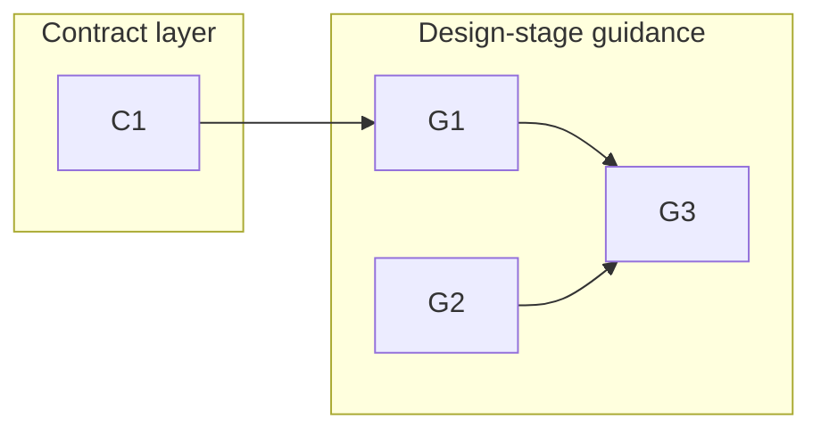

# 260701-design-decision-legibility — Tasks

## Guidelines

- Edit the framework docs in the feature worktree (`/Users/admin/nio/playground/leanplan-design-decision-legibility`, branch `feat/design-decision-legibility`), never the main checkout — the skill's `LP_ROOT` resolves to the main checkout, so verify each edit lands in the worktree copy.
- These are write-time semantic guards, not validator code: after each doc edit, `leanplan-validate` (its selftest and this feature's own artifacts) stays green — there is no validator change to make.

## Dependency DAG

Track C edits the always-loaded cross-cutting contract; track G edits the Design-stage reference.
C1 lands the canonical rule that G1 instances; G3 (the proportionality bound) references the affordances G1 and G2 land.

## T: C1

- **Goal**: Give inner-item atomicity a canonical cross-cutting home per `Design#D-1-promote-inner-atomicity-to-cross-cutting`, so it satisfies `Spec#C-2-decision-asserts-one-separable-point` as a named rule rather than a stage-local one.
  The work reframes `artifact-contract.md`'s One Concern Per Item section to own both converse directions and reconciles `specify.md`'s behavior rule to cite it as an instance.
- **Repo**: leanplan · `references/artifact-contract.md` + `references/specify.md`
- **Completion**:
  - `artifact-contract.md` names inner-item atomicity as the cross-cutting converse of One Concern Per Item over every item kind (B / C / D / T:); `specify.md`'s "one item per behavior; don't fold two into one" reads as an instance citing it.
  - The section's existing nuance survives unchanged in substance: converse-not-reversal, the partition framing, and the two legitimate look-alikes (altitude pair; Behavior + Constraint over one subject).
  - `leanplan-validate` selftest and this feature's artifacts re-validate green.
- **Dependencies**: none

## T: G1

- **Goal**: Operationalize decision atomicity in the Design stage per `Design#D-2-decision-atomicity-instance`, the Decision instance satisfying `Spec#C-2-decision-asserts-one-separable-point`.
  The work adds a `design.md` guard and a blurred↔atomic worked example that cite the C1 rule, bounded by the separability test so folded facets of one choice are never split apart.
- **Repo**: leanplan · `references/design.md`
- **Completion**:
  - `design.md` carries the "one Decision per separable choice" guard citing the cross-cutting rule, a blurred↔atomic worked example, and a matching self-check bullet.
  - Applied to the example: the ❌ fused-cache Decision splits into cache-read + invalidation-strategy, while the ✅ single choice with folded schema/alternative does not — the separability line is legible from the example alone.
  - `leanplan-validate` re-validates green.
- **Dependencies**: C1 lands the cross-cutting rule this guard is an instance of and cites.

## T: G2

- **Goal**: Add a per-Decision graspability affordance per `Design#D-3-per-decision-graspability-affordance`, satisfying `Spec#B-1-complex-decision-graspable-in-place`.
  The work generalizes `design.md`'s Architecture-step visual-companion note down to the Decision level and widens the aid to an example, diagram, or table — author's choice, fired only on genuine complexity.
- **Repo**: leanplan · `references/design.md`
- **Completion**:
  - `design.md` carries a Decision-level graspability guardrail (aid is the author's choice; the contract is in-place grasp) plus a self-check bullet, with the Architecture-level mandatory-visual guard left untouched.
  - `leanplan-validate` re-validates green.
- **Dependencies**: none

## T: G3

- **Goal**: Bound both new affordances with the proportionality guard per `Design#D-4-proportionality-guard`, satisfying `Spec#C-1-resolution-proportional-to-complexity`.
  The work extends `design.md`'s Trivial-vs-non-trivial guardrail so a trivial Decision gains neither the G1 split nor the G2 aid, naming concise-not-compressed as the governing principle.
- **Repo**: leanplan · `references/design.md`
- **Completion**:
  - `design.md`'s Trivial-vs-non-trivial guardrail states a trivial Decision gains neither a split nor an aid, with a self-check bullet requiring resolution proportional to complexity.
  - A trivial one-line Decision, run against the extended guidance, gains nothing — proportionality is legible from the guardrail.
  - `leanplan-validate` re-validates green.
- **Dependencies**: G1 and G2 land the split and the aid that this bound references.
