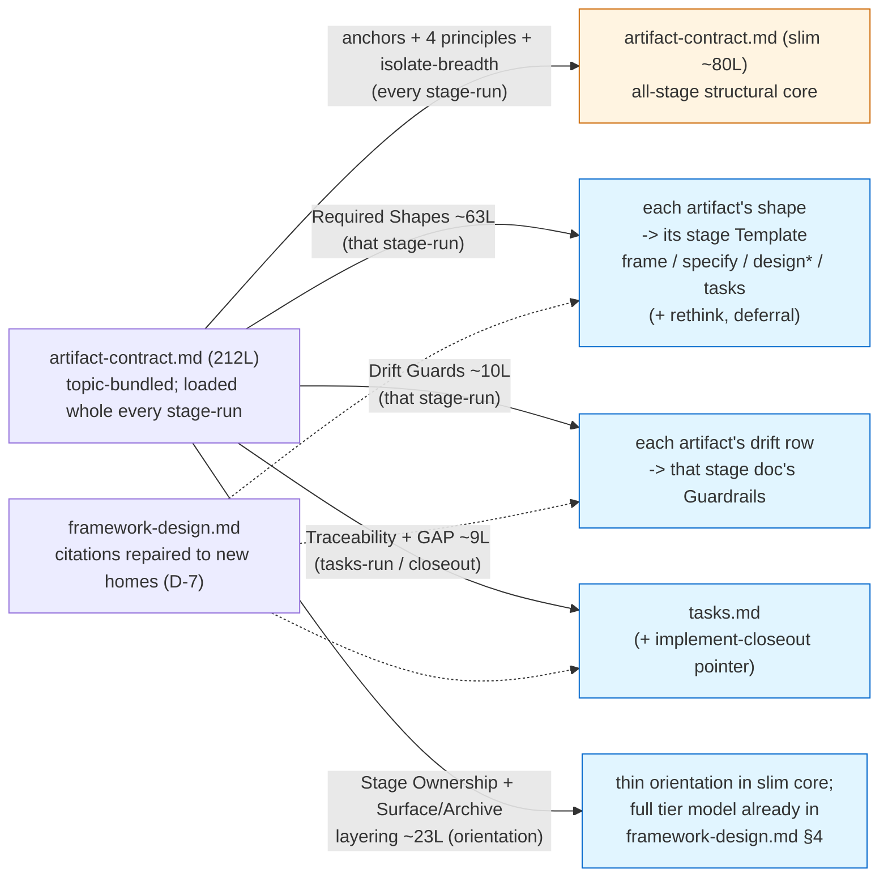

# 260701-reference-doc-boundaries — Design

## Architecture

The re-derivation from load-occasion validates the current structure everywhere except `artifact-contract.md`: the five stage docs and the off-pipeline docs are already occasion-pure (each loads at one stage-run or move, with only one-line pointers deferring foreign occasions).
The whole over-fetch lives in `artifact-contract.md` — 212 lines loaded whole at every stage-run's structure-write moment, though only its Anchors block fires at that trigger across all stages.
So the design decomposes that one doc by load-occasion and relocates each slice to the occasion that needs it, resolving the Required-Shapes↔Template duplication in the same move.

`* design.md` gains a Template it lacks today (only frame / specify / tasks have one) — the asymmetry is removed in the same move.

Every cross-unit link stays one hop: a stage doc points to the slim core for anchors/principles, and the slim core points to no relocated slice — realizing `Spec#C-2-references-resolve-one-hop`.
No content is deleted; each concern moves to exactly one new home — realizing `Spec#C-3-content-preserved-losslessly` and `Spec#C-1-one-authored-home-per-concern`.

## D-1: stage-docs-unchanged

Leave the five stage docs (`frame`/`specify`/`design`/`tasks`/`implement`) and the off-pipeline docs (`rethink`/`revise`/`deferral`/`philosophy`/`context-engineering`) at their current boundaries; the re-derivation confirms them.
Each is already occasion-pure — everything co-loading at its run belongs to that run, and foreign occasions are reached by one-line pointers that correctly defer the body (`implement.md`→`implement-closeout.md` is the exemplar).
This bounds the feature to the one doc that is actually mis-bounded, realizing `Spec#B-2-occasion-load-is-clean` without churn where the load is already clean.
Non-trivial (a from-scratch scope could have re-cut every doc) → `design-rationale.md#D-1-stage-docs-unchanged`.

## D-2: slim-contract-to-cross-stage-core

Reduce `artifact-contract.md` to the concerns that fire at (nearly) every stage-run: the Anchors grammar, the four cross-cutting authoring principles (One Prose Home Per Fact, One Concern Per Item, Prose Style, Surface Budget), and the Isolate-breadth guardrail.
These share one load-occasion profile — needed whenever any artifact is authored or self-checked — so they are one unit; the slimmed doc is the always-at-stage-run structural core (~80 lines, down from 212).
The four principles stay here, not in `philosophy.md`: they are structural rules, and `260630`'s home decision put One Concern Per Item here for exactly that reason.
Realizes `Spec#B-2-occasion-load-is-clean` (the stage-run load stops dragging other occasions' content).
Non-trivial (retained-core composition; principle-home reaffirmation) → `design-rationale.md#D-2-slim-contract-to-cross-stage-core`.

## D-3: artifact-shape-one-home-at-its-stage

Give each artifact's shape exactly one home — its authoring stage's Template — and drop the contract's `Required Shapes` section.
`frame`/`specify`/`tasks` already carry a local Template, so their shape collapses into it; `design.md` gains a Template (removing the current asymmetry where Design alone had none); Rationale/Research shapes fold into `design.md`, Understanding-Shifts into `rethink.md`, Deferrals into `deferral.md`.
This resolves the worst duplication (the 63-line `Required Shapes` block re-authored as stage Templates) into a single home per artifact, realizing `Spec#C-1-one-authored-home-per-concern`, and co-locates each shape with the run that needs it (`Spec#B-1-occasion-load-is-sufficient`).
Non-trivial (which home; stage-Template vs contract-owns) → `design-rationale.md#D-3-artifact-shape-one-home-at-its-stage`.

## D-4: drift-guards-to-their-stage

Fold each artifact's Drift-Guard row into that stage doc's Guardrails (Requirements-drift→`frame`, Spec-drift→`specify`, Design-drift→`design`, Tasks-drift→`tasks`) and drop the contract's `Drift Guards` section.
Same occasion logic as D-3 — a drift guard fires only at its own stage-run — and the Design/Tasks rows already sit partly in those docs' guardrails (self-labeled "symmetric guard"), so this consolidates rather than invents.
Realizes `Spec#C-1-one-authored-home-per-concern` and `Spec#B-2-occasion-load-is-clean`.

## D-5: traceability-to-tasks-and-closeout

Move `Traceability` + the `**GAP**` acknowledgment to `tasks.md`, where forward/reverse coverage already lives, and keep the reconciliation pointer in `implement-closeout.md`.
Traceability's occasion is `tasks-run` plus close-out/review, not the every-stage structure-write trigger it rides today, so relocating it stops it over-fetching at `frame`/`specify`/`design` runs.
Realizes `Spec#B-2-occasion-load-is-clean` and `Spec#C-1-one-authored-home-per-concern`.
Non-trivial (an alternative keeps it in the core as "shared") → `design-rationale.md#D-5-traceability-to-tasks-and-closeout`.

## D-6: references-one-hop-and-boilerplate

Keep every cross-unit reference one hop from its point of use, and split the repeated content by kind: a repeated multi-line *payload* guardrail (Isolate-breadth) gets one canonical home in the slim core with the stage docs pointing to it, while a one-line *navigation trigger* (the rethink pointer, the Companion line, the deferral capture/drain pointers) stays inlined at each stage-run because inlining a trigger matches its occasion and a pointer would only add a hop.
Realizes `Spec#C-2-references-resolve-one-hop` and `Spec#C-1-one-authored-home-per-concern` without tipping into the over-fragmentation the Requirements bars.
Every relocation (D-3/D-4/D-5) sweeps the `references/` docs for pointers to the moved section and repairs each to the new home; the in-scope pointers found are `philosophy.md` and `revise.md` (both cite the contract's now-relocated traceability / drift-guard / shape rules).
Non-trivial (the inline-trigger vs consolidate-payload judgment) → `design-rationale.md#D-6-references-one-hop-and-boilerplate`.

## D-7: framework-design-citation-repair

Repair `framework-design.md`'s ~7 citations to the relocated sections (`→ Required Shapes`, `→ Drift Guards`, `→ Traceability` at its lines 113/115/127/130/131/154) so each points to the new home, and change nothing else in that doc.
`framework-design.md` is the challenge-time archive that maps each contract rule to its canonical `references/` home; when a home moves, the map's pointer must follow, or the moved rule becomes unreachable from the archive — a C-2 dangling reference.
Its design content, role, and section structure stay unchanged, so this is meaning-preserving reference-repair, not the re-boundarying the Requirements bars — the Requirements' own "pointer-repair is ordinary follow-through" non-goal licenses it, and `Spec#C-4-scope-stays-in-workflow-refs` was warm-folded during this stage to say so.
Realizes `Spec#C-2-references-resolve-one-hop`; `README.md` needs no such repair (it carries no pointer to a relocated section).
Non-trivial (a surfaced scope-boundary refinement the planner adjudicated) → `design-rationale.md#D-7-framework-design-citation-repair`.
