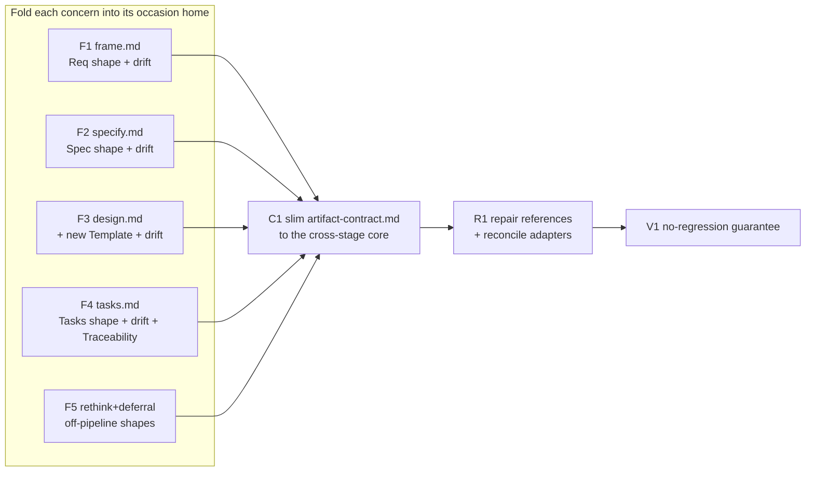

# 260701-reference-doc-boundaries — Tasks

## Guidelines

- **No performance degrade — the floor to guarantee.** This refactor only relocates content losslessly and removes over-fetch, so it must not leave any stage-run reaching for a concern it lost.
  The `V1` gate proves the floor — losslessness, per-occasion sufficiency and cleanliness (`Spec#B-1-occasion-load-is-sufficient` / `Spec#B-2-occasion-load-is-clean`), reference integrity, tooling green, and a dogfood run.
- **Relocate, don't rewrite.** Move each concern verbatim to its new home, and do not reword a rule (`Spec#C-3-content-preserved-losslessly`).
  A fold places content in the new home, and `C1` removes it from the contract only after it is placed.
- **Scope.** Re-boundarying stays in `references/`; `framework-design.md` gets citation-repair only (`Design#D-7-framework-design-citation-repair`), and `README.md` is untouched (`Spec#C-4-scope-stays-in-workflow-refs`).
- **Base branch — stacked on `feat/item-orthogonality`, not `main`.** This work re-touches the same `references/` docs that feature 260630 edited (One Concern Per Item in the contract; the B/C discriminator and the orthogonality-pass self-check bullets in the stage docs), so basing on `main` would miss or collide with them.
  Merge order follows: 260630 (PR #65) lands first, then this feature stacks onto it or retargets `main` once #65 is merged.
- **Dogfood.** Each edited doc must itself stay occasion-aligned and orthogonal — the framework obeying its own re-drawn rule.

## Dependency DAG

Track Fold relocates each artifact's shape and drift guard (and Traceability) into the occasion home; `C1` then slims the contract to the residual core; `R1` repairs every pointer to a moved section; `V1` proves no regression.
The fold tasks are mutually independent (each edits a different destination doc, reading the current contract) and can run in any order.

## T: F1

- **Goal**: Make `frame.md` the single home of the Requirements shape and its drift guard.
  Reconcile the existing Requirements Template in `frame.md` against the contract's Required-Shapes→Requirements so the Template is the one canonical shape (`Design#D-3-artifact-shape-one-home-at-its-stage`), and fold the Requirements Drift-Guard row into `frame.md`'s Guardrails (`Design#D-4-drift-guards-to-their-stage`).
- **Repo**: leanplan (`references/frame.md`; reads `references/artifact-contract.md`)
- **Completion**:
  - `frame.md` carries the Requirements shape + Req drift guard; the conditional-section logic (omit empty Non-goals/Upstream) is stated once, not re-duplicated (`Spec#C-1-one-authored-home-per-concern`).
  - A frame-run load (`frame.md` + slimmed contract) still reaches every concern frame needs (`Spec#B-1-occasion-load-is-sufficient`); content is moved verbatim (`Spec#C-3-content-preserved-losslessly`).
- **Dependencies**: none

## T: F2

- **Goal**: Make `specify.md` the single home of the Spec shape and its drift guard — collapse the contract's Required-Shapes→Spec into `specify.md`'s existing Template (`Design#D-3-artifact-shape-one-home-at-its-stage`) and fold the Spec Drift-Guard row into its Guardrails (`Design#D-4-drift-guards-to-their-stage`).
- **Repo**: leanplan (`references/specify.md`; reads `references/artifact-contract.md`)
- **Completion**:
  - `specify.md` is the sole prose home of the Spec shape + Spec drift (`Spec#C-1-one-authored-home-per-concern`); the B/C-split worked example (already here) is untouched.
  - A spec-run load reaches every concern specify needs (`Spec#B-1-occasion-load-is-sufficient`); content moved verbatim (`Spec#C-3-content-preserved-losslessly`).
- **Dependencies**: none

## T: F3

- **Goal**: Give `design.md` the Template it lacks — author the Design / Design-Rationale / Research shapes into a local Template (`Design#D-3-artifact-shape-one-home-at-its-stage`, removing the under-templated asymmetry) and fold the Design Drift-Guard row into its Guardrails (`Design#D-4-drift-guards-to-their-stage`).
- **Repo**: leanplan (`references/design.md`; reads `references/artifact-contract.md`)
- **Completion**:
  - `design.md` carries the Design/Rationale/Research shape + Design drift as its single home (`Spec#C-1-one-authored-home-per-concern`).
  - A design-run load reaches every concern design needs (`Spec#B-1-occasion-load-is-sufficient`); content moved verbatim (`Spec#C-3-content-preserved-losslessly`).
- **Dependencies**: none

## T: F4

- **Goal**: Make `tasks.md` the home of the Tasks shape, its drift guard, and Traceability.
  Collapse Required-Shapes→Tasks into the existing Template and fold the Tasks Drift-Guard row (`Design#D-3-artifact-shape-one-home-at-its-stage`, `Design#D-4-drift-guards-to-their-stage`); relocate Traceability + the `**GAP**` acknowledgment here (`Design#D-5-traceability-to-tasks-and-closeout`) and update `implement-closeout.md`'s reconciliation pointer to the new home.
- **Repo**: leanplan (`references/tasks.md`, `references/implement-closeout.md`; reads `references/artifact-contract.md`)
- **Completion**:
  - `tasks.md` is the single home of the Tasks shape + Tasks drift + Traceability/`**GAP**` (`Spec#C-1-one-authored-home-per-concern`); the `implement-closeout.md` pointer resolves to it one hop (`Spec#C-2-references-resolve-one-hop`).
  - Traceability no longer loads at frame/specify/design runs (`Spec#B-2-occasion-load-is-clean`); content moved verbatim (`Spec#C-3-content-preserved-losslessly`).
- **Dependencies**: none

## T: F5

- **Goal**: Fold the two off-pipeline artifact shapes into their move docs — the Understanding-Shifts shape into `rethink.md` and the Deferrals shape into `deferral.md` (`Design#D-3-artifact-shape-one-home-at-its-stage`, off-stage shapes).
- **Repo**: leanplan (`references/rethink.md`, `references/deferral.md`; reads `references/artifact-contract.md`)
- **Completion**:
  - the Understanding-Shifts shape lives once in `rethink.md` and the Deferrals shape once in `deferral.md` (`Spec#C-1-one-authored-home-per-concern`); each move's load reaches its shape (`Spec#B-1-occasion-load-is-sufficient`).
  - content moved verbatim (`Spec#C-3-content-preserved-losslessly`).
- **Dependencies**: none

## T: C1

- **Goal**: Slim `artifact-contract.md` to the every-stage-run core — retain Anchors, the four cross-cutting authoring principles (One Prose Home, One Concern, Prose Style, Surface Budget), the Isolate-breadth guardrail, and thin orientation; remove the now-relocated Required Shapes, Drift Guards, and Traceability (`Design#D-2-slim-contract-to-cross-stage-core`).
- **Repo**: leanplan (`references/artifact-contract.md`)
- **Completion**:
  - the contract contains only the retained core and no relocated section remains (`Spec#C-1-one-authored-home-per-concern`, `Spec#B-2-occasion-load-is-clean`); nothing an occasion needs is orphaned (checked against F1–F5's new homes).
  - the retained principles stay here, not moved to `philosophy.md` (`Design#D-2-slim-contract-to-cross-stage-core`).
- **Dependencies**: F1, F2, F3, F4, F5 (content must be placed before removal)

## T: R1

- **Goal**: Repair every pointer to a relocated section and reconcile the adapters.
  Sweep `references/` (`philosophy.md`, `revise.md`, and any stage-doc pointer) and repair each reference to a moved section to its new home one hop (`Design#D-6-references-one-hop-and-boilerplate`, `Spec#C-2-references-resolve-one-hop`); repair `framework-design.md`'s ~7 citations to the relocated sections (`Design#D-7-framework-design-citation-repair`); reconcile the Claude + Codex adapters' descriptions of `artifact-contract.md`'s contents to match the slim core.
- **Repo**: leanplan (`references/philosophy.md`, `references/revise.md`, `framework-design.md`, `adapters/claude/*/SKILL.md`, `adapters/codex/*/*`)
- **Completion**:
  - no reference to a relocated section dangles anywhere in `references/`, `framework-design.md`, or the adapters (`Spec#C-2-references-resolve-one-hop`); every repaired pointer resolves in one hop.
  - `framework-design.md`'s design content is otherwise unchanged (`Spec#C-4-scope-stays-in-workflow-refs`); `README.md` untouched.
- **Dependencies**: C1

## T: V1

- **Goal**: Prove the no-regression floor — that the re-boundaried framework performs at least as well as before.
  This is the guarantee the planner required; it verifies the whole change against the Spec rather than any single edit.
- **Repo**: leanplan (whole `references/` set + `framework-design.md` + adapters)
- **Completion**:
  - **Losslessness**: a before/after concern inventory (git diff of the pre-change docs vs the new homes) shows every rule/concern present in exactly one new home (`Spec#C-3-content-preserved-losslessly`, `Spec#C-1-one-authored-home-per-concern`).
  - **Per-occasion sufficiency + cleanliness**: for each stage-run and off-pipeline move, the set of units it loads carries every concern that occasion needs and no concern whose profile excludes it (`Spec#B-1-occasion-load-is-sufficient`, `Spec#B-2-occasion-load-is-clean`) — the direct no-under-fetch / no-degrade check.
  - **Reference integrity**: a link/grep sweep confirms no dangling pointer across `references/`, `framework-design.md`, and adapters (`Spec#C-2-references-resolve-one-hop`).
  - **Tooling green**: `scripts/leanplan-selftest` and `scripts/leanplan-validate` on a real feature both exit 0 (no accidental script/fixture breakage).
  - **Dogfood**: run at least one stage skill end-to-end against a throwaway feature using the new docs and confirm it produces a valid artifact with everything the agent needed present.
- **Dependencies**: C1, R1
