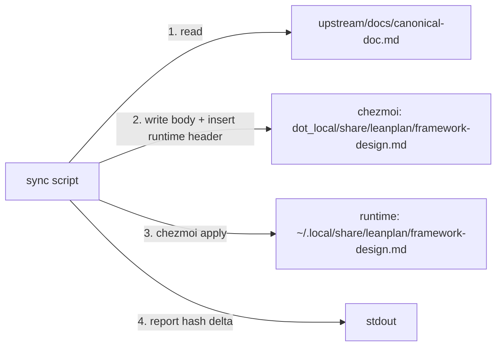

# LP-EXAMPLE — Design

## Architecture

A user-invoked shell script reads the in-repo framework doc, writes it into the chezmoi source location with a re-inserted runtime header, and invokes `chezmoi apply` to propagate to the runtime copy. Hash before/after for staleness reporting.

## D-1: sync-as-shell-script-in-canonical-scripts

Implement the sync as a POSIX shell script committed at `dot_local/share/leanplan/scripts/executable_sync-leanplan.sh`. Applied via chezmoi to `~/.local/share/leanplan/scripts/sync-leanplan.sh` with the executable bit set.

Why inline: chezmoi already manages the destination tree; colocating the tool with its target means one repo, one install path. A shell script matches the zero-dependency bar.

## D-2: in-repo-path-hard-coded

The script hard-codes `$HOME/projects/upstream/docs/canonical-doc.md` as the in-repo source. See rationale at [design-rationale.md#D-2-in-repo-path-hard-coded].

## D-3: header-note-reinsertion-between-title-and-body

The script reads the in-repo doc line-by-line, emits the title line (H1), then a blank line, then the runtime drift-marker header note, then the remainder (`tail -n +2`). The header is injected between the title and the body rather than stripping a prior runtime-copy header — the in-repo source is authoritative and always lacks the header.

Why: idempotent (no dependence on the prior runtime-copy shape); satisfies Spec#C-2-header-note-preservation regardless of how many times the script has run.

## D-4: chezmoi-apply-called-at-script-end

The script calls `chezmoi apply "$HOME/.local/share/leanplan/framework-design.md"` at the end so that the source edit propagates to runtime in the same invocation.

Why: users should not need to know about the chezmoi source / runtime split; a single command does the full job per Spec#B-1-single-invocation-sync.

## D-5: hash-check-via-shasum

Report staleness by comparing SHA-256 digests of the runtime file before and after the sync, via `shasum -a 256`.

Why: available on macOS and Linux by default; hash compares are simpler than text diffs and tolerant of trailing-whitespace noise.

## D-6: atomicity-via-chezmoi-source-write-then-apply

The chezmoi source write is a single redirection (atomic from bash's POV for small files). `chezmoi apply` writes the runtime file via temp-file-then-rename (atomic on POSIX). See rationale at [design-rationale.md#D-6-atomicity-via-chezmoi-source-write-then-apply].
