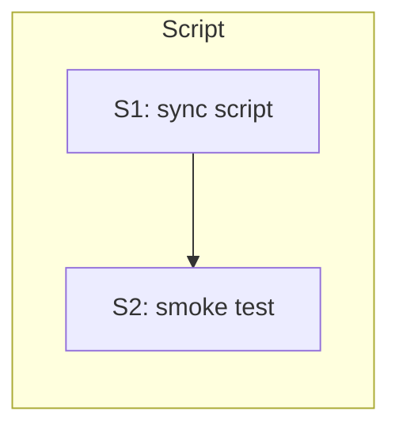

# LP-EXAMPLE — Tasks

## Guidelines

- Strictly additive to chezmoi source — no edits to the framework doc itself; the script is expected to overwrite the runtime copy at apply time.

## Dependency DAG

Single track (`S` = script). Tiny feature.

## T: S1

**Goal**: Author `dot_local/share/leanplan/scripts/executable_sync-leanplan.sh` in chezmoi source per `Design#D-1-sync-as-shell-script-in-canonical-scripts`. Script hard-codes the in-repo path per `Design#D-2-in-repo-path-hard-coded`, re-inserts the runtime header note between title and body per `Design#D-3-header-note-reinsertion-between-title-and-body`, invokes `chezmoi apply ~/.local/share/leanplan/framework-design.md` at the end per `Design#D-4-chezmoi-apply-called-at-script-end`, and prints `already up-to-date <hash>` or `updated <prior> -> <new>` via `shasum -a 256` per `Design#D-5-hash-check-via-shasum`. Error-exit before writing anything when the in-repo source is absent, satisfying `Spec#B-3-missing-source-errors`.

**Repo**: `mynghn/dotfiles` (chezmoi source).

**Completion criteria**:

- Runtime `~/.local/share/leanplan/scripts/sync-leanplan.sh` exists and is executable after `chezmoi apply`.
- After making a whitespace edit in the in-repo source, running the script causes `shasum -a 256 ~/.local/share/leanplan/framework-design.md` to change to match the new in-repo body — verifies `Spec#B-1-single-invocation-sync` and `Spec#C-1-directional`.
- Running the script with the in-repo path temporarily renamed produces exit status non-zero, a stderr error message, and leaves the runtime file unchanged — verifies `Spec#B-3-missing-source-errors`.
- Running the script twice in a row with no source change produces `already up-to-date <hash>` on the second run — verifies `Spec#B-2-staleness-reporting`.
- Runtime file body (lines from the framework intro paragraph onward) is byte-equal to the in-repo body after sync; the drift-marker header `> Runtime canonical at ...` remains on line 3 — verifies `Spec#C-2-header-note-preservation`.

**Dependencies**: none.

## T: S2

**Goal**: Smoke-test the round trip. Evolve the in-repo source with a whitespace-only edit; run the sync; verify the runtime copy reflects it and the header note survives, per `Spec#B-1-single-invocation-sync` and `Spec#C-2-header-note-preservation`. Then rename the source temporarily; run the sync; verify non-zero exit + unchanged runtime per `Spec#B-3-missing-source-errors`.

**Repo**: local (no commit).

**Completion criteria**:

- One successful happy-path run + one error-path run observed and noted.

**Dependencies**: S1 (enabler — script must exist).

## Forward coverage

| Spec item | Realized by |
|---|---|
| B-1 single-invocation-sync | S1 + S2 Completion |
| B-2 staleness-reporting | S1 Completion ("already up-to-date on second run") |
| B-3 missing-source-errors | S1 + S2 Completion |
| C-1 directional | S1 Completion ("matches new in-repo body"; no reverse-write path tested because architecture forbids it) |
| C-2 header-note-preservation | S1 + S2 Completion |
| C-3 atomicity-under-failure | **GAP** — no task explicitly tests mid-run failure. D-6 accepts a small non-atomic window (source-write vs chezmoi-apply) with self-heal on next run. Acceptable for personal-phase; revisit if atomicity becomes load-bearing. |
