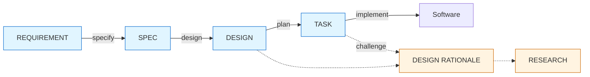

# LeanPlan — Framework Design

> Source of truth: this repo. Runtime install via chezmoi external (or `install.sh`) places the tree at `~/.local/share/leanplan/`.

**LeanPlan** is a lean, LLM-aware spec-driven-development framework for one-deployment-sized feature work. It is shaped around how LLM agents actually consume and act on planning artifacts — limited useful context, weak long-range attention over verbose instructions, stronger performance with JIT-loaded intent plus current code. Each artifact keeps only the durable state native to its stage. Not adopted from pre-existing SDD frameworks (spec-kit, Kiro, IEEE 830).

**This document is the framework's design + rationale archive** — the coordinate model, role segregation, design resolutions, naming rationale, research inputs, and roadmap. It is the *challenge-time* home: loaded only when the framework's **shape** is questioned, not during normal stage runs. The runtime homes own their content; this doc cites them rather than restating them (one prose home per fact):

- **`philosophy.md`** — the behavior-shaping principles (the WHY) and the stage map. Loaded when a principle's intent or grounding is in question.
- **`artifact-contract.md`** — the structural contract: feature layout, required shapes, anchors, drift guards, surface/archive layering, surface budget. Loaded before writing or editing artifact structure.
- **`README.md`** — the front door: what LeanPlan is, install, quick start, contributing.

This doc's `(context-engineering: <slug>)` grounding hooks resolve via `context-engineering.md` (the name→node map; load only when a hook is challenged).

## 1. Philosophy

The behavior-shaping principles are owned by `philosophy.md` (the runtime home — loaded when a principle's intent or grounding is in question). This doc does not restate them; it records the *design reasoning* behind the framework's shape (§§2–4, §§8–12). The thesis the rest follow from: **LLM-aware by construction** — framework shape reflects how LLM agents consume and produce documents; everything below follows.

Index only — numbering is kept stable so in-doc `principle N` / `§1.N` citations still resolve; the prose lives in `philosophy.md`:

1. **LLM-aware by construction** — the thesis above (this doc's framing, not a numbered `philosophy.md` principle).
2. **JIT loading, not initial heavy dump** → `philosophy.md` P1. (context-engineering: jit-loading)
3. **No flat task scripting** → `philosophy.md` P2. (context-engineering: jit-loading, distractor-sensitivity)
4. **Small surface for reviewability** → `philosophy.md` P3. (context-engineering: lost-in-the-middle, distractor-sensitivity)
5. **Archive verbose reasoning separately** → `philosophy.md` P4. (context-engineering: jit-loading, context-as-working-set)
6. **Target one-deployment scope** → `philosophy.md` P5.
7. **Plan docs are in-feature artifacts only** → `philosophy.md` P6.
8. **Persist by migration to code** → `philosophy.md` P7. (context-engineering: structured-note-taking)
9. **Session-boundary discipline** → `philosophy.md` P8. (context-engineering: explore-execute-boundary, compaction-vs-eviction, explore-then-compact-handoff, context-isolation, prefix-cache-economics)

## 2. Stages & coordinate model

The pipeline traverses **three faithful axes**, each the sole discriminator of one stage boundary — so every high-traffic seam derives from the model, not from a memorized per-seam rule. Each cites a seminal decomposition model:

| Axis | What it splits | Seam it derives |
|---|---|---|
| **World ↔ Machine** (Jackson, *The World and the Machine*, ICSE 1995) | the referent — the problem-world vs. our system (*not* biz vs. techy) | REQUIREMENT ↔ SPEC |
| **Contract ↔ Realization** | observable-outside vs. internal-inside (*not* a relative WHAT/HOW abstraction ladder) | SPEC ↔ DESIGN |
| **Product ↔ Process** (Osterweil, *Software Processes Are Software Too*) | the finished system vs. the work that builds it | DESIGN ↔ TASK |

World↔Machine and Contract↔Realization form a 2×2 over the **Product** side; Product/Process then peels TASK off it:

| | World | Machine |
|---|---|---|
| **Contract** | REQUIREMENT | SPEC |
| **Realization** | *— World Design: out of software scope —* | DESIGN |

**Reading the model.** An **artifact is a node** — a coordinate, a noun; a **stage is an edge** — one axis-flip, the skill/activity, a verb. Each pipeline step flips exactly one axis: `specify` flips World→Machine, `design` flips Contract→Realization, `plan` flips Product→Process. So the "distance" between two artifacts is the number of axes between them — adjacent pairs differ by one axis (the blurrable, high-traffic seams above) and non-adjacent pairs by two or three (robustly distinct, never blurred). The empty (World, Realization) cell — **World Design**, the non-software means to change the world ("offer a discount") — is a deliberate scope marker: LeanPlan does Machine design, not World design. Progression runs from the (World, Contract) origin (REQUIREMENT) to running software past the (Machine, Realization · Process) corner.

Edge labels are skill names (§12). Dotted edges are archive relationships and the challenge path; solid edges are skill-driven stage transformations. Not shown: the off-pipeline `sharpen` / `revise` moves and their `understanding.md` delta archive (§5.7, §12), which sit beside the pipeline rather than on it.

REQUEST (pre-REQUIREMENT immature biz request) is acknowledged but deferred. Framework currently assumes REQUIREMENT is well-formed via human-agent interaction.

## 3. Role segregation

Each stage owns one clearly-scoped concern. No overlap; no cross-stage duplication.

| Stage | Owns | Coordinate |
|---|---|---|
| REQUIREMENT | **biz outcome** — the business outcome wanted, non-technical | (World, Contract) |
| SPEC | **observable contract** — externally-observable behaviors the system must expose; generic-category abstraction | (Machine, Contract) |
| DESIGN | **internal realization** — shape of the finished system; components, chosen stack, schemas, boundaries | (Machine, Realization) |
| DESIGN RATIONALE | **decision WHY** — reasoning behind DESIGN decisions (alternatives, forces, invalidation hints) | archive L1 |
| RESEARCH | **evidence** — raw investigation underpinning WHY (codebase grep, SOTA articles, industry patterns, org history) | archive L2 |
| UNDERSTANDING | **understanding deltas** — append-only mid-round re-derivation log; written by `sharpen`, consumed by `revise` | off-pipeline archive |
| TASK | **execution plan** — *process-framed* sequence of land-able work items that realize DESIGN. Describes the **work** (what to do, in what order, how to verify); never restates the *finished system* (which is DESIGN's job — anchor in, don't paraphrase) | (Machine, Realization · Process) |

**How the model derives each seam.** The three axes (§2) each adjudicate exactly one high-traffic boundary, so an author places a fact — or catches a misplacement — by reasoning from the axis, no memorized per-seam rule:

- **World ↔ Machine derives REQUIREMENT ↔ SPEC.** REQUIREMENT states what the problem-world wants (the biz intent — "retain the at-risk customer"); SPEC states what our machine must observably do. An observable, testable predicate authored in REQUIREMENT belongs in SPEC; a bare world-intent authored in SPEC belongs in REQUIREMENT — derivable from the axis, no side-rule. (The *means* to that end — "offer a discount" — is World·Realization, a *World Design* (§2), so it stays out of both.)
- **Contract ↔ Realization derives SPEC ↔ DESIGN.** SPEC states the externally-observable contract (consumers care); DESIGN chooses the internal realization. Swapping Kafka → SQS is a DESIGN change, not a SPEC rewrite — observable-outside vs. internal-inside, an absolute cut, not a relative WHAT/HOW ladder.
- **Product ↔ Process derives DESIGN ↔ TASK.** DESIGN is the finished system (the Product); TASK is the work that builds it (the Process). A finished-system shape ("after this lands, the system looks like X") in a task card is drift — push it to DESIGN; a work-ordering step in DESIGN belongs in TASK. Time-ordering then falls out of this axis (not the reverse): the Process side is the only time-ordered artifact — once the work lands TASK becomes archival, while the Product-side artifacts describe reality going forward.

**Further orthogonal concerns the segregation enforces:**

- **WHY / evidence layering.** Each layer exists so the layer above stays clean: the Contract/Realization artifacts (REQ, SPEC, DESIGN) carry the system's truths; WHY (RATIONALE) explains the choices; evidence (RESEARCH) grounds the explanations. TASK is the bridge from plan to code.
- **Surface vs. archive.** REQ / SPEC / DESIGN / TASK are the visible review surface — loaded by default. RATIONALE and RESEARCH are hidden archives — loaded only when challenge is triggered from the surface.
- **Audience.** REQUIREMENT is primarily human-facing (biz reviewers, PM); agents use it as evaluation criteria only. DESIGN + TASK are primarily implementation-agent-facing. SPEC is shared. RATIONALE + RESEARCH are JIT for agents or humans challenging decisions.

## 4. Surface/archive layering

| Layer | Artifacts | Loaded when |
|---|---|---|
| Surface (L0) | REQUIREMENT, SPEC, DESIGN, TASK | default at review + implement time |
| Archive L1 | DESIGN RATIONALE | when challenging a DESIGN decision |
| Archive L2 | RESEARCH | when L1 is insufficient — need raw evidence |

Each level loads only via explicit trigger (anchor link from the layer above). JIT by construction. (context-engineering: jit-loading, context-as-working-set)

The runtime-loadable form — which artifact loads when — is owned by `artifact-contract.md` → Surface / Archive layering; the table above is the design-level detail.

## 5. Artifact shapes

The required sections, anchor patterns, and per-stage shapes for every artifact are the **structural contract**, owned by `artifact-contract.md` → Feature Layout / Required Shapes / Anchors (the runtime home — loaded before writing or editing artifact structure). This doc does not restate them; the *naming rationale* is §8 and the *design resolutions* that produced them are §9.

The seven per-artifact shapes — 5.1 REQUIREMENT, 5.2 SPEC, 5.3 DESIGN, 5.4 DESIGN RATIONALE, 5.5 RESEARCH, 5.6 TASK, 5.7 UNDERSTANDING — all resolve to `artifact-contract.md` → Required Shapes. The three feature-id forms (sequence / tracker-key / date) and the `## Upstream` rule live in `artifact-contract.md` → Feature Layout; their rationale is §9 ("Three feature-key forms").

## 6. Cross-cutting structural rules

### Operational — in-artifact

These in-artifact rules are the **structural contract**, owned by `artifact-contract.md`; this doc cites their canonical home, it does not restate them (grounding hooks kept where a rule rests on a context-engineering concept):

| Rule | Canonical home |
|---|---|
| Grep-friendly anchored heading patterns (`O-<N>` / `INV-<N>` / `Decision-<N>` / `Task: <id>` / `Delta-<N>`) | `artifact-contract.md` → Anchors (context-engineering: jit-loading, literal-vs-latent-matching) |
| Sibling layout at `docs/features/<KEY>/`, one-level link depth | `artifact-contract.md` → Feature Layout |
| Declarative present tense; MUST / MUST NOT reserved for true invariants | `artifact-contract.md` → Drift Guards |
| Conclusion-first prose; lists over dense paragraphs | `artifact-contract.md` → Prose Style (context-engineering: lost-in-the-middle, distractor-sensitivity) |
| Surface budget (advisory prose caps; lossless archive) | `artifact-contract.md` → Surface Budget (context-engineering: context-rot, effective-vs-advertised-context, distractor-sensitivity) |
| Mermaid for diagrams (no ASCII fallback) | `artifact-contract.md` → Drift Guards |
| Bidirectional verification mapping (SPEC O/INV ↔ TASK) | `artifact-contract.md` → Traceability |

Native to this doc — design-level authoring guidance not in the contract:

- **Edge-placement in long artifacts.** Past the >100-line ToC threshold, re-anchor critical invariants near the tail and order high-stakes DAG cards at the edges — U-shaped recall favors the edges over the middle, so the highest-stakes items sit where attention is strongest. Re-anchoring places the bare anchor *pointer*, never restated prose (`artifact-contract.md` → One Prose Home Per Fact), so edge-placement-for-recall composes with state-each-fact-once rather than contradicting it. Write-time guidance, not validator-enforced. (context-engineering: lost-in-the-middle)

### Ceremonial — moved to skill prompts or dropped

| Rule | Disposition |
|---|---|
| Frontmatter | dropped — `type` implied by filename; `status` unneeded (no draft/approved lifecycle in our model — docs are pre-ship load-bearing or post-ship discarded); cross-feature `tags` not a goal per principle 7; authorship in `git blame` / `git log`. Earns keep only if long-lived docs or complex review lifecycle are added (neither planned). |
| Universal ToC | conditional only when file > 100 lines; minimized artifacts rarely cross that |
| Drift guards (per-artifact) | skill-prompt-enforced at write time |
| Deviation / challenge protocol | operationalized in-framework via §9 Challenge mechanism + Artifact update loop + §10 Plan → code distillation — no external CLAUDE.md dependency |
| Universal ops rules (INFRAREQ / DBREQ, PR stacking, subagent parallelism, language) | skill-prompt level |
| One-deployment guardrail | advisory in default mode — TASK-time DAG-size check warns at >12 tasks and >16 tasks; `--strict` (or `LEANPLAN_STRICT=1`) escalates to error; `--allow-large` overrides. Earlier-stage heuristics (SPEC O count, DESIGN component count) are deferred — see open items. |

Documents carry durable state. Skills and prompts carry stage behavior.

**Loading order (adapter-authoring).** Order loaded context stable → volatile so the durable prefix stays cache-warm and only late, volatile content shifts. Within a stage, the stable prefix is the content *always* loaded — the adapter + its stage reference — byte-identical across re-invocations *of that stage* (re-running `/design` reuses it); then the JIT artifact slice; then live code. The cross-stage shared prefix is intentionally just the one framework-identity line, so that part of the cache win is small-but-free, not a major lever. The *conditionally* loaded universals (`philosophy.md`, full `artifact-contract.md`) are a deliberate exception: **JIT wins over prefix-warmth** — they load only on challenge, and eagerly loading them to warm the cache would violate jit-loading for content most calls never touch. So "stable first" governs the always-present prefix; it does not promote the conditional universals out of their JIT slot. Adapter authors order skill-prompt content the same way. Write-time / adapter guidance, not validator-enforced. (context-engineering: prefix-cache-economics, jit-loading)

## 7. Drift guards

The per-artifact drift guards are part of the **structural contract**, owned by `artifact-contract.md` → Drift Guards (skill-prompt-enforced at write time; `validate.py`-checked where regex-detectable). This doc does not restate them; the reasoning for what is enforced versus deliberately dropped is §6 (Ceremonial) and §9 (resolutions).

## 8. Naming decisions

**This section is the naming authority.** Every name the redesign settles follows from the coordinate model (§2) — given the axes it is predictable and resolves to exactly one element; a few established names (Decision, the Rationale / Research / Understanding archives, Guidelines, the `<KEY>` id) are retained by deliberate fiat, not re-derived (flagged below). The scheme below is the **target** ideal-shape vocabulary; a separate, dedicated framework-wide rename rolls it out atomically (backlog **#34** — ~1,000 sites: artifacts, edges, items, anchors, `validate.py`, fixtures, adapters, every shipped feature). Until that sweep lands, the framework — and L's own artifacts — run in the **prior vocab** (last column), so everything still validates and nothing is half-renamed.

| Stage (edge · verb) | Artifact (node · noun) | File | Items (anchor) | Prior vocab |
|---|---|---|---|---|
| `requirements` | Requirements | `requirements.md` | Outcome · Guarantee | `requirement` · REQUIREMENT · `requirement.md` |
| `specify` | Spec | `spec.md` | Behavior `B-` · Constraint `C-` | Outcome `O-` · Invariant `INV-` |
| `design` | Design | `design.md` | Decision `D-` | `Decision-` |
| `tasks` | Tasks | `tasks.md` | Task `T:` | `plan` · TASK · `plan.md` |
| `implement` | (code) | — | — | `impl` |

Archives **Rationale · Research · Understanding** (`Delta-`) keep their names; so do **Guidelines** and the `<KEY>` directory id (below). Axes are named in §2.

**How each name derives:**

- **A skill shares its artifact's root** — a verb where English has one (`specify`→Spec, `design`→Design), the bare noun where it doesn't (`requirements`, `tasks`). Every skill name is then predictable from its artifact, retiring the old `plan`-edge / `TASK`-artifact / `plan.md`-file triple — three names for one element.
- **Section names derive from the 2×2.** Requirements and Spec are both the **Contract** row (§2), so each splits into an episodic and a continuous half by World/Machine altitude: **Outcome / Guarantee** (World) and **Behavior / Constraint** (Machine). "Behavior" is the framework's own definition of a SPEC item — *externally-observable behavior* — which kills the old same-name "Outcome on both artifacts" confusion; **Guarantee** gives Requirements' continuous biz properties (today's loose "system policies") a real home.
- **Anchors are the shortest unambiguous initial** — `B-`, `C-`, `D-`, `T:` (colon, since Task IDs are track-keyed `A1` / `P1`, not sequence numbers). `Delta-` stays spelled (`D-` is taken by Decision; it is the rarely-cited archive item). The artifact namespace in each citation already implies the item type, so short prefixes cost no legibility; the structural detail (heading levels, fragment resolution, track prefixes) stays in `artifact-contract.md` → Anchors.
- **`plan` is rejected as an artifact name** despite being the obvious word: it is the *activity*, not a node — the whole Requirements→Spec→Design→Tasks spine *is* "the plan", so naming one node "Plan" puts an edge concept on a node (the conflation §2 cleans up) and collides with agent **plan-mode** (an unfixable external clash). **Tasks** names stage 4 by its content; its plural also fixes today's stage(`TASK`)/item(`Task:`) clash.

Decisions unchanged by the rename:

| Element | Name | Rationale |
|---|---|---|
| TASK operational rules (doc-level + task-card) | **Guidelines** | 작업 지침 — operational guidance the doer follows while executing; altitude-distinct from §1 *Philosophy* (framework-level foundational stance) and SPEC continuous items (runtime system-level) |
| Feature directory id | **`<KEY>`** — one of `NNNN-slug` (sequence), `PROJ-123` (tracker key), or `YYMMDD-slug` (date) | Three id forms, all allocated by `leanplan-new`, cover the common ways teams anchor a feature: a repo-local sequence number for stable cross-feature ordering with no tracker coupling (the default; slug carries human identity inline, spec-kit lineage); a bare external tracker key (e.g. Jira) when the feature *is* that issue and the team wants it legible in the path; a `YYMMDD` date when chronological grouping is the natural key. Earlier LeanPlan demoted tracker keys to REQUIREMENT `## Upstream` to keep identity repo-owned — that is now the default, not the only option (see §9). The `<KEY>` token is kept in path templates (redefined, not renamed) — a sweep-rename would churn ~70 sites against the principle-4 small-surface value, and the precision win here is the single normative definition, not the placeholder's spelling. |

## 9. Key design resolutions

- **RESEARCH as both edge and L2 archive.** Originally edge-only (cognitive process, no artifact). Promoted to an L2 archive file when depth is worth preserving. Evidence lives here; interpretation stays in RATIONALE.
- **External blockers promoted to tasks.** When a blocker requires explicit action (filing INFRAREQ, submitting DBREQ), that request becomes a first-class task in the DAG. Avoids hidden "waiting state". Truly out-of-control external blockers remain as dependency notes.
- **DAG tracks explicit.** Cross-repo vs. in-repo edges carry different meanings. Mermaid subgraphs + track-prefixed task IDs (P / A / D / I) surface this.
- **Outcome/Invariant split (formerly "AC split").** Traditional "Acceptance Criteria" conflates episode-verifiable ("when X, Y happens") with continuous constraints ("p99 < 5s"). Split: former → Outcome items (`### O-<N>`); latter → Invariants (`### INV-<N>`). Different observability downstream (test vs. SLO dashboard). "AC" (Acceptance Criteria, traditional SDLC term) dropped in favor of O/INV — precise, symmetric, unambiguous.
- **References carry ID + slug (identity, not restatement).** Anchors look like `SPEC#O-1-detected-anomaly-published`. ID enables stable citation across slug edits; slug names the reference at-a-glance so agents and humans can orient without JIT-loading every hop. This is the reference's *identity*, not a restatement of its *content* (the item's conditions and constraints). Agent still JIT-loads full content when needed. At the code-migration boundary (principle 8), distill semantic content into commit/comment body; ID becomes an optional in-cycle breadcrumb (e.g., `(O-1)`) that gracefully decays when plan doc is discarded.
- **Challenge mechanism.** Impl agent is expected to re-derive against current code at implement time. Prior-authored invalidation triggers are optional hints, not gates. Stop-the-line triggers (enumerated in `impl` skill) include: current code contradicts DESIGN, no verification path exists, dependency missing or invalidated, impl requires SPEC behavior change, invariant unprovable by current test strategy, task scope expands beyond feature boundary. Aligned with the "no flat scripting" principle.
- **SPEC / DESIGN contract line.** SPEC carries generic-category tech (the observable contract), DESIGN carries chosen stack + realization (the internal realization). Swapping Kafka → SQS is a DESIGN change, not a SPEC rewrite — the cut is observable-outside vs. internal-inside (Contract↔Realization, §2), not a relative WHAT/HOW ladder.
- **Dependencies are enablers, not gates.** The DAG signals what becomes *possible* when prior tasks land, not rigid order requirements. Impl agent re-evaluates at task entry. Framing borrowed from OpenSpec.
- **Plan docs as transient artifacts.** Plan docs are in-feature only — they don't accumulate into a living system spec. Code is the long-term source of truth. Rejected OpenSpec's delta-specs + canonical-specs mechanism on this principle: the destination (living spec) is a maintenance burden we don't want.
- **Artifact update loop (within-cycle).** At *any* successive stage (DESIGN, TASK, or implementation), if a prior artifact is revealed wrong — not just needing refinement — the agent walks up to the **highest affected layer** and updates there: DESIGN for realization errors, SPEC for contract errors, REQUIREMENT for scope changes. Downstream artifacts that referenced the updated layer are re-evaluated (may stay valid, update locally, or trigger re-planning) — never fully re-derived by default. Never patch downstream alone to mask upstream errors; that is silent drift. Scope gate: if the update pushes REQUIREMENT beyond one-deployment size, pause per principle 6. Minor refinements (no invalidation) stay in code per principle 8. Applies within the plan-implement cycle only; post-ship, docs are discarded per principle 7. The editing core of this loop — identify highest affected layer → edit → re-evaluate downstream → scope-gate — is now carried by the off-pipeline `revise` move (§12, `references/revise.md`), generalized from impl to any in-flight stage and gated on a recorded justification; impl's stop-the-line *triggers* stay impl's but delegate the edit to it.
- **Three feature-key forms.** `leanplan-new` allocates the directory id as one of: `NNNN-slug` (repo-local sequence, the default — scan `docs/features/*` max + 1, zero-pad 4), a bare tracker key like `NEWCS-3595` (auto-detected from an `[A-Z]+-N` arg), or `YYMMDD-slug` (`--date`, today or an explicit override). The sequence scan counts only exactly-WIDTH-digit ids, so 6-digit date keys never inflate it. **This revises the original "identity is repo-owned, not vendor-owned" stance**: tracker keys were previously demoted to REQUIREMENT `## Upstream` and barred from the dir name; they are now a permitted id form for teams that anchor a feature to a Jira/tracker item — with the sequence form remaining the default and `## Upstream` still holding refs that are not the id. Keying is allocator-enforced *only* — the validator stays naming-agnostic, so hand-created or legacy dirs coexist un-keyed. Limitations: sequence numbers are allocated against the local working tree (parallel branches can grab the same number — renumber one before merge); tracker-key auto-detection means a title that happens to match `[A-Z]+-N` is read as a key. Rejected sweep-renaming the `<KEY>` path token (kept literal, redefined in §5) — the §8 precision value is about authored content, not the placeholder spelling.
- **Conclusion-first prose style (cross-stage).** Surface readability turns on *order*, not only length (principle 4): a terse paragraph can still bury its conclusion. Added a cross-stage authoring rule — lead with the conclusion; prefer bullet / ordered lists over dense paragraphs — carried in the universally-loaded references (`artifact-contract.md` → Prose Style, with a `philosophy.md` principle-3 hook) and registered in §6, so it propagates to every stage with no per-stage duplication. The pre-existing REQUIREMENT user-story bullet form is reframed as an instance, not a special case. Deliberately **not** validator-enforced — "conclusion-first" and "list vs. paragraph" resist reliable regex; like declarative-present-tense it stays skill-prompt guidance.

## 10. Plan → code distillation

Persist-worthy insights migrate from plan artifacts into code at implementation time (principle 8). Plan docs become discardable once this migration completes. (context-engineering: structured-note-taking) The *principle* is `philosophy.md` P7; this section is its design-level detail — the persistence hierarchy, the commit-vs-comment split, and squash durability.

### Hierarchy of persistence

| Form | Persistence | Access pattern | Drift risk |
|---|---|---|---|
| Types / signatures / structure | compiler-verified | while writing/reading | near-zero |
| Tests (incl. property tests) | CI-verified | at break | low |
| Custom annotations (enforced) | at call site | while reading | low |
| Commit messages | git history (immutable) | `git blame` / `git log` | very low |
| Inline comments | with the line | while reading | moderate — rots with code |
| Plan doc only | transient | none once discarded | complete |

Impl agent prefers higher forms when possible. Lower forms are a fallback when the WHY cannot be encoded structurally.

### Commit message vs. inline comment

Complementary, not substitutes:

| Commit message | Inline comment |
|---|---|
| "Why this *change* was made" | "Why this *code* is shaped this way" |
| Decisional WHYs, alternatives rejected, tradeoffs accepted | Constraints a reader needs *while reading*, subtle invariants, workarounds |
| Investigative access (`git blame`) | Adjacent access (eyes-on-code) |
| Survives refactors (history independent of file structure) | Dies with the line |

### Promotion rule (squash / rebase durability)

Local commit messages can be erased by squash / rebase workflows. Persist rationale by durability target:

| Rationale kind | Durable target |
|---|---|
| Local ("why this code is shaped this way") | code / tests / types / inline comment |
| Change ("why this commit exists", alternatives considered) | PR body or squash-commit message (survives squash merge) |
| Cross-feature architecture | runbook or org ADR (if maintained); otherwise structural code (types, module boundaries) |

PR body is particularly durable — visible in GitHub history even after squash, linkable from future investigations. Don't rely on local commit messages for change rationale in teams that squash-merge.

### Workflow implication

At task close-out, impl agent:

1. Reviews the task's plan references (SPEC O / INV, DESIGN decisions, RATIONALE entries).
2. Identifies WHYs not already encoded in code / tests / types.
3. Migrates each to the strongest persistence form available.
4. Verifies plan artifact contributions are no longer load-bearing (can be discarded).

This belongs in the impl-side skill (`impl`), not the plan-side skills (`requirement`, `specify`, `design`, `plan`). It is a post-implementation distillation step, distinct from code writing itself.

Aligned with CLAUDE.md's existing comment discipline — principle 8 does not relax "default no comments", it clarifies *where the rare WHYs come from*: distilled from plan artifacts, not invented freshly.

## 11. Research inputs (summary)

Framework choices informed by parallel research:

- **Traditional SDLC** (IEEE 830, arc42, ADR, RFC formats, WBS, INVEST, Gherkin) → convergent `{context / the thing / alternatives / completion}` pattern survived; preambles, glossaries, traceability matrices dropped.
- **Modern LLM-first SDD** (spec-kit, Kiro, Cursor rules, Aider, Boris Tane, OpenSpec) → absorbed standing constraints + EARS-style AC + research-as-JIT + "enablers not gates" framing + "what a spec is NOT" test; rejected numbered checkbox DAGs, real-time completion UI, frozen upfront sequence diagrams, and delta-spec / living-canonical-spec accumulation (plan docs stay transient per principle 7).
- **Agent-communication patterns** (Anthropic prompt engineering, context engineering, Skills authoring) → grounded Grep-friendly headings, sibling layout, constraints-framing-over-step-framing.

## 12. Skill responsibilities

Skills map to **edges** (transformations between stages), not to nodes — with two off-pipeline exceptions, the `sharpen` and `revise` moves (noted below). Each edge skill produces the next stage's artifact from the prior one. Skill names are bare (no `feature-` prefix).

| Skill | Edge | Produces | Scope |
|---|---|---|---|
| `requirement` | (standalone) → REQUIREMENT | REQUIREMENT | Author REQUIREMENT interactively — Problem, Outcome (biz future state + success signal folded), conditional Non-goals and Upstream. Biz-framed, no implementation choices. Currently a standalone skill; future: may become a REQUEST → REQUIREMENT edge (`distill`) when naive biz writings are formalized as REQUEST input (§14). |
| `specify` | REQUIREMENT → SPEC | SPEC | Derive tech contract (Outcome items + conditional Invariants, Non-goals). Generic-category abstraction only. Headers `## Outcome` / `## Invariants`; items `### O-<N>: <slug>` and `### INV-<N>: <slug>`. Enforce "what a spec is NOT" drift guard. Split episode-verifiable (Outcome) from continuous (Invariants). Research activity on REQ → SPEC edge; archive notable findings as RESEARCH entries when depth is worth preserving. |
| `design` | SPEC → DESIGN | DESIGN (+ RATIONALE, RESEARCH as needed) | Architecture diagram (Mermaid) + Decisions (`## Decision-<N>: <slug>`). Anchor non-trivial decisions to RATIONALE. Every SPEC O + INV is realized by ≥ 1 Decision, Architecture element, or (for trivial realization) a directly-cited TASK Completion criterion — not only Decisions. Write RATIONALE entries for non-trivial decisions and RESEARCH entries along the SPEC → DESIGN research activity. Drift guard: chosen realization only; no work ordering or ops process text. |
| `plan` | DESIGN → TASK | TASK | DAG with track subgraphs + prefixed IDs. Task cards with Goal (WHAT + HOW + inline anchors), Repo, Completion, Dependencies, conditional Guidelines. Verify bidirectional mapping: every SPEC O + INV maps to ≥ 1 completion criterion AND every TASK cites ≥ 1 SPEC O / INV / DESIGN Decision / doc Guideline reason. |
| `impl` | TASK → code | working software | Load task refs, inspect current code, re-reason against current reality, challenge prior DESIGN when contradicted (stop-the-line *triggers* detect the drift and delegate the walk-up/edit to `/revise` per §9 / §12), verify completion criteria, distill WHYs to code per §10 (types > tests > annotations > commit messages > inline comments; change rationale → PR body for squash-safety). |

Each skill enforces the relevant drift guards from §7 and naming conventions from §8 at write time. Universal operational rules stay at skill / CLAUDE.md level, not re-emitted per artifact.

**RESEARCH** is not a standalone skill. The research activity spans the `specify` and `design` edges; entries worth archiving are written into the RESEARCH artifact during those skills' execution.

**`sharpen`** is not a stage edge. It is the off-pipeline move — a thin adapter over `references/sharpen.md`, invocable mid-round from inside any stage to re-derive a disturbed understanding and emit a durable delta; it reads committed artifacts but never edits them, and produces no next-stage artifact.

**`revise`** is the second off-pipeline move and `sharpen`'s repair-half complement — a thin adapter over `references/revise.md`, invocable at any in-flight occasion (a stage boundary, between tasks, or mid-task during impl) to inject a justified drift into committed artifacts and propagate it downstream-only: intake a `Delta` justification, identify the corrected artifact, edit in place (re-derive only on an anchor-set change) preserving anchor IDs, then re-validate. It edits committed artifacts — but only against a recorded justification, and never upstream of the artifact it corrects. It is the single home for the in-cycle artifact-update editing core (§9): impl's stop-the-line *triggers* detect drift and delegate the edit-and-propagate here, so a mid-impl correction flows through the same entry as every other occasion. It produces no next-stage artifact.

## 13. Evolution path

Framework ships incrementally; not every phase is required to start.

| Phase | Addition | Status |
|---|---|---|
| 1 | 7 skill prompts (§12) — 1 standalone (`requirement`) + 4 edge + 2 off-pipeline (`sharpen`, `revise`) | ✅ shipped |
| 2 | Bash validators + scaffolds + git hooks (structural safety nets) | ✅ shipped — `validate.py`, `leanplan-new`, `pre-commit` / `commit-msg` hooks |
| 3 | CLI wrapper + per-feature progress state files | ◐ partial — `leanplan-new` shipped; progress-state files dropped as informational-only (§14; principle 7) |
| 4 | Harness-flavored capabilities (see below) | ○ future (post-v1) |
| 5 | Integrations (LSP, Jira deep-link, CI gates) | ○ future |

**v1 criteria**: **scope division** (splitting oversized input before planning) + **requirement distillation** (REQUEST → REQUIREMENT from naive biz input). Both are prompt + orchestration; achievable by Phase 2–3.

### What frontier harnesses provide vs. what we build

Claude Code / Codex already provide: cross-session memory, parallel sub-agents, MCP integration, lifecycle hooks, bulk-edit tools. The SDD layer adds on top:

- **Skills** (framework shape as prompts) — Phase 1
- **Validators** (drift regex, anchor integrity, SPEC → TASK coverage) — Phase 2
- **Lifecycle glue** (slash commands binding skills + validators) — Phase 2–3
- **Progress state files** (per-feature YAML, git-persisted) — Phase 2–3 — *informational only*; cross-session impl survival rests on harness task-state + git, not a per-feature session-state artifact (session-boundary principle, §1.9; principle 7)
- **Domain glue** (INFRAREQ / DBREQ via Jira MCP, submodule handling) — Phase 3
- **CLI wrapper** (thin shell over the above) — Phase 3+

**Session management** is the worked example of this split. The **session-boundary discipline** (§1.9, `philosophy.md` P8) names the *behavior* — keep the planning spine warm, hard-cut to a fresh frame at plan→impl, isolate noisy sub-tasks, light-compact at pivots — portably, naming no command. Where a harness supplies grounded session-management *mechanisms*, they realize it: on Claude Code, `/handoff <goal>` at the plan→impl cut (a goal-scoped fresh-session brief) and `/compact-focus` at in-session pivots, both grounded in the same context-engineering concepts (`explore-execute-boundary`, `compaction-vs-eviction`, `explore-then-compact-handoff`, `prefix-cache-economics`). A bare install — no such commands, no external KB — performs the boundary by hand; the principle never depends on them.

### Beyond safety nets — long-term harness ambitions (Phase 4+)

Most structural validators are bounded-value (catch agent failure). Genuine new capabilities that justify a harness-like endpoint:

- **Learning from past cycles** — pattern library from accumulated RATIONALE; quality feedback from shipped outcomes; deviation provenance tracking.
- **Meta-experimentation** — cycle branching at decision points, pre-cycle simulation, A/B implementation.
- **Active intelligence** — gap detection, scope-spill prediction, decision-risk scoring grounded in team history.
- **Team / org coordination** — cross-feature awareness (informational, not canonical per principle 7); role-specialist reviewers; multi-developer state.
- **Explainability** — causal chains queryable post-ship (line → commit → task → decision → rationale).

Most require accumulated data across many shipped cycles; post-v1. Harness-like outcome is the long-term direction, not a near-term deliverable.

## 14. Open items

Genuinely open — not yet built or decided:

- **REQUEST → REQUIREMENT edge (`distill`)**: `requirement` currently authors REQUIREMENT standalone (interactive with user). Future: when naive biz writings become an explicit REQUEST input artifact, add a `distill` skill for the REQUEST → REQUIREMENT sharpening edge.
- **Divide-and-conquer for oversized work**: how to split inputs that exceed one-deployment scope. Framework assumes proper sizing for now.
- **Earlier-stage one-deployment heuristics**: scope-sizing checks at SPEC time (O count) and DESIGN time (component count) remain deferred. The TASK-time DAG-size guardrail is active in advisory mode (warn at >12 / >16 tasks; `--strict` escalates to error; `--allow-large` overrides). Hard-block heuristics earlier would catch oversized work sooner but are unproven; revisit if it recurs in practice.
- **Real business-domain dogfood**: the framework now self-hosts its own evolution — `docs/features/*` holds several shipped cycles (ce-grounding, artifact-later-update, lean-review-surfaces, understanding-sharpening, reflexive-surface-budget, …). A dogfood on a non-meta *business* feature is still desirable to stress it against domain complexity.

Resolved / shipped — moved out of "open", kept for provenance:

- **Phase 2 validator** — shipped (§13). `scripts/validate.py` covers anchor integrity, bidirectional coverage, drift regex, duplicate-anchor detection, broken-citation detection, frontmatter discouragement, MUST/MUST NOT misuse, ASCII diagram detection, checkbox detection, and design ↔ rationale consistency, plus the `**GAP**` ack for deliberately-uncovered SPEC items.
- **Cross-session continuity** — decided: no plan-doc artifact. Multi-session impl rests on harness task-state + git commits carrying distilled WHYs (principles 7–8); no artifact addition planned.
