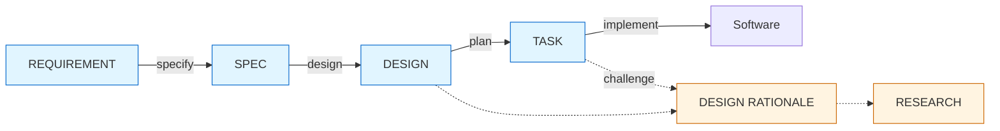

# LeanPlan — Framework Design

> Source of truth: this repo. Runtime install via chezmoi external (or `install.sh`) places the tree at `~/.local/share/leanplan/`.

**LeanPlan** is a lean spec-driven-development framework for mid-scoped (one-deployment-sized) feature work in monorepos. Shaped around how LLM agents actually consume and act on planning artifacts — limited useful context, weak long-range attention over verbose instructions, stronger performance with JIT-loaded intent plus current code. Each artifact keeps only the durable state native to its stage — not every stage carries the same sections. Not adopted from pre-existing SDD frameworks (spec-kit, Kiro, IEEE 830).

## 1. Philosophy

1. **LLM-aware by construction.** Framework shape reflects how LLM agents consume and produce documents. Everything follows from this.
2. **JIT loading, not initial heavy dump.** Minimal plan-doc length is the target; deep context lives in separately-loaded archives. (CE: jit-loading)
3. **No flat task scripting.** Implementation agents reason at implement-time; plan docs provide intent + constraints, not step-by-step recipes. (CE: jit-loading, distractor-sensitivity)
4. **Small surface for human reviewability.** Verbose docs get rubber-stamped; rubber-stamped docs leak over-specific instructions to implementation; agents get confused. Less surface = higher review fidelity. (CE: lost-in-the-middle, distractor-sensitivity)
5. **Archive verbose reasoning separately.** Detailed investigation and rationale are preserved, but hidden from primary review surface. Accessed JIT by both humans and agents. (CE: jit-loading, context-as-working-set)
6. **Target one-deployment scope.** Trivial changes skip the ceremony. Oversized work is split before entry.
7. **Plan docs are in-feature artifacts only.** Their role is review surface + agent navigation during the plan-implement cycle. They do not aspire to long-surviving source-of-truth status — code is truth going forward. Evolving plan docs into a canonical system spec would add drift risk vs. code, perpetual maintenance burden, and cognitive load from competing sources of truth.
8. **Persist by migration to code, not by doc evolution.** At implementation time, impl agent distills non-obvious WHYs from plan artifacts into the code itself — types, tests, annotations, commit messages, or inline comments. Plan docs become discardable once migrated. Distillation happens against final code reality, not predicted at plan-write time. (CE: structured-note-taking)
9. **Session-boundary discipline.** Keep the planning spine (requirement→spec→design→plan) continuous in one warm session; make the hard hand-off to a fresh session at the plan→impl boundary; isolate breadth-heavy sub-tasks into sub-agents; light-compact at major pivots. Cross-session impl survival rests on harness task-state + git, not a new per-feature state artifact. (CE: explore-execute-boundary, compaction-vs-eviction, explore-then-compact-handoff, context-isolation, prefix-cache-economics)

## 2. Stages & coordinate model

Stages traverse two axes: **Abstraction** (HIGH ↔ LOW) and **Biz/Tech** (BIZ ↔ TECH). Progression goes from (HIGH, BIZ) origin to (LOW, TECH) running software.

Edge labels are skill names (§12). Dotted edges are archive relationships and the challenge path; solid edges are skill-driven stage transformations.

REQUEST (pre-REQUIREMENT immature biz request) is acknowledged but deferred. Framework currently assumes REQUIREMENT is well-formed via human-agent interaction.

## 3. Role segregation

Each stage owns one clearly-scoped concern. No overlap; no cross-stage duplication.

| Stage | Owns | Coordinate |
|---|---|---|
| REQUIREMENT | **biz WHAT** — what business outcome is wanted, non-technical | (HIGH, BIZ) |
| SPEC | **tech WHAT (contract)** — externally-observable behaviors the system must expose; generic-category abstraction | (HIGH, TECH) |
| DESIGN | **tech HOW (realization)** — shape of the finished system; components, chosen stack, schemas, boundaries | (LOW, TECH) |
| DESIGN RATIONALE | **tech WHY** — reasoning behind DESIGN decisions (alternatives, forces, invalidation hints) | archive L1 |
| RESEARCH | **evidence** — raw investigation underpinning WHY (codebase grep, SOTA articles, industry patterns, org history) | archive L2 |
| TASK | **execution plan** — time-ordered, *process-framed* sequence of land-able work items that realize DESIGN. Describes the **work** (what to do, in what order, how to verify); never restates the *finished system* (which is DESIGN's job — anchor in, don't paraphrase) | (LOW, TECH), time-axis |

**Orthogonal dimensions the segregation enforces:**

- **Contract vs. realization.** SPEC states the externally-observable contract (consumers care). DESIGN chooses internal realization. Swapping Kafka → SQS is a DESIGN change, not a SPEC rewrite. Preserves abstraction altitude.
- **Time-independent vs. time-dependent.** REQUIREMENT / SPEC / DESIGN / RATIONALE / RESEARCH describe truths about the finished system. TASK is the only artifact that's time-ordered — once the work lands, TASK becomes archival; the others describe reality going forward.
- **WHAT / HOW / WHY / evidence layering.** Each layer exists so the layer above can stay clean. WHAT (REQ, SPEC) carries contracts. HOW (DESIGN) realizes them. WHY (RATIONALE) explains choices. Evidence (RESEARCH) grounds explanations. TASK is the bridge from plan to code.
- **Surface vs. archive.** REQ / SPEC / DESIGN / TASK are the visible review surface — loaded by default. RATIONALE and RESEARCH are hidden archives — loaded only when challenge is triggered from the surface.
- **Audience.** REQUIREMENT is primarily human-facing (biz reviewers, PM); agents use it as evaluation criteria only. DESIGN + TASK are primarily implementation-agent-facing. SPEC is shared. RATIONALE + RESEARCH are JIT for agents or humans challenging decisions.

## 4. Surface/archive layering

| Layer | Artifacts | Loaded when |
|---|---|---|
| Surface (L0) | REQUIREMENT, SPEC, DESIGN, TASK | default at review + implement time |
| Archive L1 | DESIGN RATIONALE | when challenging a DESIGN decision |
| Archive L2 | RESEARCH | when L1 is insufficient — need raw evidence |

Each level loads only via explicit trigger (anchor link from the layer above). JIT by construction. (CE: jit-loading, context-as-working-set)

## 5. Artifact shapes

All artifacts live as siblings at `docs/features/<KEY>/`, where `<KEY>` is the feature id, allocated by `leanplan-new` in one of three forms:

- **Sequence** (default) — `NNNN-slug`: a zero-padded repo-local number (4 digits; `$LEANPLAN_ID_WIDTH` overrides) plus a kebab slug, e.g. `0007-anomaly-publisher`. The number is the highest existing `docs/features/*` sequence id + 1.
- **Tracker key** — a bare external issue key, e.g. Jira `NEWCS-3595`, when the feature is anchored to a tracker item. No slug (the key is already unique).
- **Date** — `YYMMDD-slug`, e.g. `260616-anomaly-publisher`, dated at creation (today, or an explicit override).

Other / legacy dirs are skipped by the allocator and coexist; the validator stays naming-agnostic. A tracker reference that is *not* the id (or supplementary PRD / Slack refs) still lives as metadata in REQUIREMENT's `## Upstream`. Max one-level link depth across artifacts.

### 5.1 REQUIREMENT — (HIGH, BIZ). Human-review surface.

| Section | Required? |
|---|---|
| Problem | yes |
| Outcome (biz future state + success signal folded in) | yes |
| Non-goals | conditional — biz-level scope ambiguity |
| Upstream | conditional — Jira / PRD / Slack refs when they exist (metadata; lives here even when a tracker key is also used as the feature id) |

### 5.2 SPEC — (HIGH, TECH). Contract.

| Section | Required? | Structure |
|---|---|---|
| Outcome (tech future state + episode-verifiable conditions) | yes | `## Outcome` header; items as `### O-<N>: <slug>` |
| Invariants (continuous: SLA, non-blocking, integrity) | conditional | `## Invariants` header; items as `### INV-<N>: <slug>` |
| Non-goals | conditional — tech-level scope ambiguity | bulleted |

### 5.3 DESIGN — (LOW, TECH). Shape of the finished system.

| Section | Required? |
|---|---|
| Architecture (Mermaid diagram + brief caption) | yes |
| Decisions (per-decision `## Decision-<N>: <slug>` blocks; anchor → RATIONALE when non-trivial) | yes |

Schemas and interfaces fold into individual Decisions. External boundaries shown as labeled diagram nodes/edges.

### 5.4 DESIGN RATIONALE — archive L1.

| | |
|---|---|
| Structure | per-decision anchored blocks (`## Decision-<N>: <slug>` matches DESIGN) |
| Body | free-form, no prescribed inner sections |
| When to create an entry | non-trivial decisions only |

### 5.5 RESEARCH — archive L2.

| | |
|---|---|
| Structure | per-topic anchored blocks (`## <descriptive topic name>`) |
| Body | free-form — codebase investigation, SOTA articles, industry patterns, org history, etc. |
| When to create an entry | research depth worth archiving for future reference |

### 5.6 TASK — (LOW, TECH). Work navigation.

**Doc-level sections:**

| Section | Required? |
|---|---|
| Guidelines (feature-level work-stance rules — git/PR workflow, scope discipline, rollout procedure, coordination; e.g., base branch, "strictly additive changes", canary sequence) | conditional |
| Dependency DAG (Mermaid; track subgraphs + prefixed task IDs) | yes |
| Task entries | yes |

**Task card fields** (per `## Task: <id>`):

| Field | Required? | Content |
|---|---|---|
| Goal | yes | description of what to do — WHAT + HOW (when non-obvious) — with inline SPEC O / INV and DESIGN decision anchors colocated with the content they support (e.g., `Add anomaly publisher per SPEC#O-1-detected-anomaly-published, realized via outbox pattern per DESIGN#Decision-3-outbox-based-publisher`). Anchors carry ID + slug so the slug names the reference at-a-glance; agent JIT-loads full content when needed. Card is self-sufficient at cut-off boundary (sentence survives even if anchor target is discarded). |
| Repo | yes | where the work lives |
| Completion criteria | yes | observable verification + method inline when non-obvious. Continuous Invariants → ongoing mechanism (SLO / monitor / CI gate); episodic Outcomes → one-shot test. dev/prod split for infra/DB. |
| Dependencies | yes | prior task IDs as **enablers** (what's unblocked when they land), not rigid gates. Impl agent re-evaluates at task entry. Truly-external notes only when needed. |
| Guidelines | conditional | task-level work-stance rules — scope discipline, reuse discipline, procedural constraints; e.g., "strictly additive to Publisher", "use existing outbox only (no new impl)", "notify ops before touching prod config" |

TASK is a navigation graph, not an execution script.

## 6. Cross-cutting structural rules

### Operational — in-artifact

| Rule | Purpose |
|---|---|
| Grep-friendly anchored headings (`## O-<N>: <slug>`, `## INV-<N>: <slug>`, `## Decision-<N>: <slug>`, `## Task: <id>`) | Enable anchor-based JIT linking across artifacts; the grep-able ID+slug is a literal lexical handle agents/humans locate by exact match, not latent inference. (CE: jit-loading, literal-vs-latent-matching) |
| Sibling layout at `docs/features/<KEY>/`, one-level link depth max | Prevent nested partial-read failures |
| Declarative present tense; MUST / MUST NOT reserved for true invariants | Language signals re-reasoning invitation vs. commands |
| Conclusion-first prose; prefer bullet / ordered lists over dense paragraphs | Reviewer grasps the artifact from headings + lead lines (review fidelity); agent attends to front-loaded claims over buried ledes. Write-time guidance, not validator-enforced; stage shapes (REQUIREMENT user-stories) are instances. See `artifact-contract.md` → Prose Style. (CE: lost-in-the-middle, distractor-sensitivity) |
| Edge-placement in long artifacts: past the >100-line ToC threshold, re-anchor critical invariants near the tail and order high-stakes DAG cards at the edges | U-shaped recall favors the edges over the middle, so the highest-stakes items sit where attention is strongest; the >100-line trigger reuses the §6 ToC threshold (a LeanPlan-local heuristic, not a cutoff the concept states). Write-time guidance, not validator-enforced. (CE: lost-in-the-middle) |
| Surface budget: keep REQUIREMENT / SPEC / DESIGN / TASK tight; push depth to RATIONALE / RESEARCH or split an oversized feature. Soft per-stage *prose*-line caps are advisory — Mermaid/code/blank lines excluded, so diagrams never read as bloat (the values live once in `artifact-contract.md` → Surface Budget, enforced by `validate.py`) | Surface artifacts are designed for review fidelity, not completeness — a lean surface is reviewed carefully, a verbose one rubber-stamped, and over-specific detail leaks into impl. *Direction, not a hard cap*: an advisory backstop for pathological bloat, mirroring the DAG-size guardrail (`validate.py` warns, `--strict` escalates, `--allow-large` suppresses). Archive is **lossless** — moving content off the surface keeps it JIT-loadable. (CE: context-rot, effective-vs-advertised-context, distractor-sensitivity) |
| Mermaid for diagrams (no ASCII fallback) | Clean diffs; agents edit reliably; GitHub renders natively |
| Verification mapping (bidirectional) — every SPEC Outcome item (O) and Invariant (INV) maps to ≥ 1 TASK completion criterion; every TASK cites ≥ 1 SPEC O, INV, DESIGN Decision, or doc Guideline as its reason | Catches both unverified requirements (SPEC → TASK gap) and orphan implementation work (TASK without plan justification) |

### Ceremonial — moved to skill prompts or dropped

| Rule | Disposition |
|---|---|
| Frontmatter | dropped — `type` implied by filename; `status` unneeded (no draft/approved lifecycle in our model — docs are pre-ship load-bearing or post-ship discarded); cross-feature `tags` not a goal per principle 7; authorship in `git blame` / `git log`. Earns keep only if long-lived docs or complex review lifecycle are added (neither planned). |
| Universal ToC | conditional only when file > 100 lines; minimized artifacts rarely cross that |
| Drift guards (per-artifact) | skill-prompt-enforced at write time |
| Deviation / challenge protocol | operationalized in-framework via §9 Challenge mechanism + Artifact update loop + §10 Plan → code distillation — no external CLAUDE.md dependency |
| Universal ops rules (INFRAREQ / DBREQ, PR stacking, subagent parallelism, language) | skill-prompt level |
| One-deployment guardrail | advisory in default mode — TASK-time DAG-size check warns at >12 tasks and >16 tasks; `--strict` (or `LEANPLAN_STRICT=1`) escalates to error; `--allow-large` overrides. Earlier-stage heuristics (SPEC O count, DESIGN component count) are deferred — see open items. |

Documents carry durable state. Skills and prompts carry stage behavior.

**Loading order (adapter-authoring).** Order loaded context stable → volatile so the durable prefix stays cache-warm and only late, volatile content shifts. Within a stage, the stable prefix is the content *always* loaded — the adapter + its stage reference — byte-identical across re-invocations *of that stage* (re-running `/design` reuses it); then the JIT artifact slice; then live code. The cross-stage shared prefix is intentionally just the one framework-identity line, so that part of the cache win is small-but-free, not a major lever. The *conditionally* loaded universals (`philosophy.md`, full `artifact-contract.md`) are a deliberate exception: **JIT wins over prefix-warmth** — they load only on challenge, and eagerly loading them to warm the cache would violate jit-loading for content most calls never touch. So "stable first" governs the always-present prefix; it does not promote the conditional universals out of their JIT slot. Adapter authors order skill-prompt content the same way. Write-time / adapter guidance, not validator-enforced. (CE: prefix-cache-economics, jit-loading)

## 7. Drift guards (skill-prompt enforced at write time)

| Artifact | Guard |
|---|---|
| REQUIREMENT | No implementation *choices* (specific tech stack, internal architecture, chosen pattern). Biz-native vocabulary like "admin tool", "partner API", "batch integration" is fine — these are channels, not choices. Implementation details → SPEC / DESIGN. |
| SPEC | If implementation can change without changing externally visible behavior, it doesn't belong in SPEC. Implication: specific tech names (Kafka, Redis) are realization → DESIGN; generic categories ("message queue", "event stream", "HTTP API") stay in SPEC. |
| SPEC Outcome ↔ Invariants | Episode-triggered condition → Outcome item (`### O-<N>`). Continuous property that must hold regardless of implementation — including environmental bindings (existing backbone, compliance boundary, deployment envelope) — → Invariant (`### INV-<N>`). Chosen realization with real alternatives → DESIGN. If no alternative existed, it is not a choice — push back up to Invariants (avoids false optionality in DESIGN). |
| DESIGN | Chosen tech stack + realization. No work ordering, no INFRAREQ / DBREQ procedure, no PR stacking — those are TASK. |
| RATIONALE | Non-trivial decisions only. Trivial decisions carry only the one-line "why" inline in DESIGN. |
| RESEARCH | Evidence and citations only. Interpretations belong in RATIONALE. |
| TASK | No step-by-step edit instructions ("edit file X at line Y"). Impl agent re-derives against current code. |
| TASK ↔ DESIGN (process vs. realization) | **Plan cards describe the *work*; DESIGN describes the *finished system*.** Task fields — Goal, Completion, Guidelines — carry process specifics (what outcome the task achieves, how to verify it, in what work-stance). Tech-realization specifics — field-by-field mappings, response/proto shapes, call/orchestration sequences, signatures, code paths, schemas — belong in a DESIGN Decision block. The plan card *anchors* into the Decision (`DESIGN#Decision-N-…`); it does not restate the Decision's content. Symmetric rule: when a downstream task needs to know "what does the system look like in this slice?", the answer must already live in DESIGN — so write it there at design time, not freshly in the task card. *Detection cue*: if a Goal bullet starts answering "after the work lands, the system looks like X" (rather than "this task achieves Y, verified by Z"), push the X to DESIGN. |
| TASK Guidelines ↔ DESIGN | Guidelines describe the *work stance* (procedure, discipline, temporary mechanisms during the cycle); DESIGN describes the finished *system* (permanent structure and chosen realization). If it describes what exists *after* the work lands → DESIGN. If it describes how the work *proceeds* → Guideline. Compatibility behaviors (externally observable) → SPEC Invariants; testing specifics (what passes) → Completion criteria. |

## 8. Naming decisions

| Element | Name | Rationale |
|---|---|---|
| SPEC continuous-property section | **Invariants** | precise; formal-methods heritage; agents parse reliably |
| TASK operational rules (doc-level + task-card) | **Guidelines** | 작업 지침 — operational guidance the doer follows while executing; altitude-distinct from §1 *Philosophy* (framework-level foundational stance) and SPEC *Invariants* (runtime system-level) |
| Main functional section at REQUIREMENT and SPEC | **Outcome** (mirrored) | makes REQUIREMENT ↔ SPEC WHAT-translation visible |
| JIT anchor heading patterns | SPEC Outcome items `### O-<N>: <slug>` and Invariants `### INV-<N>: <slug>` (nested under H2 `## Outcome` / `## Invariants` section headers); DESIGN `## Decision-<N>: <slug>`; TASK `## Task: <id>` (track-prefixed like P1 / A1 / D1 / I1). | ID enables stable cross-reference across slug edits; slug carries identity inline so JIT load isn't forced just to see what the reference is. Markdown anchor fragments resolve independent of heading level. |
| Feature directory id | **`<KEY>`** — one of `NNNN-slug` (sequence), `PROJ-123` (tracker key), or `YYMMDD-slug` (date) | Three id forms, all allocated by `leanplan-new`, cover the common ways teams anchor a feature: a repo-local sequence number for stable cross-feature ordering with no tracker coupling (the default; slug carries human identity inline, spec-kit lineage); a bare external tracker key (e.g. Jira) when the feature *is* that issue and the team wants it legible in the path; a `YYMMDD` date when chronological grouping is the natural key. Earlier LeanPlan demoted tracker keys to REQUIREMENT `## Upstream` to keep identity repo-owned — that is now the default, not the only option (see §9). The `<KEY>` token is kept in path templates (redefined, not renamed) — a sweep-rename would churn ~70 sites against the principle-4 small-surface value, and the precision win here is the single normative definition, not the placeholder's spelling. |

## 9. Key design resolutions

- **RESEARCH as both edge and L2 archive.** Originally edge-only (cognitive process, no artifact). Promoted to an L2 archive file when depth is worth preserving. Evidence lives here; interpretation stays in RATIONALE.
- **External blockers promoted to tasks.** When a blocker requires explicit action (filing INFRAREQ, submitting DBREQ), that request becomes a first-class task in the DAG. Avoids hidden "waiting state". Truly out-of-control external blockers remain as dependency notes.
- **DAG tracks explicit.** Cross-repo vs. in-repo edges carry different meanings. Mermaid subgraphs + track-prefixed task IDs (P / A / D / I) surface this.
- **Outcome/Invariant split (formerly "AC split").** Traditional "Acceptance Criteria" conflates episode-verifiable ("when X, Y happens") with continuous constraints ("p99 < 5s"). Split: former → Outcome items (`### O-<N>`); latter → Invariants (`### INV-<N>`). Different observability downstream (test vs. SLO dashboard). "AC" (Acceptance Criteria, traditional SDLC term) dropped in favor of O/INV — precise, symmetric, unambiguous.
- **References carry ID + slug (identity, not restatement).** Anchors look like `SPEC#O-1-detected-anomaly-published`. ID enables stable citation across slug edits; slug names the reference at-a-glance so agents and humans can orient without JIT-loading every hop. This is the reference's *identity*, not a restatement of its *content* (the item's conditions and constraints). Agent still JIT-loads full content when needed. At the code-migration boundary (principle 8), distill semantic content into commit/comment body; ID becomes an optional in-cycle breadcrumb (e.g., `(O-1)`) that gracefully decays when plan doc is discarded.
- **Challenge mechanism.** Impl agent is expected to re-derive against current code at implement time. Prior-authored invalidation triggers are optional hints, not gates. Stop-the-line triggers (enumerated in `impl` skill) include: current code contradicts DESIGN, no verification path exists, dependency missing or invalidated, impl requires SPEC behavior change, invariant unprovable by current test strategy, task scope expands beyond feature boundary. Aligned with the "no flat scripting" principle.
- **SPEC / DESIGN contract line.** SPEC carries generic-category tech (the WHAT), DESIGN carries chosen stack + realization (the HOW). Swapping Kafka → SQS is a DESIGN change, not a SPEC rewrite. Preserves abstraction altitude.
- **Dependencies are enablers, not gates.** The DAG signals what becomes *possible* when prior tasks land, not rigid order requirements. Impl agent re-evaluates at task entry. Framing borrowed from OpenSpec.
- **Plan docs as transient artifacts.** Plan docs are in-feature only — they don't accumulate into a living system spec. Code is the long-term source of truth. Rejected OpenSpec's delta-specs + canonical-specs mechanism on this principle: the destination (living spec) is a maintenance burden we don't want.
- **Artifact update loop (within-cycle).** At *any* successive stage (DESIGN, TASK, or implementation), if a prior artifact is revealed wrong — not just needing refinement — the agent walks up to the **highest affected layer** and updates there: DESIGN for realization errors, SPEC for contract errors, REQUIREMENT for scope changes. Downstream artifacts that referenced the updated layer are re-evaluated (may stay valid, update locally, or trigger re-planning) — never fully re-derived by default. Never patch downstream alone to mask upstream errors; that is silent drift. Scope gate: if the update pushes REQUIREMENT beyond one-deployment size, pause per principle 6. Minor refinements (no invalidation) stay in code per principle 8. Applies within the plan-implement cycle only; post-ship, docs are discarded per principle 7. The editing core of this loop — identify highest affected layer → edit → re-evaluate downstream → scope-gate — is now carried by the off-pipeline `revise` move (§12, `references/revise.md`), generalized from impl to any in-flight stage and gated on a recorded justification; impl's stop-the-line *triggers* stay impl's but delegate the edit to it.
- **Three feature-key forms.** `leanplan-new` allocates the directory id as one of: `NNNN-slug` (repo-local sequence, the default — scan `docs/features/*` max + 1, zero-pad 4), a bare tracker key like `NEWCS-3595` (auto-detected from an `[A-Z]+-N` arg), or `YYMMDD-slug` (`--date`, today or an explicit override). The sequence scan counts only exactly-WIDTH-digit ids, so 6-digit date keys never inflate it. **This revises the original "identity is repo-owned, not vendor-owned" stance**: tracker keys were previously demoted to REQUIREMENT `## Upstream` and barred from the dir name; they are now a permitted id form for teams that anchor a feature to a Jira/tracker item — with the sequence form remaining the default and `## Upstream` still holding refs that are not the id. Keying is allocator-enforced *only* — the validator stays naming-agnostic, so hand-created or legacy dirs coexist un-keyed. Limitations: sequence numbers are allocated against the local working tree (parallel branches can grab the same number — renumber one before merge); tracker-key auto-detection means a title that happens to match `[A-Z]+-N` is read as a key. Rejected sweep-renaming the `<KEY>` path token (kept literal, redefined in §5) — the §8 precision value is about authored content, not the placeholder spelling.
- **Conclusion-first prose style (cross-stage).** Surface readability turns on *order*, not only length (principle 4): a terse paragraph can still bury its conclusion. Added a cross-stage authoring rule — lead with the conclusion; prefer bullet / ordered lists over dense paragraphs — carried in the universally-loaded references (`artifact-contract.md` → Prose Style, with a `philosophy.md` principle-3 hook) and registered in §6, so it propagates to every stage with no per-stage duplication. The pre-existing REQUIREMENT user-story bullet form is reframed as an instance, not a special case. Deliberately **not** validator-enforced — "conclusion-first" and "list vs. paragraph" resist reliable regex; like declarative-present-tense it stays skill-prompt guidance.

## 10. Plan → code distillation

Persist-worthy insights migrate from plan artifacts into code at implementation time (principle 8). Plan docs become discardable once this migration completes. (CE: structured-note-taking)

### Hierarchy of persistence

| Form | Persistence | Access pattern | Drift risk |
|---|---|---|---|
| Types / signatures / structure | compiler-verified | while writing/reading | near-zero |
| Tests (incl. property tests) | CI-verified | at break | low |
| Custom annotations (enforced) | at call site | while reading | low |
| Commit messages | git history (immutable) | `git blame` / `git log` | very low |
| Inline comments | with the line | while reading | moderate — rots with code |
| Plan doc only | transient | none once discarded | complete |

Impl agent prefers higher forms when possible. Lower forms are a fallback when the WHY cannot be encoded structurally.

### Commit message vs. inline comment

Complementary, not substitutes:

| Commit message | Inline comment |
|---|---|
| "Why this *change* was made" | "Why this *code* is shaped this way" |
| Decisional WHYs, alternatives rejected, tradeoffs accepted | Constraints a reader needs *while reading*, subtle invariants, workarounds |
| Investigative access (`git blame`) | Adjacent access (eyes-on-code) |
| Survives refactors (history independent of file structure) | Dies with the line |

### Promotion rule (squash / rebase durability)

Local commit messages can be erased by squash / rebase workflows. Persist rationale by durability target:

| Rationale kind | Durable target |
|---|---|
| Local ("why this code is shaped this way") | code / tests / types / inline comment |
| Change ("why this commit exists", alternatives considered) | PR body or squash-commit message (survives squash merge) |
| Cross-feature architecture | runbook or org ADR (if maintained); otherwise structural code (types, module boundaries) |

PR body is particularly durable — visible in GitHub history even after squash, linkable from future investigations. Don't rely on local commit messages for change rationale in teams that squash-merge.

### Workflow implication

At task close-out, impl agent:

1. Reviews the task's plan references (SPEC O / INV, DESIGN decisions, RATIONALE entries).
2. Identifies WHYs not already encoded in code / tests / types.
3. Migrates each to the strongest persistence form available.
4. Verifies plan artifact contributions are no longer load-bearing (can be discarded).

This belongs in the impl-side skill (`impl`), not the plan-side skills (`requirement`, `specify`, `design`, `plan`). It is a post-implementation distillation step, distinct from code writing itself.

Aligned with CLAUDE.md's existing comment discipline — principle 8 does not relax "default no comments", it clarifies *where the rare WHYs come from*: distilled from plan artifacts, not invented freshly.

## 11. Research inputs (summary)

Framework choices informed by parallel research:

- **Traditional SDLC** (IEEE 830, arc42, ADR, RFC formats, WBS, INVEST, Gherkin) → convergent `{context / the thing / alternatives / completion}` pattern survived; preambles, glossaries, traceability matrices dropped.
- **Modern LLM-first SDD** (spec-kit, Kiro, Cursor rules, Aider, Boris Tane, OpenSpec) → absorbed standing constraints + EARS-style AC + research-as-JIT + "enablers not gates" framing + "what a spec is NOT" test; rejected numbered checkbox DAGs, real-time completion UI, frozen upfront sequence diagrams, and delta-spec / living-canonical-spec accumulation (plan docs stay transient per principle 7).
- **Agent-communication patterns** (Anthropic prompt engineering, context engineering, Skills authoring) → grounded Grep-friendly headings, sibling layout, constraints-framing-over-step-framing.

## 12. Skill responsibilities

Skills map to **edges** (transformations between stages), not to nodes — with two off-pipeline exceptions, the `sharpen` and `revise` moves (noted below). Each edge skill produces the next stage's artifact from the prior one. Skill names are bare (no `feature-` prefix).

| Skill | Edge | Produces | Scope |
|---|---|---|---|
| `requirement` | (standalone) → REQUIREMENT | REQUIREMENT | Author REQUIREMENT interactively — Problem, Outcome (biz future state + success signal folded), conditional Non-goals and Upstream. Biz-framed, no implementation choices. Currently a standalone skill; future: may become a REQUEST → REQUIREMENT edge (`distill`) when naive biz writings are formalized as REQUEST input (§14). |
| `specify` | REQUIREMENT → SPEC | SPEC | Derive tech contract (Outcome items + conditional Invariants, Non-goals). Generic-category abstraction only. Headers `## Outcome` / `## Invariants`; items `### O-<N>: <slug>` and `### INV-<N>: <slug>`. Enforce "what a spec is NOT" drift guard. Split episode-verifiable (Outcome) from continuous (Invariants). Research activity on REQ → SPEC edge; archive notable findings as RESEARCH entries when depth is worth preserving. |
| `design` | SPEC → DESIGN | DESIGN (+ RATIONALE, RESEARCH as needed) | Architecture diagram (Mermaid) + Decisions (`## Decision-<N>: <slug>`). Anchor non-trivial decisions to RATIONALE. Every SPEC O + INV is realized by ≥ 1 Decision, Architecture element, or (for trivial realization) a directly-cited TASK Completion criterion — not only Decisions. Write RATIONALE entries for non-trivial decisions and RESEARCH entries along the SPEC → DESIGN research activity. Drift guard: chosen realization only; no work ordering or ops process text. |
| `plan` | DESIGN → TASK | TASK | DAG with track subgraphs + prefixed IDs. Task cards with Goal (WHAT + HOW + inline anchors), Repo, Completion, Dependencies, conditional Guidelines. Verify bidirectional mapping: every SPEC O + INV maps to ≥ 1 completion criterion AND every TASK cites ≥ 1 SPEC O / INV / DESIGN Decision / doc Guideline reason. |
| `impl` | TASK → code | working software | Load task refs, inspect current code, re-reason against current reality, challenge prior DESIGN when contradicted (stop-the-line *triggers* detect the drift and delegate the walk-up/edit to `/revise` per §9 / §12), verify completion criteria, distill WHYs to code per §10 (types > tests > annotations > commit messages > inline comments; change rationale → PR body for squash-safety). |

Each skill enforces the relevant drift guards from §7 and naming conventions from §8 at write time. Universal operational rules stay at skill / CLAUDE.md level, not re-emitted per artifact.

**RESEARCH** is not a standalone skill. The research activity spans the `specify` and `design` edges; entries worth archiving are written into the RESEARCH artifact during those skills' execution.

**`sharpen`** is not a stage edge. It is the off-pipeline move — a thin adapter over `references/sharpen.md`, invocable mid-round from inside any stage to re-derive a disturbed understanding and emit a durable delta; it reads committed artifacts but never edits them, and produces no next-stage artifact.

**`revise`** is the second off-pipeline move and `sharpen`'s repair-half complement — a thin adapter over `references/revise.md`, invocable at any in-flight occasion (a stage boundary, between tasks, or mid-task during impl) to inject a justified drift into committed artifacts and propagate it downstream-only: intake a `Delta` justification, identify the corrected artifact, edit in place (re-derive only on an anchor-set change) preserving anchor IDs, then re-validate. It edits committed artifacts — but only against a recorded justification, and never upstream of the artifact it corrects. It is the single home for the in-cycle artifact-update editing core (§9): impl's stop-the-line *triggers* detect drift and delegate the edit-and-propagate here, so a mid-impl correction flows through the same entry as every other occasion. It produces no next-stage artifact.

## 13. Evolution path

Framework ships incrementally; not every phase is required to start.

| Phase | Addition | Cost |
|---|---|---|
| 1 (now) | 7 skill prompts (§12) — 1 standalone (`requirement`) + 4 edge + 2 off-pipeline (`sharpen`, `revise`) | low |
| 2 | Bash validators + scaffolds + git hooks (structural safety nets) | medium |
| 3 | CLI wrapper + per-feature progress state files | medium-high |
| 4 | Harness-flavored capabilities (see below) | high |
| 5 | Integrations (LSP, Jira deep-link, CI gates) | high |

**v1 criteria**: **scope division** (splitting oversized input before planning) + **requirement distillation** (REQUEST → REQUIREMENT from naive biz input). Both are prompt + orchestration; achievable by Phase 2–3.

### What frontier harnesses provide vs. what we build

Claude Code / Codex already provide: cross-session memory, parallel sub-agents, MCP integration, lifecycle hooks, bulk-edit tools. The SDD layer adds on top:

- **Skills** (framework shape as prompts) — Phase 1
- **Validators** (drift regex, anchor integrity, SPEC → TASK coverage) — Phase 2
- **Lifecycle glue** (slash commands binding skills + validators) — Phase 2–3
- **Progress state files** (per-feature YAML, git-persisted) — Phase 2–3 — *informational only*; cross-session impl survival rests on harness task-state + git, not a per-feature session-state artifact (session-boundary principle, §1.9; principle 7)
- **Domain glue** (INFRAREQ / DBREQ via Jira MCP, submodule handling) — Phase 3
- **CLI wrapper** (thin shell over the above) — Phase 3+

**Session management** is the worked example of this split. The **session-boundary discipline** (§1.9, `philosophy.md` P8) names the *behavior* — keep the planning spine warm, hard-cut to a fresh frame at plan→impl, isolate noisy sub-tasks, light-compact at pivots — portably, naming no command. Where a harness supplies grounded session-management *mechanisms*, they realize it: on Claude Code, `/handoff <goal>` at the plan→impl cut (a goal-scoped fresh-session brief) and `/compact-focus` at in-session pivots, both grounded in the same CE concepts (`explore-execute-boundary`, `compaction-vs-eviction`, `explore-then-compact-handoff`, `prefix-cache-economics`). A bare install — no such commands, no external KB — performs the boundary by hand; the principle never depends on them.

### Beyond safety nets — long-term harness ambitions (Phase 4+)

Most structural validators are bounded-value (catch agent failure). Genuine new capabilities that justify a harness-like endpoint:

- **Learning from past cycles** — pattern library from accumulated RATIONALE; quality feedback from shipped outcomes; deviation provenance tracking.
- **Meta-experimentation** — cycle branching at decision points, pre-cycle simulation, A/B implementation.
- **Active intelligence** — gap detection, scope-spill prediction, decision-risk scoring grounded in team history.
- **Team / org coordination** — cross-feature awareness (informational, not canonical per principle 7); role-specialist reviewers; multi-developer state.
- **Explainability** — causal chains queryable post-ship (line → commit → task → decision → rationale).

Most require accumulated data across many shipped cycles; post-v1. Harness-like outcome is the long-term direction, not a near-term deliverable.

## 14. Open items

- **REQUEST → REQUIREMENT edge (`distill`)**: `requirement` skill currently authors REQUIREMENT standalone (interactive with user). Future: when naive biz writings become an explicit REQUEST input artifact, add `distill` skill for the REQUEST → REQUIREMENT sharpening edge.
- **Dogfooding on a real-world feature**: a tiny meta-feature (framework-doc sync script) was used to validate shapes during Phase 1 bring-up; the bundled `fixtures/valid/` is a generic descendant. A richer dogfood on a real business feature is still desirable to stress the framework against domain complexity.
- **Divide-and-conquer for oversized work**: how to split inputs that exceed one-deployment scope. Framework assumes proper sizing for now.
- **Earlier-stage one-deployment heuristics**: scope-sizing checks at SPEC time (O count) and DESIGN time (component count) remain deferred. The TASK-time DAG-size guardrail is now active in advisory mode (warn at >12 / >16 tasks; `--strict` escalates to error; `--allow-large` overrides). Hard-block heuristics at earlier stages would catch oversized work sooner but are unproven; revisit if oversized work becomes a recurring issue in practice.
- **Phase 2 validator (shipped)**: `validate.py` at `~/.local/share/leanplan/scripts/validate.py` covers anchor integrity, bidirectional coverage, drift regex, duplicate-anchor detection, broken-citation detection, frontmatter discouragement, MUST/MUST NOT misuse, ASCII diagram detection, checkbox detection, and design ↔ rationale consistency. Includes `**GAP**` ack for deliberately-uncovered SPEC items.
- **Cross-session continuity**: multi-session implementation work needs lightweight continuity state (inherited progress, task status). Out of scope for plan docs per principle 7 — handled at harness level (conversation state, task tracking) and by git commits carrying distilled WHYs per principle 8. No artifact addition planned.
