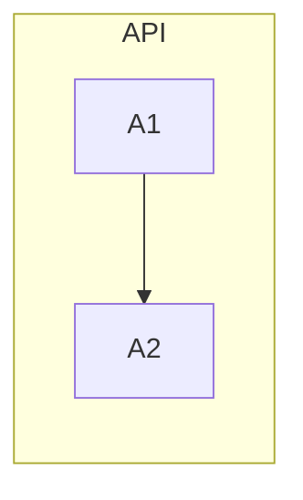

# LeanPlan Plan Stage

LeanPlan is a lean, LLM-aware spec-driven-development framework for one-deployment-sized feature work in monorepos. This doc carries the procedure for the TASK stage — sequencing DESIGN into land-able task cards in `plan.md`. Edge: DESIGN → TASK (`plan.md`).

Companion: `philosophy.md` (principles), `artifact-contract.md` (shape rules).

## Inputs

- REQUIREMENT, SPEC, DESIGN — surface artifacts.
- DESIGN RATIONALE — *not* loaded by default; load only when a decision seems questionable mid-planning and you need full rationale.
- Current repo boundaries and deployment constraints.

## Output

`<cwd>/docs/features/<KEY>/plan.md`

## Procedure

1. **Load** artifact contract + SPEC + DESIGN.
2. **Compose doc-level Guidelines (conditional)** — only when feature-wide work-stance rules genuinely apply (base branch, canary sequence, cross-team coordination). Skip otherwise.
3. **Identify tracks** — group work by a coordination-relevant axis (common: repo, or protocol-vs-service, or infra-vs-app). Each track becomes a Mermaid subgraph + a prefix letter (e.g. `P` = protocol, `A` = api, `D` = data, `I` = infra). Tracks are navigational aid for humans; the impl agent doesn't consume them as a formal concept.
4. **Author `Task: <id>` cards**, each with:
   - **Goal** — *process-framed*: what outcome this task achieves + how (when the work approach is non-obvious), with inline `SPEC#O-<N>-<slug>` / `SPEC#INV-<N>-<slug>` / `DESIGN#Decision-<N>-<slug>` anchors colocated with the supported sentence. **Anchor — don't restate.** If the Goal starts answering "after this lands, the system looks like X" (field mappings, response shapes, call sequences, signatures, code paths), push X to the relevant DESIGN Decision and link to it from the Goal.
   - **Repo** — where the work lives.
   - **Completion** — observable verification + method when non-obvious. Continuous Invariants → ongoing mechanism (SLO / monitor / CI gate); episodic Outcome items → one-shot test. Split dev / prod for infra + DB. Enumerated case scenarios (a/b/c/...) are healthy here — verification is process-specific.
   - **Dependencies** — prior task IDs as enablers.
   - **Guidelines** (conditional) — task-scoped stance rules.
5. **Draw the DAG** at the top under `## Dependency DAG` (or `## DAG`). Subgraphs by track; edges = "prior unblocks this one".
6. **Bidirectional verification** — do this explicitly and report. Do not paper over gaps:
   - **Forward**: walk every SPEC `O-<N>` and `INV-<N>`; each must map to ≥ 1 task Completion criterion **or** be acknowledged via a `**GAP**` annotation. List uncovered items.
   - **Reverse**: walk every `Task: <id>`; each Goal must cite ≥ 1 SPEC O / INV / DESIGN Decision / doc Guideline as its reason. List orphan tasks.
7. **One-deployment guardrail (advisory)** — task count > 12 warns; > 16 warns more strongly; under `--strict` (or `LEANPLAN_STRICT=1`) these escalate to errors. If oversized, surface a split question to the user: should this be split into multiple features?
8. **Self-check**:
   - No step-by-step edit instructions in any Goal.
   - No tech-realization restatement in Goals (field mappings, response/proto shapes, controller orchestration sequences, signatures, code paths). If a Goal explains *what the system looks like after the work lands*, that content belongs in a DESIGN Decision — the Goal anchors in.
   - Every Completion is observable (you could write the verification).
   - Task cards are self-sufficient at cut-off (sentences complete without the anchor target).
   - DAG renders.

## Guardrails

- **Intent + constraints, not scripts.** No step-by-step edit instructions ("edit file X at line Y"). The impl agent re-derives against current code at task entry.
- **Process specifics belong here; tech-realization specifics belong in DESIGN.** A task card describes the *work* — what outcome it achieves, how to verify it, in what work-stance. The *finished system's shape* (field mappings, response/proto shapes, controller orchestration sequences, signatures, code paths, schemas) belongs in a DESIGN `Decision-<N>` block. Anchor the Decision (`DESIGN#Decision-<N>-<slug>`) from the Goal; do not restate it.
  - ✅ healthy in Goal: *"BFF facade for ListMyCoupons — thin delegation to D2 (`DESIGN#Decision-13-cross-domain-wrapping`); itinerary-aware logic stays in socar-server (`SPEC#INV-2-shared-business-policy`)."*
  - ✅ healthy in Completion: *"(a) authed + valid spec → response with `is_available` accurate; (b) anon → UNAUTHENTICATED; (c) parity with app channel for identical input."*
  - ❌ drift in Goal: *"Request mapping: `web.{a, b, c}` → `domain.{a', b', c'}`; response mapping: `repeated PriceItem price_items=1 ...`; controller orchestration: `resolve(ctx) → checkPaymentCard → checkApprovedDriver → previewV2`."* — push these to DESIGN.
- **Dependencies are *enablers*, not gates.** Phrase as "P2 lands the schema that makes P1 testable", not "P1 cannot start until P2 completes". Impl agent re-evaluates at task entry.
- **Guidelines describe work-stance, not system shape.** If a line describes what exists *after* the work lands, push it to DESIGN. Externally-observable compat behavior → SPEC Invariants. Test specifics → task Completion.
- **External blockers become first-class tasks.** INFRAREQ / DBREQ filings, cross-team coordination — those are tasks in the DAG, not hidden "waiting" states.
- **Anchors carry ID + slug (identity, not restatement).** `SPEC#O-1-detected-anomaly-published-within-5s` — ID stable; slug names the reference at-a-glance. Don't paraphrase the item's content in the task card; rely on the anchor + JIT load when needed.
- **`**GAP**` ack is rare.** Use it only for deliberately-deferred coverage with a documented acceptance rationale.

## Template

````markdown
# <KEY> — TASK

## Guidelines
- <only feature-level work-stance rules; omit section otherwise>

## Dependency DAG



## Task: A1

- **Goal**: <process-framed — what this task achieves + how (when non-obvious); inline anchors like `SPEC#O-1-…` and `DESIGN#Decision-1-…`. Anchor — don't restate the Decision's content.>
- **Repo**: <repo/path>
- **Completion**:
  - <observable proof, citing SPEC#O-* or SPEC#INV-*; enumerate case scenarios when verification has branches>
- **Dependencies**: none
- **Guidelines**: <only task-local stance rules when needed>
````

## Hand-off

For each independently startable task: `/impl <KEY> <task-id>` (Claude) or `impl <KEY> <task-id>` (Codex).
